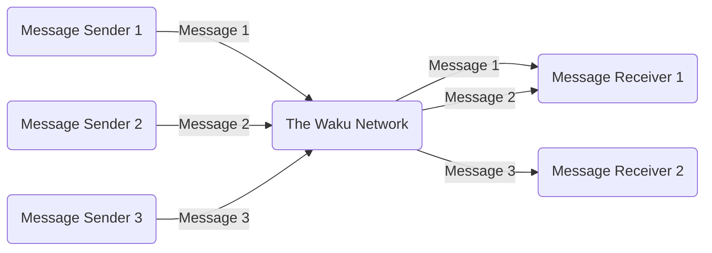

File /Logos Waku/Docs/Full Waku Docs.md contents:
***Folder Context (docs):***
File /docs/research/research-and-studies/rln-key-benchmarks.md contents:
---
title: RLN Key Benchmarks
---

## Introduction

Since RLN has been chosen as the spamming protection mechanism for waku, we must understand the practical implications of using it. This issue explains the main differences between `relay` and `rln-relay` and gives some benchmarks after running simulations using `waku-simulator`, in a network with the following characteristics:
- 100 nwaku nodes, each one with a valid rln membership and publishing a message every 10 seconds to a common topic.
- rln contract deployed in Ethereum Sepolia
- 10.000 memberships registered in the contract
- pure relay (store and light protocols disabled)

The main deltas `rln` vs `rln-relay` are:
- New `proof ` field in `WakuMessage` containing 384 extra bytes. This field must be generated and attached to each message.
- New validator, that uses `proof` to `Accept` or `Reject` the message. The proof has to be verified.
- New dependency on a blockchain, Ethereum, or any EVM chain, to keep track of the members allowed to publish.

But what are the practical implications of these?

## TLDR:
- Proof generation is constant-ish. 0.15 second for each proof
- Proof verification is constant-ish, 0.012 seconds. In a network with 10k nodes and D=6 this would add an overhead delay of 0.06 seconds.
- Gossipsub scoring drops connections from spammer peers, which acts as the punishment (instead of slashing). Validated in the simulation.
- Rln doesn't have any impact on memory consumption.

## Proof generation times

Seems that proof generation times stay constant no matter the size of the message. In the following simulation it was increased from: `1kB`, `10kB`, `50kB`, `150kB`. On average it takes `0.15 seconds` to calculate the message proof. This means that when a node wants to send a message, it will need to spend this time generating the proof. It seems very reasonable and it actually acts as a mini proof of work, where a consumer computer won't be able to publish a really high number of messages per second.


## Proof verification times

On the other hand, rln also adds an overhead in the gossipsub validation process. On average it takes `0.012 seconds` to verify the proof. It seems that when we increase the message size, validation time seems to increase a bit, which can be for any other reason besides rln itself (eg deserializing the message might take longer).

This number seems reasonable and shouldn't affect that much the average delay of a message. Assuming a d-regular graph, with `10k` nodes and `D=6`, we can have up to  `log(total_nodes)/log(D)=5` hops. So in the worst case, rln will add a network latency of `0.012*5 = 0.06 seconds`


## Spam protection

For the initial release of RLN, slashing won't be implemented and it still remains unclear if it will be implemented in the future. Luckily, even if slashing is not implemented rln can be used to detect spam and punish the sender off-chain (instead of slashing an onchain collateral). This is done with gossipsub scoring.

In the following simulation, we can see `100` nwaku interconnected nodes, where one of them suddenly starts spamming the network with multiple valid rln messages `3000 messages/minute`. Since its rate limited to 1msg/10 seconds, we can see that in almost no time, every node in the network disconnects from the spammer peer (see red node), leaving it with `0 peers`, which disincentivise such attacks and without requiring a financial slashing.


## RLN tree sync

Using RLN implies that waku should now piggyback on a blockchain (the case study uses Ethereum Sepolia) and has to stay up to date with the latest events emitted by the rln smart contract. These events are used to locally construct a tree that contains all members allowed to create valid proofs to send messages. Some numbers:
- A tree with 10k members takes `2Mbytes` of space. Negligible.
- A tree with 10k members takes `<4 minutes to synchronize. Assumable since it's done just once.
- With a block range of 5000 blocks for each request, we would need `520 requests` to synchronize 1 year of historical data from the tree. Assumable since most of the free endpoints out there allow 100k/day.

## Performance relay vs. rln-relay

Same simulation with 100 nodes was executed `with rln` and `without rln`:
- Memory consumption is almost identical

**with rln**


**without rln**


- Couldn't capture cpu metrics
- Minor differences in messages per seconds is due to injection technique, nothing related to rln itself.


---

File /docs/research/research-and-studies/message-propagation.md contents:
---
title: Message Propagation Times With Waku-RLN
---

**TLDR**: We present the results of 1000 `nwaku` nodes running `rln` using different message sizes, in a real network with bandwidth limitations and network delays. The goal is to study the message propagation delay distribution, and how it's affected by i) rln and ii) message size in a real environment. We observe that for messages of `10kB` the average end-to-end propagation delay is `508 ms`. We can also observe that the message propagation delays are severely affected when increasing the message size, which indicates that it is not a good idea to use waku for messages of eg. `500kB`. See simulation parameters.

## Introduction

Waku uses [relay](https://rfc.vac.dev/spec/11/) as a routing protocol, which is an adaptation of [gossipsub](https://arxiv.org/pdf/2007.02754.pdf). It routes messages following a publisher/subscriber architecture, where nodes can publish messages or subscribe to topics. If message `m` is published to topic `t`, all `i` nodes `n_1...n_i` subscribed to `t` will get `m`. The `relay` protocol ensures that every node gets the messages of the topics it is subscribed to.

However, since `relay` works in a decentralized manner, all nodes contribute to the gossiping of a message, until it has successfully reached all the interested nodes (subscribed to it). This means that a message can travel multiple hops until it reaches all nodes. The amount of hops determines the **message propagation time**, which is measured as the **time difference of when the node published the message and when another node received**.

**This issue aims to go from theory to practice, by i) understanding message propagation times in theory and ii) presenting nwaku simulation results in an end-to-end setup with rln, with real message propagation times**.

## Theory

Let's start with **message propagation times in theory**. On a high level, it depends on:
- The gossipsub [configuration](https://github.com/libp2p/specs/blob/master/pubsub/gossipsub/gossipsub-v1.0.md#parameters), being `D` one of the most important parameters. This sets the hops that a message will travel to reach all nodes. Higher `D`, less hops, less delay. Note that a higher `D` implies more bandwidth consumption.
- The node. Different nodes will see different propagation times, because a message can travel different paths. A node connected directly to the publisher (1 hop) will see lower propagation times than other nodes further away.
- Individual propagation times. Since a message can travel multiple hops to reach its destination, each hop adds a contribution to the overall message propagation time. This individual propagation time depends on the characteristics on the nodes involved in the connections.

In a D-regular graph, like the one formed by waku nodes around a topic, the maximum amount of hops that a message can travel to reach all nodes can be calculated as `ceil(log(total_nodes)/log(D))`. For example, with log(1000)/log(6) = 3.85 = 4. So in a network with 1000 nodes and `D=6`, no matter which node publishes the message, in 4 hops it will reach all the nodes.

Notice the **"worst case"** since some nodes might be directly connected to the publisher, so they will get the message in just 1 hop.

But how long does it take to jump each hop? It depends on:
- The latency between nodes. Can be measured as the time to respond to a ping.
- The size of the messages. The bigger the message, the more time it takes to transmit.
- Nodes bandwidth. Sender upload bandwidth and receiver download bandwidth. More important when using big message sizes.
- Message validation time. When each node receives a message, it applies some validation to decide if the message is further gossiped or not. In the case of waku, this is RLN ([paper](https://arxiv.org/pdf/2207.00116.pdf), [rfc](https://rfc.vac.dev/spec/32/))

Assuming a message `m` that travels 4 hops from node `n1` (publisher) to `n5` (subscriber) we can calculate the message propagation time `mpt=ipt_1+ipt_2+ipt_3+ipt_4` where `ipt` is the individual propagation time between each node in the chain.

However, specific message propagation times are useless, we need average times under specific conditions. And **for this, we need simulations**.

## Simulations

Using [shadow](https://shadow.github.io/docs/guide/shadow.html) simulator, we have developed a [tool](https://github.com/waku-org/research/tree/master/rln-delay-simulations) that allows to simulate message propagation delays of `nwaku` (using a slightly modified [branch](https://github.com/waku-org/nwaku/compare/master...simulations), mainly to instrument it with tools to measure the times + starting from an already connected mesh. Thanks [@Menduist](https://github.com/menduist) for the help. Note that running this simulation requires a significant amount of resources, done with 256 GB of RAM.

The configuration of the simulation is (see [config](https://github.com/waku-org/research/blob/master/rln-delay-simulations/shadow.yaml)):
- `latency=100ms`. Average latency in our current waku network. Thanks [@vpavlin](https://github.com/vpavlin) for the measurements. See [this](https://grafana.infra.status.im/d/b819dbfe-acb6-4086-8736-578ca148d7cd/waku-networkmonitor-v2?orgId=1&refresh=30s&viewPanel=12) for live data.
- `down_bandwidth=83Mbps`, `up_bandwidth=38Mbps`. As shown in [Table 2](https://github.com/waku-org/research/issues/31) that's the worldwide median speed.
- `D=6`, which is the current `nwaku` [configuration](https://github.com/waku-org/nwaku/blob/v0.21.0/waku/waku_relay/protocol.nim#L73-L78).
- `nodes=1000`. Amount of nodes used in the simulation
- `nwaku` was used with a minor [modification](https://github.com/waku-org/nwaku/compare/master...simulations)
- A total of `10` messages were published, that led to `9990` received messages.
- Since `shadow` **doesn't take into account CPU times** ([by now](https://github.com/shadow/shadow/discussions/1675#discussioncomment-7342812)), we simulate it with `sleepAsync` as per https://github.com/waku-org/research/issues/23 findings. `0.012 seconds` for proof verification and `0.15 seconds` for proof generation.

## Results

The following figure shows the **message propagation time with real simulations**, showing the distribution in a network with the above configuration with three different message sizes: `10kB`, `100kB`, `500kB`. Note that the whiskers indicate the best/worst values and the box contains P25 to P75 values. Average `mu` and P95 are also shown. Raw data [here](https://github.com/waku-org/research/tree/master/rln-delay-simulations/raw).


**Important note**. The first messages sent in the simulations are omitted, since they show an abnormal propagation delay that doesn't reflect reality. This is due to how flow control works in TCP, where right after connection, the sender node has no idea of the "bandwidth" of the receiver node, so it will start sending packages at a lower rate. This translates into high transmission times, and it's more pronounced when dealing with big message sizes.

In other words, in a 100Mpbs link, 100Mbits won't be sent in 1 second, or at least not a the beginning, when the node is slowly increasing the rate until based on ACK/NACK ratio. For more information about this, this is explained in [here](https://www.youtube.com/watch?v=vb_wjh_nAmo).

**Conclusions:**
- Using small messages `10kB` the **average propagation delay is `508 ms`**, quite reasonable for applications using waku. The variance is acceptable, with 95% of the messages arriving in `<627 ms`.
- When using a size of `10kB` we can see that the best case propagation delay is `263 ms`. This corresponds to the nodes that are just 1 hop from the publisher. The proof generation time `0.15 seconds` affects the most, where the rest is the inter-node latency and the transmission of the message itself.
- We can see that the **message propagation delay increases with big messages**, `100kB` and `500kB`. So its **probably not a good idea to use waku for such big messages**. Note that these simulations had 1000 nodes, so if we scale it to 10000 or beyond, propagation times would be worse.
- Best case propagation time (lower part of the whisker) is quite similar in all cases. This is because it corresponds to the node that is just 1 hop away from the publisher.

**Future work**:
- Current waku `D` [values](https://github.com/waku-org/nwaku/blob/v0.21.0/waku/waku_relay/protocol.nim#L73-L78) (average of 6 ranging from 4 to 12) have a huge impact on the bandwidth that a node consumes. Are we willing to lower D in order to reduce bandwidth but increase message propagation times?
- Since `shadow` doesn't take CPU time into account, it's currently simulated for rln, which should be the biggest bottleneck. Once `shadow` has [this feature](https://github.com/shadow/shadow/discussions/1675#discussioncomment-7342812) times would be more accurate.

---

File /docs/research/research-and-studies/maximum-bandwidth.md contents:
---
title: Maximum Bandwidth for Global Adoption
---

**TLDR**: This issue aims to **set the maximum bandwidth** in `x Mbps` that each waku shard should consume so that the **maximum amount of people can run a full waku node**. It is up to https://github.com/waku-org/research/issues/22 to specify how this maximum will be enforced.

**Conclusion:** Limit to `10 Mbps` each waku shard.

## Introduction

Waku is designed in a way that everyone should be able to run a full node on an average laptop with a residential Internet connection, at least in one shard. This will enable true decentralization and give power to the users, since they won't need to rely on third parties to send/receive messages. Professional node operators running in data centers, can of course contribute to multiple shards, but we should keep the bandwidth/hardware requirements of single shard rather low.

This vision opposes the federated approach, where a few nodes requiring vast amounts of resources (cpu, memory, bandwidth) run in data centres, taking the power from the user. While federated approaches are an improvement from traditional client-server architectures, waku envisions a fully peer-to-peer architecture where anyone should be able to run a node.

In order to ensure that anyone can run a node **in desktop**, there are two main **limiting factors**:
1. Bandwidth consumption in Mbps
2. CPU/memory resources (mainly limited by RLN proof verification)

This issue focuses on i) bandwidth consumption and https://github.com/waku-org/research/issues/30 on ii) CPU/memory resources. Note that on https://github.com/waku-org/research/issues/23 an analysis on the impact on RLN was already made, but wasn't focused on scalability. Said issues do.

In https://github.com/waku-org/research/issues/22 we discussed **why** and **how** to limit the maximum bandwidth per shard, but we haven't come up with a specific number in Mbps. **This issue i) presents data from the available bandwidth at different locations and ii) suggests a maximum bandwidth in Mbps that waku should enforce**.

## Bandwidth availability and usage

The following tables show:
- Table [1] The Q25, Q75 and average bandwidth (upload/download) in Mbps available on different continents. Raw data is available [here](https://www.measurementlab.net/data/) and credits to [@leobago](https://github.com/leobago) for the summarized version. Note: The below numbers were rounded to the nearest integer.
- Table [2] The median global bandwidth (upload/download) in Mbps, taken from [speedtest](https://www.speedtest.net/global-index) (accessed 12 Oct 2023). 
- Table [3] Download bandwidth requirements in Mbps for Netflix video streaming, [source](https://www.comparethemarket.com/broadband/content/broadband-for-streaming/).

|    *Table [1]*             | Download (Mbps) |            |        | Upload (Mbps) |            |        |
|------------------|-----------------|------------|--------|---------------|------------|--------|
|                  |   **Q25**           |   **Average**  |  **Q75**  |   **Q25**         |   **Average**  |   **Q75**  |
|   North-America  |   58            |   107      |   137  |   38          |   68       |   85   |
|   South-America  |   21            |   54       |   72   |   13          |   33       |   44   |
|   Europe         |   49            |   93       |   119  |   30          |   56       |   72   |
|   Asia           |   23            |   53       |   71   |   15          |   37       |   50   |
|   Oceania        |   44            |   84       |   108  |   27          |   50       |   63   |
|   Africa         |   12            |   26       |   33   |   7           |   17       |   22   |

|   *Table [2]*     | Median Download (Mbps) | Median Upload (Mbps) |
|--------|------------------------|----------------------|
| Global | 83                     | 38                   |

| *Table [3]* **Video resolution** | **Recommended Bandwidth** | 
|----------------------|---------------------------|
| HD                   | 3 Mbps                    | 
| Full HD              | 5 Mbps                    | 
| 4K/UHD               | 15 Mbps                   | 

## Selecting a maximum bandwidth

With the above data, we should be informed to take a decision on the maximum bandwidth that we should enforce per shard. With this number, we will apply the techniques explained in https://github.com/waku-org/research/issues/22 to ensure (with some statistical confidence) that the bandwidth won't exceed that number.

The **trade-off is clear**:
- We **enforce a low bandwidth**: more people can run full waku nodes, overall network throughput is less, network decentralization is easier, gives power to the user as its fully sovereign.
- We **don't enforce a low bandwidth**: not possible to run full waku nodes in laptops acting as a centralization force, nodes are run by few professional operators in data centers, waku users just use light clients, network throughput can scale way easier, federated approach.

So it's about where to draw this line.

Points to take into account:
- **Relay contributes to bandwidth the most**: Relay is the protocol that mostly contributes to bandwidth usage, and it can't choose to allocate fewer bandwidth resources like other protocols (eg `store` can choose to provide less resources and it will work). In other words, the network sets the relay bandwidth requirements, and if the node can't meet them, it just wont work.
- **Upload and download bandwidth are the same**: Due to how gossipsub works, and hence `relay`, the bandwidth consumption is symmetric, meaning that upload and download bandwidth is the same. This is because of `D` and the reciprocity of the connections, meaning that one node upload is another download.
- **Nodes not meeting requirements can use light clients**. Note that nodes not meeting the bandwidth requirements can still use waku, but they will have to use light protocols, which are a great alternative, especially on mobile, but with some drawbacks (trust assumptions, less reliability, etc)
- **Waku can't take all the bandwidth:** Waku is meant to be used in conjunction with other services, so it shouldn't consume all the existing bandwidth. If Waku consumes `x Mbps` and someone bandwidth is `x Mpbs`, the UX won't be good.
- **Compare with existing well-known services:** As shown in *Table [3]*, Netflix 4K video streaming takes 15Mbps, so that is an order of magnitude to take into account.

Coming up with a number:
- Lowest average download speed across continents is Africa (26 Mbps)
- Lowest average upload speed across continents is Africa (17 Mbps)
- Since in waku the bandwidth consumption is symmetric, we are limited by the lowest (17 Mpbs)
- However waku should not consume all bandwidth, leaving some room for other applications.
- We could set 10 Mbps, which is between Full HD video and 4K.
- With 10Mbps the % of average bandwidth waku will consume is:
  - North-America 9 %
  - South-America 18 %
  - Europe  11 %
  - Asia 18 %
  - Oceania 12 %
  - Africa 38 %

**Conclusion:** Limit to `10 Mbps` each waku shard. How? Not trivial, see https://github.com/waku-org/research/issues/22#issuecomment-1727795042

*Note:* This number is not set in stone and is subject to modifications, but it will most likely stay in the same order of magnitude if changed.

---

File /docs/research/research-and-studies/incentivisation.md contents:
---
title: Incentivisation
---

Waku is a family of decentralised communication protocols. The Waku Network (TWN) consists of independent nodes running Waku protocols. TWN needs incentivisation (shortened to i13n) to ensure proper node behaviour.

The goal of this document is to outline and contextualize our approach to TWN i13n. After providing an overview of Waku and relevant prior work, we focus on Waku Store - a client-server protocol for querying historical messages. We introduce a minimal viable addition to Store to enable i13n, and list research directions for future work.

# Incentivisation in decentralised networks

## Incentivisation tools

We can think of incentivisation tools as a two-by-two matrix:
- rewards vs punishment;
- monetary vs reputation.

In other words, there are four quadrants:
- monetary reward: the node gets rewarded;
- monetary punishment: the nodes deposits funds that are taken away (slashed) if it misbehaves;
- reputation reward: the node's reputation increases if it behaves well;
- reputation punishment: the node's reputation decreases if it behaves badly.

Reputation only works if high reputation brings tangible benefits. For example, if nodes chose neighbors based on reputation, low-reputation nodes miss out on potential revenue. Reputation scores may be local (a node assigns scores to its neighbors) or global (each node gets a uniform score). Global reputation in its simplest form involves a trusted third party, although decentralised approaches are also possible.

## Prior work

We may split incentivized decentralised networks into early file-sharing, blockchains, and decentralised storage.

### Early P2P file-sharing

Early P2P file-sharing networks employ reputation-based approaches and sticky defaults. For instance, the BitTorrent protocol rewards uploading peers with faster downloads. The download bandwidth available to a peer depends on how much it has uploaded. Moreover, peers share pieces of a file before having received it in whole. This non-monetary i13n policy has been proved to work in practice.

### Blockchains

Bitcoin has introduced proof-of-work (PoW) for native monetary rewards in a P2P network. PoW miners are automatically assigned newly mined coins for generating blocks. Miners must expend physical resources to generate a block. If the block is invalid, these expenses are not compensated (implicit monetary punishment). Proof-of-stake (PoS), used in Ethereum and many other cryptocurrencies, introduces explicit monetary punishments. PoS validators lock up (stake) native tokens and get rewarded for validating blocks or slashed for misbehaviour.

### Decentralised storage

Post-Bitcoin decentralised storage networks include Codex, Storj, Sia, Filecoin, IPFS. Their i13n methods combine techniques from early P2P file-sharing with blockchain-inspired reward mechanisms.

# Waku background

Waku is a [family of protocols](https://waku.org/about/architect) for a modular privacy-preserving censorship-resistant decentralised communication network. The backbone of Waku is the Relay protocol (and its spam-protected version [RLN-Relay](https://rfc.vac.dev/spec/17/)). Additionally, there are light protocols: Store, Filter, and Lightpush. Light protocols are also referred to as client-server protocols and request-response protocols.

A server is a node running Relay and a server-side of at least one light protocol. A client is a node running a client-side of any of the light protocols. A server may sometimes be referred to as a full node, and a client as a light node. There is no strict definition of a full node vs a light node in Waku (see [discussion](https://github.com/waku-org/research/issues/28)).

In light protocols, a client sends a request to a server, and a server performs some actions and returns a response:
- [Store](https://rfc.vac.dev/spec/13/): the server responds with messages relayed that match a set of criteria;
- [Filter](https://rfc.vac.dev/spec/12/): the server will relay (only) messages that pass a filter to the client;
- [Lightpush](https://rfc.vac.dev/spec/19/): the server publishes the client's message to the Relay network.

## Waku i13n challenges

Waku has no consensus and no native token, which brings it closer to reputation-incentivised file-sharing networks. As of late 2023, Waku only operates under reputation-based rewards and punishments. While [RLN-Relay](https://rfc.vac.dev/spec/17/) adds monetary punishments for spammers, slashing is yet to be activated.

Monetary rewards and punishments should ideally be atomically linked with the node's behaviour. A benefit of blockchains in this respect is that the desired behaviour of miners or validators can be verified automatically. Enforcing atomicity in a communication network is more challenging: it is non-trivial to prove that a given piece of data has been relayed.

Our goal is to combine monetary and reputation-based incentives for Waku. Monetary incentives have demonstrated their robustness in blockchains. We think they are necessary to scale the network beyond the initial phase when it's maintained altruistically.

## Waku Store

Waku Store is a light protocol for querying historic messages that works as follows:
1. the client sends a `HistoryQuery` to the server;
2. the server sends a `HistoryResponse` to the client.

The response may be split into multiple parts, as specified by pagination parameters in `PagingInfo`.

We define a _relevant_ message as a message that matches client-defined criteria (e.g., relayed within a given time frame). Upon receiving a request, a server should quickly send back a response containing all and only relevant messages.

# Waku Store incentivisation

An incentivised Store protocol has the following extra steps:
1. pricing:
	1. cost calculation
	2. price advertisement
	3. price negotiation
2. payment:
	1. payment itself
	2. proof of payment
3. reputation
4. results cross-checking

In this document, we focus on the simplest proof-of-concept (PoC) i13n for Store. Compared to the fully-fledged protocol, the PoC version is simplified in the following ways:
- cost calculation is based on a common-knowledge price;
- there is no price advertisement and no price negotiation;
- each query is paid for in a separate transaction, `txid` acts a proof of payment;
- the reputation system is simplified (see below);
- the results are not cross-checked.

In the PoC protocol:
1. the client calculates the price based on the known rate per hour of history;
2. the client pays the appropriate amount to the server's address;
3. the client sends a `HistoryQuery` to the server alongside the proof of payment (`txid`);
4. the server checks that the `txid` corresponds to a confirmed transaction with at least the required amount;
5. the server sends a `HistoryResponse` to the client.

In further subsections, we list the potential direction for future work towards a fully-fledged i13n mechanism.

## Pricing

For PoC, we assume a constant price per hour of history. This price and the blockchain address of the server are assumed to be common knowledge. This simplifies the client-server interaction, avoiding the price negotiation step.

In the future versions of the protocol, the price will be negotiated and will depend on multiple parameters, such as the total size of the relevant messages in the response.

### Future work

- DoS protection - see https://github.com/waku-org/research/issues/66
- Cost calculation - see https://github.com/waku-org/research/issues/35
- Price advertisement - see https://github.com/waku-org/research/issues/51
- Price negotiation - see https://github.com/waku-org/research/issues/52

## Payment

For the PoC, each request is paid for with a separate transaction. The transaction hash (`txid`) acts as a proof of payment. The server verifies the payment by ensuring that:
1. the transaction has been confirmed;
2. the transaction is paying the proper amount to the server's account;
3. the `txid` does not correspond to any prior response.

The client gives proof of payment before it receives the response. Other options could be:
1. the client pays after the fact;
2. the client pays partly upfront and partly after the fact;
3. a centralised third party (either trusted or semi-trusted, like a smart contract) ensures atomicity;
4. cryptographically ensured atomicity (similar to atomic swaps, Lightning, or Hopr).

Our design considerations are:
- the PoC protocol should be simple;
- servers are more "permanent" entities and are more likely to have long-lived identities;
- it is more important to protect the clients's privacy than the server's privacy.

In light of these criteria, we suggest that the client pays first. This is simpler than splitting the payment, or involving an extra atomicity-enforcing mechanism. Moreover, pre-payment is arguably more privacy-preserving than post-payment, which encourages servers to deanonymise clients to prevent fraud.

### Future work

- Add more payment methods - see https://github.com/waku-org/research/issues/58
- Design a subscription model with service credentials - see https://github.com/waku-org/research/issues/59
- Add privacy to service credentials - see https://github.com/waku-org/research/issues/60
- Consider the impact of network disruptions - see https://github.com/waku-org/research/issues/65

## Reputation

We use reputation to discourage the server from taking the payment and not responding. The client keeps track of the server's reputation:
- all servers start with zero reputation points;
- if the server honours the request, it gets `+n` points;
- if the server does not respond before a timeout, it gets `-m` points.
- if the server's reputation drops below `k` points, the client will never query it again.

`n`, `m`, and `k` are subject to configuration.

Optionally, a client may treat a given server as trusted, assigning it a constant positive reputation.

Potential issues:
- An attacker can establish new server identities and continue running away with clients' money. Countermeasures:
	- a client only queries trusted servers (which however leads to centralisation);
	- when querying a new server, a client first sends a small (i.e. cheap) request as a test;
	- more generally, the client selects a server on a case-by-case basis, weighing the payment amount against the server's reputation.
- The ban mechanism can theoretically be abused. For instance, a competitor may attack the victim server and cause the clients who were awaiting the response to ban that server. Countermeasure: prevent DoS-attacks.

### Future work

Design a more comprehensive reputation system:
- local reputation - see https://github.com/waku-org/research/issues/48
- global reputation - see https://github.com/waku-org/research/issues/49

## Results cross-checking

As there is no consensus over past messages, a client may want to query multiple servers and merge their responses. Cross-checking helps ensure that servers are a) not censoring real messages; b) not injecting fake messages into history. Cross-checking is absent in PoC but may be considered later.

### Future work

- Cross-checking the results against censorship - see https://github.com/waku-org/research/issues/57
- Use RLN to limit fake message insertion - see https://github.com/waku-org/research/issues/38

# Evaluation

We should think about what the success metrics for an incentivised protocol are, and how to measure them both in simulated settings, as well as in a live network.

# Longer-term future work

- Analyze privacy issues - see https://github.com/waku-org/research/issues/61
- Analyze decentralised storage protocols and their relevance e.g. as back-end storage for Store servers - see https://github.com/waku-org/research/issues/34
- Analyze the role of message senders, in particular, whether they should pay for sending non-ephemeral messages - see https://github.com/waku-org/research/issues/32
- Generalise incentivisation protocol to other Waku light protocols (Lightpush and Filter) - see https://github.com/waku-org/research/issues/67.

---

File /docs/research/research-and-studies/capped-bandwidth.md contents:
---
title: Capped Bandwidth in Waku
---

This post explains i) why The Waku Network requires a capped bandwidth per shard and ii) how to achieve it by rate limiting with RLN v2.

## Problem

First of all, let's begin with the terminology. We have talked in the past about "predictable" bandwidth, but a better name would be "capped" bandwidth. This is because it is totally fine that the waku traffic is not predictable, as long as it is capped. And it has to be capped because otherwise, no one will be able to run a node.

Since we aim that everyone can run a full waku node (at least subscribed to a single shard) it is of paramount importance that the bandwidth requirements (up/down) are i) reasonable to run with a residential internet connection in every country and ii) limited to an upper value, aka capped. If the required bandwidth to stay up to date with a topic is higher than what the node has available, then it will start losing messages and won't be able to stay up to date with the topic messages. And not to mention the problems this will cause to other services and applications being used by the user.

The main problem is that one can't just choose the bandwidth it allocates to `relay`. One could set the maximum bandwidth willing to allocate to `store` but this is not how `relay` works. The required bandwidth is not set by the node, but by the network. If a pubsub topic `a` has a traffic of 50 Mbps (which is the sum of all messages being sent multiplied by its size, times the D_out degree), then if a node wants to stay up to date in that topic, and relay traffic in it, then it will require 50 Mbps. There is no thing such as "partially contributing" to the topic (with eg 25Mbps) because then you will be losing messages, becoming an unreliable peer and potentially be disconnected. The network sets the pace.

So waku needs an upper boundary on the in/out bandwidth (mbps) it consumes. Just like apps have requirements on cpu and memory, we should set a requirement on bandwidth, and then guarantee that if you have that bandwidth, you will be able to run a node without any problem. And this is the tricky part. This metric is Waku's constraint, similar to the gas-per-block limit in blockchains.

## Previous Work

Quick summary of the evolution to solve this problem:
* Waku started with no rate-limiting mechanism. The network was subject to DoS attacks.
* RLN v1 was introduced, which allowed to rate-limit in a privacy-preserving and anonymous way. The rate limit can be configured to 1 message every `y` seconds. However, this didn't offer much granularity. A low `y` would allow too many messages and a high `y` would make the protocol unusable (impossible to send two messages in a row).
* RLN v2 was introduced, which allows to rate-limit each user to `x` messages every `y` seconds. This offers the granularity we need. It is the current solution deployed in The Waku Network.

## Current Solution (RLN v2)

The current solution to this problem is the usage of RLN v2, which allows to rate-limit `x` messages every `y` seconds. On top of this, the introduction of [WAKU2-RLN-CONTRACT](https://github.com/waku-org/specs/blob/master/standards/core/rln-contract.md) enforces a maximum amount of messages that can be sent to the network per `epoch`. This is achieved by limiting the amount of memberships that can be registered. The current values are:
* `R_{max}`: 160000 mgs/epoch
* `r_{max}`: 600 msgs/epoch
* `r_{min}`: 20 msgs/epoch

In other words, the contract limits the amount of memberships that can be registered from `266` to `8000` depending on which rate limit users choose.

On the other hand [64/WAKU2-NETWORK](https://github.com/vacp2p/rfc-index/blob/main/waku/standards/core/64/network.md) states that:
* `rlnEpochSizeSec`: 600. Meaning the epoch size is 600 seconds.
* `maxMessageSize`: 150KB. Meaning the maximum message size that is allowed. Note: recommended average of 4KB.

Putting this all together and assuming:
* Messages are sent uniformly distributed.
* All users totally consumes its rate-limit.

We can expect the following message rate and bandwidth for the whole network:
* A traffic of `266 msg/second` on average (`160000/600`)
* A traffic of `6 MBps` on average (266 * 4KB * 6), where `4KB` is the average message size and `6` is the average gossipsub D-out degree.

And assuming a uniform distribution of traffic among 8 shards:
* `33 msg/second` per shard.
* `0.75 MBps` per shard. 


---

File /docs/research/index.md contents:
---
title: Research
hide_table_of_contents: true
sidebar_position: 1
---

**Research and Studies**: Protocol simulations and theoretical analysis to support the design of Waku protocols. The protocol definitions are on the [Waku RFCs](https://rfc.vac.dev/waku) website.

**Benchmarks**: Results of implementations and engineering-related benchmarks for Waku clients.

Waku also has the following published research papers:
- [**WAKU-RLN-RELAY: Privacy-Preserving Peer-to-Peer Economic Spam Protection**](https://arxiv.org/abs/2207.00117)
- [**Message Latency in Waku Relay with Rate Limiting Nullifiers**](https://eprint.iacr.org/2024/1073)
- [**Waku: A Family of Modular P2P Protocols For Secure & Censorship-Resistant Communication**](https://arxiv.org/abs/2207.00038)
- [**The Waku Network as Infrastructure for dApps**](https://ieeexplore.ieee.org/document/10646404)


---

File /docs/research/benchmarks/test-results-summary.md contents:
---
title: Performance Benchmarks and Test Reports
---


## Introduction
This page summarises key performance metrics for nwaku and provides links to detailed test reports.

> ## TL;DR
>
> - Average Waku bandwidth usage: ~**10 KB/s** (minus discv5 Discovery) for 1KB message size and message injection rate of 1msg/s.  
Confirmed for topologies of up to 2000 Relay nodes.
> - Average time for a message to propagate to 100% of nodes: **0.4s** for topologies of up to 2000 Relay nodes.
> - Average per-node bandwidth usage of the discv5 protocol: **8 KB/s** for incoming traffic and **7.4 KB/s** for outgoing traffic,   
 in a network with 100 continuously online nodes.
> - Future improvements: A messaging API is currently in development to streamline interactions with the Waku protocol suite.  
Once completed, it will enable benchmarking at the messaging API level, allowing applications to more easily compare their  
own performance results.


## Insights

### Relay Bandwidth Usage: nwaku v0.34.0
The average per-node `libp2p` bandwidth usage in a 1000-node Relay network with 1KB messages at varying injection rates.


| Message Injection Rate | Average libp2p incoming bandwidth (KB/s) | Average libp2p outgoing bandwidth (KB/s) |
|------------------------|------------------------------------------|------------------------------------------|
| 1 msg/s                | ~10.1                                    | ~10.3                                    |
| 1 msg/10s              | ~1.8                                     | ~1.9                                     |

### Message Propagation Latency: nwaku v0.34.0-rc1
The message propagation latency is measured as the total time for a message to reach all nodes.  
We compare the latency in different network configurations for the following simulation parameters:
- Total messages published: 600
- Message size: 1KB
- Message injection rate: 1msg/s

The different network configurations tested are:
- Relay Config: 1000 nodes with relay enabled
- Mixed Config: 210 nodes, consisting of bootstrap nodes, filter clients and servers, lightpush clients and servers, store nodes
- Non-persistent Relay Config: 500 persistent relay nodes, 10 store nodes and 100 non-persistent relay nodes

Click on a specific config to see the detailed test report.

| Config                                                                                                                       | Average Message Propagation Latency (s) | Max Message Propagation Latency (s)|
|------------------------------------------------------------------------------------------------------------------------------|-----------------------------------------|------------------------------------|
| [Relay](https://www.notion.so/Waku-regression-testing-v0-34-1618f96fb65c803bb7bad6ecd6bafff9) (1000 nodes)                   | 0.05                                    | 1.6                                |
| [Mixed](https://www.notion.so/Mixed-environment-analysis-1688f96fb65c809eb235c59b97d6e15b) (210 nodes)                       | 0.0125                                  | 0.007                              |
| [Non-persistent Relay](https://www.notion.so/High-Churn-Relay-Store-Reliability-16c8f96fb65c8008bacaf5e86881160c) (510 nodes)| 0.0125                                  | 0.25                               |  

### Discv5 Bandwidth Usage: nwaku v0.34.0
The average bandwidth usage of discv5 for a network of 100 nodes and message injection rate of 0 or 1msg/s.  
The measurements are based on a stable network where all nodes have already connected to peers to form a healthy mesh.

|Message size         |Average discv5 incoming bandwidth (KB/s)|Average discv5 outgoing bandwidth (KB/s)|
|-------------------- |----------------------------------------|----------------------------------------|
| no message injection| 7.88                                   | 6.70                                   |
| 1KB                 | 8.04                                   | 7.40                                   |
| 10KB                | 8.03                                   | 7.45                                   |

## Testing
### DST
The VAC DST team performs regression testing on all new **nwaku** releases, comparing performance with previous versions.  
They simulate large Waku networks with a variety of network and protocol configurations that are representative of real-world usage.

**Test Reports**: [DST Reports](https://www.notion.so/DST-Reports-1228f96fb65c80729cd1d98a7496fe6f)  


### QA
The VAC QA team performs interoperability tests for **nwaku** and **go-waku** using the latest main branch builds.  
These tests run daily and verify protocol functionality by targeting specific features of each protocol.  

**Test Reports**: [QA Reports](https://discord.com/channels/1110799176264056863/1196933819614363678)  

### nwaku
The **nwaku** team follows a structured release procedure for all release candidates.  
This involves deploying RCs to `status.staging` fleet for validation and performing sanity checks.  

**Release Process**: [nwaku Release Procedure](https://github.com/waku-org/nwaku/blob/master/.github/ISSUE_TEMPLATE/prepare_release.md)  


### Research
The Waku Research team conducts a variety of benchmarking, performance testing, proof-of-concept validations and debugging efforts.  
They also maintain a Waku simulator designed for small-scale, single-purpose, on-demand testing.


**Test Reports**: [Waku Research Reports](https://www.notion.so/Miscellaneous-2c02516248db4a28ba8cb2797a40d1bb)

**Waku Simulator**: [Waku Simulator Book](https://waku-org.github.io/waku-simulator/)


---

File /docs/research/benchmarks/postgres-adoption.md contents:
---
title: PostgreSQL
description: Document that describes why Nim-Waku started to use Postgres and shows some benchmark and comparison results.
---

## Introduction

The *Nim Waku Node*, *nwaku*, has the capability of archiving messages until a certain limit (e.g. 30 days) so that other nodes can synchronize their message history throughout the *Store* protocol.

The *nwaku* originally used *SQLite* to archive messages but this has an impact on the node. *Nwaku* is single-threaded and therefore, any *SQLite* operation impacts the performance of other protocols, like *Relay.*

Therefore, the *Postgres* adoption is needed to enhance that.

[https://github.com/waku-org/nwaku/issues/1888](https://github.com/waku-org/nwaku/issues/1888)

## How to connect the *nwaku* to *Postgres*

Simply pass the next parameter to *nwaku*

```bash
--store-message-db-url="postgres://${POSTGRES_USER}:${POSTGRES_PASSWORD}@${POSTGRES_HOST}:${POSTGRES_PORT}/postgres
```

Notice that this only makes sense if the _nwaku_ has the _Store_ protocol mounted
```bash
--store=true
```

(start the _nwaku_ node with `--help` parameter for more _Store_ options)

## Examples of *nwaku* using *Postgres*

[https://github.com/waku-org/nwaku-compose](https://github.com/waku-org/nwaku-compose)

[https://github.com/waku-org/test-waku-query](https://github.com/waku-org/test-waku-query)

## Stress tests

The following repository was created as a tool to stress and compare performance between *nwaku*+*Postgres* and *nwaku*+*SQLite*:

[https://github.com/waku-org/test-waku-query](https://github.com/waku-org/test-waku-query)

### Insert test results

#### Maximum insert throughput

**Scenario**

- 1 node subscribed to pubsubtopic ‘x’ and the *Store* protocol mounted.
- ‘n’ nodes connected to the “store” node, and publishing messages simultaneously to pubsubtopic ‘x’.
- All nodes running locally in a *Dell Latitude 7640*.
- Each published message is fixed, 1.4 KB: [publish_one_client.sh](https://github.com/waku-org/test-waku-query/blob/master/sh/publish_one_client.sh)
- The next script is used to simulate multiple nodes publishing messages: [publish_multiple_clients.sh](https://github.com/waku-org/test-waku-query/blob/fe7061a21eb14395e723402face755c826077aec/sh/publish_multiple_clients.sh)

**Sought goal**

Find out the maximum number of concurrent inserts that both *SQLite* and *Postgres* could support, and check whether _Postgres_ behaves better than _SQLite_ or not.

**Conclusion**

Messages are lost after a certain threshold, and this message loss is due to limitations in the *Relay* protocol (GossipSub - libp2p.)

For example, if we set 30 nodes publishing 300 messages simultaneously, then 8997 rows were stored and not the expected 9000, in both *SQLite* and *Postgres* databases.

The reason why few messages were lost is because the message rate was higher than the *relay* protocol can support, and therefore a few messages were not stored. In this example, the test took 38.8’’, and therefore, the node was receiving 232 msgs/sec, which is much more than the normal rate a node will work with, which is ~10 msgs/sec (rate extracted from Grafana’s stats for the *status.prod* fleet.)

As a conclusion, the bottleneck is within the *Relay* protocol itself and not the underlying databases. Or, in other words, both *SQLite* and *Postgres* can support the maximum insert rate a Waku node will operate within normal conditions.

### Query test results (jmeter)

In this case, we are comparing *Store* performance by means of Rest service.

**Scenario**

- node_a: one _nwaku_ node with *Store* and connected to *Postgres.*
- node_b: one _nwaku_ node with *Store* and using *SQLite*.
- Both *Postgres* and *SQLite* contain +1 million rows.
- node_c: one _nwaku_ node with *REST* enabled and acting as a *Store client* for node_a.
- node_d: one _nwaku_ node with *REST* enabled and acting as a *Store client* for node_b.
- With _jmeter_, 10 users make *REST* *Store* requests concurrently to each of the “rest” nodes (node_c and node_d.)
- All _nwaku_ nodes running wakuorg/nwaku:v0.32.0

[This](https://github.com/waku-org/test-waku-query/blob/master/docker/jmeter/http_store_requests.jmx) is the _jmeter_ project used.


*Results*

With this, the *node_b* brings a higher throughput than the *node_a* and that indicates that the node that uses SQLite performs better. The following shows the measures taken by _jmeter_ with regard to the REST requests.


### Query test results (only Store protocol)

In this test suite, only the Store protocol is being analyzed, i.e. without REST. For that, a go-waku node is used, which acts as *Store* client. On the other hand, we have another go-waku app that publishes random *Relay* messages periodically. Therefore, this can be considered a more realistic approach.

The following diagram shows the topology used:


For that, the next apps were used:

1. [Waku-publisher.](https://github.com/alrevuelta/waku-publisher/tree/9fb206c14a17dd37d20a9120022e86475ce0503f) This app can publish Relay messages with different numbers of clients 
2. [Waku-store-query-generator](https://github.com/Ivansete-status/waku-store-query-generator/tree/19e6455537b6d44199cf0c8558480af5c6788b0d). This app is based on the Waku-publisher but in this case, it can spawn concurrent go-waku Store clients.

That topology is defined in [this](https://github.com/waku-org/test-waku-query/blob/7090cd125e739306357575730d0e54665c279670/docker/docker-compose-manual-binaries.yml) docker-compose file.

Notice that the two `nwaku` nodes run the very same version, which is compiled locally.

#### Comparing archive SQLite & Postgres performance in [nwaku-b6dd6899](https://github.com/waku-org/nwaku/tree/b6dd6899030ee628813dfd60ad1ad024345e7b41)

The next results were obtained by running the docker-compose-manual-binaries.yml from [test-waku-query-c078075](https://github.com/waku-org/test-waku-query/tree/c07807597faa781ae6c8c32eefdf48ecac03a7ba) in the sandbox machine (metal-01.he-eu-hel1.misc.wakudev.status.im.)

**Scenario 1**

**Store rate:** 1 user generating 1 store-req/sec.

**Relay rate:** 1 user generating 10msg/sec, 10KB each.

In this case, we can see that the SQLite performance is better regarding the store requests.


The following graph shows how the *SQLite* node has blocking periods whereas the *Postgres* always gives a steady rate.


**Scenario 2**

**Store rate:** 10 users generating 1 store-req/sec.

**Relay rate:** 1 user generating 10msg/sec, 10KB each.

In this case, is more evident that the *SQLite* performs better.


**Scenario 3**

**Store rate:** 25 users generating 1 store-req/sec.

**Relay rate:** 1 user generating 10msg/sec, 10KB each.

In this case, the performance is similar regarding the timings. The store rate is bigger in *SQLite* and *Postgres* keeps the same level as in scenario 2.


#### Comparing archive SQLite & Postgres performance in [nwaku-b452ed8](https://github.com/waku-org/nwaku/tree/b452ed865466a33b7f5b87fa937a8471b28e466e)

This nwaku commit is after a few **Postgres** optimizations were applied.

The next results were obtained by running the docker-compose-manual-binaries.yml from [test-waku-query-c078075](https://github.com/waku-org/test-waku-query/tree/c07807597faa781ae6c8c32eefdf48ecac03a7ba) in the sandbox machine (metal-01.he-eu-hel1.misc.wakudev.status.im.)

**Scenario 1**

**Store rate** 1 user generating 1 store-req/sec. Notice that the current Store query used generates pagination which provokes more subsequent queries than the 1 req/sec that would be expected without pagination.

**Relay rate:** 1 user generating 10msg/sec, 10KB each.


It cannot be appreciated but the average *****Store***** time was 11ms.

**Scenario 2**

**Store rate:** 10 users generating 1 store-req/sec. Notice that the current Store query used generates pagination which provokes more subsequent queries than the 10 req/sec that would be expected without pagination.

**Relay rate:** 1 user generating 10msg/sec, 10KB each.


**Scenario 3**

**Store rate:** 25 users generating 1 store-req/sec. Notice that the current Store query used generates pagination which provokes more subsequent queries than the 25 req/sec that would be expected without pagination. 

**Relay rate:** 1 user generating 10msg/sec, 10KB each.


#### Conclusions

After comparing both systems, *SQLite* performs much better than *Postgres* However, a benefit of using *Postgres* is that it performs asynchronous operations, and therefore doesn’t consume CPU time that would be better invested in *Relay* for example.

Remember that _nwaku_ is single-threaded and *chronos* performs orchestration among a bunch of async tasks, and therefore it is not a good practice to block the whole _nwaku_ process in a query, as happens with *SQLite*

After applying a few *Postgres* enhancements, it can be noticed that the use of concurrent *Store* queries doesn’t go below the 250ms barrier. The reason for that is that most of the time is being consumed in [this point](https://github.com/waku-org/nwaku/blob/6da1aeec5370bb1c116509e770178cca2662b69c/waku/common/databases/db_postgres/dbconn.nim#L124). The `libpqisBusy()` function indicates that the connection is still busy even the queries finished.

Notice that we usually have a rate below 1100 req/minute in _status.prod_ fleet (checked November 7, 2023.)

-----------------------------

### Multiple nodes & one single database

This study aims to look for possible issues when having only one single database while several Waku nodes insert or retrieve data from it.
The following diagram shows the scenery used for such analysis.


There are three nim-waku nodes that are connected to the same database and all of them are trying to write messages to the same _PostgreSQL_ instance. With that, it is very common to see errors like:
```
ERR 2023-11-27 13:18:07.575+00:00 failed to insert message                   topics="waku archive" tid=2921 file=archive.nim:111 err="error in runStmt: error in dbConnQueryPrepared calling waitQueryToFinish: error in query: ERROR:  duplicate key value violates unique constraint \"messageindex\"\nDETAIL:  Key (storedat, id, pubsubtopic)=(1701091087417938405, 479c95bbf74222417abf76c7f9c480a6790e454374dc4f59bbb15ca183ce1abd, /waku/2/default-waku/proto) already exists.\n
```

The `db-postgres-hammer` is aimed to stress the database from the `select` point of view. It performs `N` concurrent `select` queries with a certain rate.

#### Results

The following results were obtained by using the sandbox machine (metal-01.he-eu-hel1.misc.wakudev) and running nim-waku nodes from https://github.com/waku-org/nwaku/tree/b452ed865466a33b7f5b87fa937a8471b28e466e and using the `test-waku-query` project from https://github.com/waku-org/test-waku-query/tree/fef29cea182cc744c7940abc6c96d38a68739356

The following shows the results

1. Two `nwaku-postgres-additional` inserting messages plus 50 `db-postgres-hammer` making 10 `selects` per second.


2. Five `nwaku-postgres-additional` inserting messages plus 50 `db-postgres-hammer` making 10 `selects` per second.


In this case, the insert time gets more spread because the insert operations are shared amongst five more nodes. The _Store_ query time remains the same on average.

3. Five `nwaku-postgres-additional` inserting messages plus 100 `db-postgres-hammer` making 10 `selects` per second.
This case is similar to 2. but stressing more the database.


---

File /docs/privacy-policy.md contents:
---
displayed_sidebar: null
sidebar_class_name: hidden
pagination_prev: null
pagination_next: null
---

# Privacy Policy

Last updated: 9 February 2024

This Privacy Policy is intended to inform users of our approach to privacy in respect of this website (**"Website"**). In this regard, if you are visiting our Website, this Privacy Policy applies to you.

### 1) Who we are

For the purposes of this Privacy Policy and the collection and processing of personal data as a controller, the relevant entity is the Logos Collective Association, which has its registered office in Zug and its legal domicile address at

```
Logos Collective Association
c/o PST Consulting GmbH
Baarerstrasse 10
6300 Zug
Switzerland
```

Whenever we refer to “Logos”, “we” or other similar references, we are referring to the Logos Collective Association.

### 2) We limit the collection and processing of personal data from your use of the Website

We aim to limit the collection and processing of personal data from users of the Website. We only collect and process certain personal data for specific purposes and where we have the legal basis to do so under applicable privacy legislation. We will not collect or process any personal data that we don’t need and where we do store any personal data, we will only store it for the least amount of time needed for the indicated purpose. 

In this regard, we collect and process the following personal data from your use of the Website:  

* **IP address**: As part of such use of the Website we briefly process your IP address but we have no way of identifying you. We however have a legitimate interest in processing such IP addresses to ensure the technical functionality and enhance the security measures of the Website. This IP address is not stored by us over time.

### 3) Third party processing of personal data

In addition to our limited and collection of personal data, third parties may collect or process personal data as a result of the Website making use of certain features or to provide certain content. To the extent you interact with such third party content or features, their respective privacy policies will apply. 

### 4) Security measures we take in respect of the Website 

As a general approach, we take data security seriously and we have implemented a variety of security measures on the Website to maintain the safety of your personal data when you submit such information to us. 

### 5) Exporting data outside the European Union and Switzerland

We are obliged to protect the privacy of personal data that you may have submitted in the unlikely event that we export your personal data to places outside the European Union or Switzerland. This means that personal data will only be processed in countries or by parties that provide an adequate level of protection as deemed by Switzerland or the European Commission. Otherwise, we will use other forms of protections, such as specific forms of contractual clauses to ensure such personal data is provided the same protection as required in Switzerland or Europe. In any event, the transmission of personal data outside the European Union and Switzerland will always occur in conformity with applicable privacy legislation. 


### 6) Your choices and rights

As explained in this Privacy Policy, we limit our collection and processing of your personal data wherever possible. Nonetheless, you still have certain choices and rights in respect of the personal data which we do collect and process. As laid out in relevant privacy legislation, you have the right to:

* Ask us to correct or update your personal data (where reasonably possible);

* Ask us to remove your personal data from our systems;

* Ask us for a copy of your personal data, which may also be transferred to another data controller at your request;
* Withdraw your consent to process your personal data (only if consent was asked for a processing activity), which only affects processing activities that are based on your consent and doesn’t affect the validity of such processing activities before you have withdrawn your consent;

* Object to the processing of your personal data; and

* File a complaint with the Federal Data Protection and Information Commissioner (FDPIC), if you believe that your personal data has been processed unlawfully.

### 7) Third party links

On this Website, you may come across links to third party websites. These third party sites have separate and independent privacy policies. We therefore have no responsibility or liability for the content and activities of these third party websites.

### 8) This Privacy Policy might change

We may modify or replace any part of this Privacy Policy at any time and without notice. Please check the Website periodically for any changes. The new Privacy Policy will be effective immediately upon its posting on our Website.

### 9) Contact information

To the extent that you have any questions about the Privacy Policy, please contact us at legal@free.technology.

This document is licensed under CC-BY-SA.


---

File /docs/migrations/js-waku/migration_v0.026_0.027.md contents:
# Migrating to Waku v0.027

A migration guide for refactoring your application code from Waku v0.026 to v0.027.

## Table of Contents

- [Migrating to Waku v0.027](#migrating-to-waku-v0027)
  - [Table of Contents](#table-of-contents)
  - [Network Configuration](#network-configuration)
    - [Default Network Configuration](#default-network-configuration)
    - [Static Sharding](#static-sharding)
    - [Auto Sharding](#auto-sharding)
  - [Pubsub Topic Configuration](#pubsub-topic-configuration)
  - [Removed APIs](#removed-apis)
  - [Type Changes](#type-changes)
  - [Internal/Private Utility Function Changes](#internalprivate-utility-function-changes)

## Network Configuration

The way to configure network settings for a Waku node has been simplified. The new NetworkConfig type only allows for Static Sharding or Auto Sharding.

### Default Network Configuration

If no network configuration is provided when creating a Light Node, The Waku Network configuration will be used by default.

**Before**
```typescript
import { createLightNode } from "@waku/sdk";

const waku = await createLightNode();
// This would use the default pubsub topic, that was, `/waku/2/default-waku/proto`
```

**After**
```typescript
import { createLightNode } from "@waku/sdk";

const waku = await createLightNode();
// This will now use The Waku Network configuration by default:
// { clusterId: 1, shards: [0,1,2,3,4,5,6,7] }
```

### Static Sharding

**Before**
```typescript
import { createLightNode } from "@waku/sdk";

const waku = await createLightNode({
  shardInfo: {
    clusterId: 1,
    shards: [0, 1, 2, 3]
  }
});
```

**After**
```typescript
import { createLightNode } from "@waku/sdk";

const waku = await createLightNode({
  networkConfig: {
    clusterId: 1,
    shards: [0, 1, 2, 3]
  }
});
```


### Auto Sharding

**Before**
```typescript
import { createLightNode } from "@waku/sdk";

const waku = await createLightNode({
  shardInfo: {
    clusterId: 1,
    contentTopics: ["/my-app/1/notifications/proto"]
  }
});
```

**After**
```typescript
import { createLightNode } from "@waku/sdk";

const waku = await createLightNode({
  networkConfig: {
    clusterId: 1,
    contentTopics: ["/my-app/1/notifications/proto"]
  }
});
```

## Pubsub Topic Configuration

Named pubsub topics are no longer supported. You must use either Static Sharding or Auto Sharding to configure pubsub topics.

**Before**
```typescript
import { createLightNode } from "@waku/sdk";

const waku = await createLightNode({
  pubsubTopics: ["/waku/2/default-waku/proto"]
});
```

**After**

Use Static Sharding:
```typescript
import { createLightNode } from "@waku/sdk";

const waku = await createLightNode({
  networkConfig: {
    clusterId: 1,
    shards: [0, 1, 2, 3, 4, 5, 6, 7]
  }
});
```

Or use Auto Sharding:
```typescript
import { createLightNode } from "@waku/sdk";

const waku = await createLightNode({
  networkConfig: {
    clusterId: 1,
    contentTopics: ["/your-app/1/default/proto"]
  }
});
```

## Removed APIs

The following APIs have been removed:

- ApplicationInfo type: Use `string` for application and version in `NetworkConfig` instead.
- `shardInfo` option in `createLightNode`: Use `networkConfig` instead.
- `pubsubTopics` option in `createLightNode`: Use `networkConfig` with Static Sharding or Auto Sharding instead.

If you were using `ApplicationInfo` before, you should now use `ContentTopicInfo` (Auto Sharding) and specify your application and version in the content topic `string`.

**Before**
```typescript
import { createLightNode } from "@waku/sdk";

const waku = await createLightNode({
  shardInfo: {
    clusterId: 1,
    application: "my-app",
    version: "1"
  }
});
```

**After**
```typescript
import { createLightNode } from "@waku/sdk";

const waku = await createLightNode({
  networkConfig: {
    clusterId: 1,
    contentTopics: ["/my-app/1/default/proto"]
  }
});
```

## Type Changes

- `ShardingParams` has been removed. Use `NetworkConfig` instead.
- `NetworkConfig` is now defined as `StaticSharding` | `AutoSharding`.
- `StaticSharding` is equivalent to the previous `ShardInfo`.
- `AutoSharding` is equivalent to the previous `ContentTopicInfo`.

## Internal/Private Utility Function Changes

Several utility functions have been updated or added:

- `ensureShardingConfigured` has been removed. Use `derivePubsubTopicsFromNetworkConfig` instead.
- New function `derivePubsubTopicsFromNetworkConfig` has been added to derive pubsub topics from the network configuration.
- `shardInfoToPubsubTopics` now accepts `Partial<NetworkConfig>` instead of `Partial<ShardingParams>`.
- New function `pubsubTopicsToShardInfo` has been added to convert pubsub topics to a ShardInfo object.

If you were using any of these utility functions directly, you'll need to update your code accordingly.

**Before**
```typescript
import { ensureShardingConfigured } from "@waku/utils";

const result = ensureShardingConfigured(shardInfo);
```

**After**
```typescript
import { derivePubsubTopicsFromNetworkConfig } from "@waku/utils";

const pubsubTopics = derivePubsubTopicsFromNetworkConfig(networkConfig);
```
Note: The default `NetworkConfig` for The Waku Network is now `{ clusterId: 1, shards: [0,1,2,3,4,5,6,7] }.`


---

File /docs/terms.md contents:
---
displayed_sidebar: null
sidebar_class_name: hidden
pagination_prev: null
pagination_next: null
---

# Terms of Use

Last updated: 14 February 2024

These website terms of use ('**Website Terms of Use**') are entered into by you and us, and they govern your access and use of this Website, including any content and functionality contained in the Website.

It is your responsibility to read the Website Terms of Use carefully before your use of the Website and your use of the Website means you have agreed to be bound and comply with these Website Terms of Use.

If you do not agree with these Website Terms of Use, you must not access or use the Website.

### 1) Who we are

For the purposes of these Website Terms of Use, the relevant entity is the Logos Collective Association, which has its registered office in Zug and its legal domicile address at:

```
Logos Collective Association
c/o PST Consulting GmbH
Baarerstrasse 10
6300 Zug
Switzerland
```

Whenever we refer to “Logos”, “we”, “us” or any other similar references, we are referring to the Logos Collective Association.

### 2) Disclaimers

The Website is provided by us on an ‘as is’ basis and you use the Website at your own sole discretion and risk.

We disclaim all warranties of any kind, express or implied, including without limitation the warranties of merchantability, fitness for a particular purpose, and non-infringement of intellectual property or other violation of rights. We do not warrant or make any representations concerning the completeness, accuracy, legality, utility, reliability, suitability or availability of the use of the Website, the content on this Website or otherwise relating to the Website, such content or on any sites linked to this site.These disclaimers will apply to the maximum extent permitted by applicable law.

We make no claims that the Website or any of its content is accessible, legally compliant or appropriate in your jurisdiction. Your access or use of the Website is at your own sole discretion and you are solely responsible for complying with any applicable local laws.

The content herein or as accessible through this website is intended to be made available for informational purposes only and should not be considered as creating any expectations or forming the basis of any contract, commitment or binding obligation with us. No information herein shall be considered to contain or be relied upon as a promise, representation, warranty or guarantee, whether express or implied and whether as to the past, present or the future in relation to the projects and matters described herein.

The information contained herein does not constitute financial, legal, tax, or other advice and should not be treated as such.

Nothing in this Website should be construed by you as an offer to buy or sell, or soliciting any offer to buy or sell any tokens or any security.

### 3) Forward looking statements

The Website may also contain forward-looking statements that are based on current expectations, estimates, forecasts, assumptions and projections about the technology, industry and markets in general.

The forward looking statements, which may include statements about the roadmap, project descriptions, technical details, functionalities, features, the development and use of tokens by projects, and any other statements related to such matters or as accessible through this website are subject to a high degree of risk and uncertainty. The forward looking statements are subject to change based on, among other things, market conditions, technical developments, and regulatory environment. The actual development and results, including the order and the timeline, might vary from what’s presented. The information contained herein is a summary and does not purport to be accurate, reliable or complete and we bear no responsibility for the accuracy, reliability or completeness of information contained herein. Because of the high degree of risk and uncertainty described above, you should not place undue reliance on any matters described in this website or as accessible through this website.

While we aim to update our website regularly, all information, including the timeline and the specifics of each stage, is subject to change and may be amended or supplemented at any time, without notice and at our sole discretion.

### 4) Intellectual property rights

The Website and its contents are made available under Creative Commons Attribution 4.0 International license (CC-BY 4.0). In essence this licence allows users to copy, modify and distribute the content in any format for any purpose, including commercial use, subject to certain requirements such as attributing us. For the full terms of this licence, please refer to the following website: https://creativecommons.org/licenses/by/4.0/.

### 5) Third-party website links

To the extent the Website provides any links to a third party website, then their terms and conditions, including privacy policies, govern your use of those third party websites. By linking such third party websites, Status does not represent or imply that it endorses or supports such third party websites or content therein, or that it believes such third party websites and content therein to be accurate, useful or non-harmful. We have no control over such third party websites and will not be liable for your use of or activities on any third party websites accessed through the Website. If you access such third party websites through the Website, it is at your own risk and you are solely responsible for your activities on such third party websites.

### 6) Limitation of liability

We will not be held liable to you under any contract, negligence, strict liability, or other legal or equitable theory for any lost profits, cost of procurement for substitute services, or any special, incidental, or consequential damages related to, arising from, or in any way connected with these Website Terms of Use, the Website, the content on the Website, or your use of the Website, even if we have been advised of the possibility of such damages. In any event, our aggregate liability for such claims is limited to EUR 100 (one hundred Euros). This limitation of liability will apply to the maximum extent permitted by applicable law.

### 7) Indemnity

You shall indemnify us and hold us harmless from and against any and all claims, damages and expenses, including attorneys’ fees, arising from or related to your use of the Website, the content on the Website, including without limitation your violation of these Website Terms of Use.

### 8) Modifications

We may modify or replace any part of this Website Terms of Use at any time and without notice. You are responsible for checking the Website periodically for any changes. The new Website Terms of Use will be effective immediately upon its posting on the Website.

### 9) Governing law

Swiss law governs these Website Terms of Use and any disputes between you and us, whether in court or arbitration, without regard to conflict of laws provisions.

### 10) Disputes

In these terms, “dispute” has the broadest meaning enforceable by law and includes any claim you make against or controversy you may have in relation to these Website Terms of Use, the Website, the content on the Website, or your use of the Website.

We prefer arbitration over litigation as we believe it meets our principle of resolving disputes in the most effective and cost effective manner. You are bound by the following arbitration clause, which waives your right to litigation and to be heard by a judge. Please note that court review of an arbitration award is limited. You also waive all your rights to a jury trial (if any) in any and all jurisdictions.

If a (potential) dispute arises, you must first use your reasonable efforts to resolve it amicably with us. If these efforts do not result in a resolution of such dispute, you shall then send us a written notice of dispute setting out (i) the nature of the dispute, and the claim you are making; and (ii) the remedy you are seeking.

If we and you are unable to further resolve this dispute within sixty (60) calendar days of us receiving this notice of dispute, then any such dispute will be referred to and finally resolved by you and us through an arbitration administered by the Swiss Chambers’ Arbitration Institution in accordance with the Swiss Rules of International Arbitration for the time being in force, which rules are deemed to be incorporated herein by reference. The arbitral decision may be enforced in any court. The arbitration will be held in Zug, Switzerland, and may be conducted via video conference virtual/online methods if possible. The tribunal will consist of one arbitrator, and all proceedings as well as communications between the parties will be kept confidential. The language of the arbitration will be in English. Payment of all relevant fees in respect of the arbitration, including filing, administration and arbitrator fees will be in accordance with the Swiss Rules of International Arbitration.

Regardless of any applicable statute of limitations, you must bring any claims within one year after the claim arose or the time when you should have reasonably known about the claim. You also waive the right to participate in a class action lawsuit or a classwide arbitration against us.

### 11) About these Website Terms of Use

These Website Terms of Use cover the entire agreement between you and us regarding the Website and supersede all prior and contemporaneous understandings, agreements, representations and warranties, both written and oral, with respect to the Website.

The captions and headings identifying sections and subsections of these Website Terms of Use are for reference only and do not define, modify, expand, limit, or affect the interpretation of any provisions of these Website Terms of Use.

If any part of these Website Terms of Use is held invalid or unenforceable, that part will be severable from these Website Terms of Use, and the remaining portions will remain in full force and effect. If we fail to enforce any of these Website Terms of Use, that does not mean that we have waived our right to enforce them.

If you have any specific questions about these Website Terms of Use, please contact us at legal@free.technology.

This document is licensed under CC-BY-SA.


---

File /docs/security.md contents:
---
displayed_sidebar: null
sidebar_class_name: hidden
pagination_prev: null
pagination_next: null
---

# Security

We take security seriously at Waku and across the <a href="https://free.technology/" target="_blank">Institute of Free Technology</a> and its affiliates.

Please report any security incidents via <a href="mailto:security@free.technology">security@free.technology</a>.

Please report any discovered vulnerabilities in our bounty programme at <a href="https://hackenproof.com/ift" target="_blank">HackenProof</a> to help ensure our protocols and software remain secure.


---

File /docs/rules-of-engagement.md contents:
---
displayed_sidebar: null
sidebar_class_name: hidden
pagination_prev: null
pagination_next: null
---

# Rules of Engagement

Waku is a nascent technology and the Waku community is still growing. Hence, the Waku team is keen to work closely with projects to help leverage Waku technology to drive the success of their own applications.

We describe below the expected flow for working with Waku and some rules of engagement to set expectations for project teams interacting with the Waku team.

## 1. Initial discussion

We encourage the initial discussion to happen over a video call. However, in-person event or online discussions are also an option.

During this initial interaction, the project team should present their product and the needs they have in relation to peer-to-peer communication and real time interaction.

The Waku team will provide an overview of Waku and point to specific protocol and software that should help fulfil such needs.

Benefits and caveats are highlighted and further documentation and examples will be provided.

## 2. Solution design

Projects should review Waku documentations and libraries in their own time; start building a PoC using Waku.

Projects should start designing over Waku and come up with skeleton design or user flows about specific friction points or complex area (e.g. user experience, scaling).

Project should appoint one or two Waku SME (Subject Matter Expert) to drive most discussions with Waku team to start acquire expertise on Waku behaviour.

Project's Waku SMEs should present unresolved design issues to Waku team.

The Waku team will then review and provide skeleton design solutions on how to overcome said unresolved or complex issues.

## 3. Commitment

The project should finalise a design, solution or protocol they will build using Waku.

If they wish to, they can present this solution to the Waku team to get feedback and identify technical gaps.

The Waku team can provide feedback, highlight potential caveats, and communicate on delivery timeline for gaps, if any.

:::note
While the Waku team can provide feedback or even design potential solution on how Waku could be integrated in an application.
It is the responsibility of the project team to understand the potential caveats and limitations that may incur with such a design.

The Waku team can provide options, but it is up to the project team to decide on the final solution.
:::

## 4. Building

The project then start building their MVP using Waku. The Waku team can provide support regarding API usage, bugs encountered, documentation gaps.

Waku team will use feedback raised by project to improve APIs, fix bugs and enhance documentation. Waku team continues R&D to deliver any committed technical gaps.

Project delivers their MVP.

:::note
The Waku team is keen to help any usage of Waku library. Please note that code snippets are necessary for preliminary investigations of issues.

Sometimes, a code snippet is not enough; in this case, a [minimal reproduction repo](https://minimum-reproduction.wtf/) is necessary to allow us to do further investigation.
If the project is open-source, then the Waku team might try to further investigate using it, as long as the reproduction steps are easy.

If no code is provided to help with the investigation, then there is nothing the Waku team can do.

For any unresolved issue, the project must open an issue on the related GitHub repository under the [waku-org](https://github.com/waku-org) organisation.
:::

## 5. Ongoing relation

Once the project application is live, the Waku team is keen to maintain regular contact. This can include discussion around performance, bugs found by users, etc.

The Waku team is keen to regularly present new and upcoming development to project team, highlight items that are particularly relevant.

If a project wishes to take onboard any new Waku protocol, or decide to extend their product with a new functionality using Waku, the circle can resume from [step 1](#1-initial-discussion).


---

File /docs/learn/waku-vs-libp2p.md contents:
---
title: Comparing Waku and libp2p
hide_table_of_contents: true
---

Since Waku is built on top of libp2p, they share a lot of concepts and terminologies between them. However, there are key differences between them that are worth noting.

## Waku as a service network

Waku intends to incentivise mechanisms to run nodes, but it is not part of libp2p's scope. Additionally, users or developers do not have to deploy their infrastructure as a prerequisite to use Waku. It is a service network. However, you are encouraged to [run a node](/#run-a-waku-node) to support and decentralise the network.

## Waku as a turnkey solution

Waku includes various protocols covering the following domains: privacy preservation, censorship resistance, and platform agnosticism, allowing it to run on any platform or environment.

Waku provides out-of-the-box protocols to enable mostly offline/resource-limited devices, [Store](/learn/concepts/protocols#store)/[Light Push](/learn/concepts/protocols#light-push)/[Filter](/learn/concepts/protocols#filter) caters to those use cases.

## Economic spam protection

libp2p does not have strong spam protection guarantees, [RLN Relay](/learn/concepts/protocols#rln-relay) is a protocol being developed by the Waku team towards this goal.


---

File /docs/learn/waku-network.md contents:
---
title: The Waku Network
hide_table_of_contents: true
---

The Waku Network is a shared p2p messaging network that is open-access, useful for generalized messaging, privacy-preserving, scalable and accessible even to resource-restricted devices. Some of the most prominent features include:

1. DoS/spam protection with privacy-preserving Rate-Limiting Nullifiers.
2. Scalability by sharding traffic into 8 pubsub topics.
3. Automatic shard selection based on content topic.
4. Services for resource-restricted nodes, including historical message storage and retrieval, filtering, etc.

:::tip
If you want to learn more about the Waku Network, [The Waku Network: Technical Overview](https://blog.waku.org/2024-03-26-waku-network-tech-overview/) article provides an in-depth look under the hood.
:::

## Why join the Waku network?

1. Applications or projects can build decentralized communication components on this network, gaining from the fault-tolerance of shared infrastructure, the out-of-the-box censorship resistance of a p2p network and the privacy-preservation of Waku protocols.
2. Supporters of public goods and decentralized infrastructure can run their nodes to support the network.
3. We are also working on incentivisation vectors to encourage more node operators to provide services to the network.

## Prerequisites

1. **Ethereum Sepolia HTTPS endpoint**, which can be yours or from a third party. Have a look at the [Access a Sepolia Node Using Infura](https://github.com/waku-org/nwaku/blob/master/docs/tutorial/pre-requisites-of-running-on-chain-spam-protected-chat2.md#3-access-a-node-on-the-sepolia-testnet-using-infura) guide for a free Infura option. This node is used to interact with the [on-chain RLN membership contract](https://rfc.vac.dev/waku/standards/core/17/rln-relay/).
2. **Wallet with Sepolia Ethereum** (less than 0.1 Sepolia ETH). Have a look at the [Create a Sepolia Ethereum Wallet](https://github.com/waku-org/nwaku/blob/master/docs/tutorial/pre-requisites-of-running-on-chain-spam-protected-chat2.md#1-create-a-sepolia-ethereum-account-and-obtain-its-private-key) and [Obtain Sepolia Ethereum from Faucet](https://github.com/waku-org/nwaku/blob/master/docs/tutorial/pre-requisites-of-running-on-chain-spam-protected-chat2.md#2-obtain-sepolia-eth-from-faucet) guides to get a Sepolia wallet and fund it with some Sepolia Ethereum. This wallet is required to register [RLN membership](https://rfc.vac.dev/waku/standards/core/17/rln-relay/#setup-and-registration), which is essential for publishing on the network.

## Running a Waku network node

Have a look at the [Run Nwaku with Docker Compose](/guides/nwaku/run-docker-compose) guide for instructions on running a [nwaku](https://github.com/waku-org/nwaku) node in the Waku Network. Use the Sepolia node and wallet you obtained above.

:::info
The public Waku Network replaces the previous experimental shared routing layer based on a default pubsub topic (`/waku/2/default-waku/proto`). If your project currently uses this or any other shared pubsub topics, we encourage you to migrate to the public Waku Network with built-in DoS protection, scalability, and reasonable bandwidth usage.
:::


---

File /docs/learn/security-features.md contents:
---
title: Security Features
hide_table_of_contents: true
---

Waku's protocol layers offer different services and security considerations, shaping the overall security of Waku. We document the security models in the [RFCs of the protocols](https://rfc.vac.dev/), aiming to provide transparent and open-source references. This empowers Waku users to understand each protocol's security guarantees and limitations.

Some of Waku's security features include the following:

## [Pseudonymity](https://rfc.vac.dev/waku/standards/core/10/waku2/#pseudonymity)

Waku ensures pseudonymity across its protocol layers, using libp2p `PeerID` as identifiers instead of disclosing true identities. However, it is important to note that pseudonymity does not provide complete anonymity. Actions performed under the same pseudonym (`PeerID`) can be linked, leading to the potential re-identification of the actual actor.

## [Anonymity/unlinkability](https://rfc.vac.dev/waku/standards/core/10/waku2/#anonymity--unlinkability)

Anonymity means an adversary cannot connect an actor to their actions or data. To achieve anonymity, avoiding linking activities with actors or their Personally Identifiable Information (PII) is crucial. In Waku, the following anonymity features are provided:

- [Publisher-message unlinkability](https://rfc.vac.dev/waku/standards/core/11/relay/#security-analysis): Ensures that the publisher of messages in the `Relay` protocol cannot be linked to their published messages.
- [Subscriber-topic unlinkability](https://rfc.vac.dev/waku/standards/core/11/relay/#security-analysis): Ensures that the subscriber of topics in the `Relay` protocol cannot be linked to the topics they have subscribed to.

## [Spam protection](https://rfc.vac.dev/waku/standards/core/10/waku2/#spam-protection)

The spam protection feature in `Relay` ensures that no adversary can flood the system with many messages, intentionally or not, regardless of the content's validity or usefulness. This protection is achieved through the [scoring mechanism](https://github.com/libp2p/specs/blob/master/pubsub/gossipsub/gossipsub-v1.1.md#spam-protection-measures) of `GossipSub v1.1`. Peers assign scores to their connections based on their behaviour and remove peers with low scores.

Ongoing research is being conducted, including developing [Rate Limit Nullifiers (RLN)](/learn/concepts/protocols#rln-relay), which can be explored further at: <https://github.com/vacp2p/research/issues/148>.

## [Data confidentiality, integrity, and authenticity](https://rfc.vac.dev/waku/standards/core/10/waku2/#data-confidentiality-integrity-and-authenticity)

Confidentiality in Waku is ensured through data encryption, while integrity and authenticity are achieved through digital signatures. These security measures are available in [Waku Message (version 1)](https://rfc.vac.dev/waku/standards/core/14/message/#version-1) and Noise protocols, which offer payload encryption and encrypted signatures. Noise protocols also facilitate secure channel negotiation within the Waku Network.

## [Security considerations](https://rfc.vac.dev/waku/standards/core/10/waku2/#security-considerations)

In protocols like `Store` and `Filter`, where direct connections are required for the designated service, anonymity or unlinkability is not guaranteed. This is because nodes use their `PeerID` to identify each other during direct connections, making the service obtained in these protocols linkable to the beneficiary's `PeerID`, considered Personally Identifiable Information (PII). In `Store`, the queried node can link the querying node's `PeerID` to the topics being queried. Similarly, in `Filter`, a node can link the `PeerID` of a light node to its content filter.


---

File /docs/learn/research.md contents:
---
title: Research
hide_table_of_contents: true
---

The following features are currently experimental and under research and initial implementation:

## Economic spam resistance

We aim to enable an incentivised spam protection technique to enhance `Relay` by using [Rate Limit Nullifiers (RLN)](https://rfc.vac.dev/vac/32/rln-v1/). In this advanced method, peers are limited to a certain messaging rate per epoch, and an immediate financial penalty is enforced for spammers who break this rate. You can find more details in the [RLN Relay blog post](https://vac.dev/rln-relay).

We have prepared a PoC implementation of this method in JS: <https://examples.waku.org/rln-js/>

## Prevention of denial of service (DoS) and node incentivisation

Denial of service signifies the case where an adversarial peer exhausts another node's service capacity (e.g., by making a large number of requests) and makes it unavailable to the rest of the system. RnD on DoS attack mitigation can be tracked from here: <https://github.com/vacp2p/research/issues/148>.

In a nutshell, peers have to pay for the service they obtain from each other. In addition to incentivising the service provider, accounting also makes DoS attacks costly for malicious peers. The accounting model can be used in `Store` and `Filter` to protect against DoS attacks.

Additionally, along with RLN, this gives node operators who provide a useful service to the network an incentive to perform that service. Read more here: <https://vac.dev/building-privacy-protecting-infrastructure>

You can also read more about the ongoing challenges the Waku team is working on here: <https://github.com/waku-org/research>


---

File /docs/learn/glossary.md contents:
---
title: Glossary
hide_table_of_contents: true
---

# Waku Docs Glossary

Definitions and usage of the terminology used in the Waku ecosystem.

### Bootstrapping

Bootstrapping is the initial entry point of a [node](#node) to the [Waku Network](#waku-network). Once connected, other [peer discovery](#peer-discovery) methods can be employed to locate other [peers](#peer) in the network.

### [Content topic](/learn/concepts/content-topics)

A content topic is a string attached to [messages](#waku-message) to enable [protocol-level](#protocol) features like selective message processing and retrieval based on specific criteria.

### [Dappnode](https://dappnode.com/)

Dappnode is an open-source platform that simplifies the hosting and management of decentralised applications and blockchain nodes, including [Waku](#waku).

### [Discv5](/learn/concepts/discv5)

Discv5 is a [peer discovery](#peer-discovery) mechanism using a Distributed Hash Table (DHT) to store [ENR](#enr) records, providing censorship resistance, load distribution, and enhanced network resilience.

### [DNS discovery](/learn/concepts/dns-discovery)

DNS discovery is a [peer discovery](#peer-discovery) mechanism that allows the retrieval of an [ENR](#enr) tree from the TXT field of a domain name, enabling the storage of [node](#node) connection details and promoting decentralisation.

### [ENR](https://eips.ethereum.org/EIPS/eip-778)

Ethereum Node Record (ENR) is a specification used to represent and identify [nodes](#node), facilitating [discovery](#peer-discovery) and communication within the network. Besides connection details, `ENR` also includes node configuration information like enabled protocol and shards.

### [Filter](/learn/concepts/protocols#filter)

Filter is a [protocol](#protocol) that enables [light nodes](#light-node) to selectively subscribe to specific [messages](#waku-message) transmitted by [peers](#peer) using [content topics](#content-topic). It is designed to be a lightweight alternative for accessing the [Relay](#relay) network.

### [GossipSub](/learn/concepts/network-domains#gossip-domain)

GossipSub is a [protocol](#protocol) for efficient and scalable information dissemination in decentralised networks commonly used in blockchain systems.

### [Libp2p](https://libp2p.io/)

Libp2p is a modular network stack and protocol suite that allows developers to build decentralised, peer-to-peer applications across various network protocols.

### Light node

A light node is a [resource-limited](#resource-limited) device or client that leverages service nodes to access the [Relay](#relay) network.

### [Light push](/learn/concepts/protocols#light-push)

Light push is a protocol enabling [light nodes](#light-node) to send [messages](#waku-message) to the [Relay](#relay) network and receive acknowledgements confirming that a [peer](#peer) has received them.

### Mostly offline

Mostly offline devices are clients who spend most of their time offline or disconnected from the internet and only occasionally to the internet and [Waku Network](#waku-network). Examples include browsers and mobile phones.

### Node

A node is a device or client that implements Waku [protocols](#protocol) and leverages the [Waku Network](#waku-network) to enable secure and private peer-to-peer web3 communication.

### Node key

A node key is a [Secp256k1](https://en.bitcoin.it/wiki/Secp256k1) (64-char hex string) private key for generating the [PeerID](#peer-id), [listening](#transport) addresses, and [discovery](#peer-discovery) addresses of a Waku node.

### Out-of-band

Out-of-band refers to exchanging information through a separate, secure channel distinct from the main communication method to enhance security.

### Payload

The payload field in a [Waku Message](#waku-message) contains the application data, serving as the business logic message transmitted between clients over Waku. Applications can encrypt the payload or employ encryption methods specified in [Waku Message Payload Encryption](#waku-message-payload-encryption).

### Peer

A peer refers to other [nodes](#node) and participants of the [Waku Network](#waku-network) with whom communication and interaction are possible.

### [Peer discovery](/learn/concepts/peer-discovery)

Peer discovery is when a [node](#node) locates and gets information about other [peers](#peer) in the [Waku Network](#waku-network).

### [Peer exchange](/learn/concepts/peer-exchange)

Peer exchange is a [peer discovery](#peer-discovery) mechanism that enables [light nodes](#light-node) to request and receive peers from other nodes in the network, allowing them to bootstrap and expand their connections without depending on [Discv5](#discv5).

### Peer ID

`PeerID` is the unique identifier of a [node](#node) in the [Waku Network](#waku-network) generated from the cryptographic hash of the node's public key.

### [Protocol](/learn/concepts/protocols)

A protocol is a set of rules that enables [nodes](#node) within the [Waku Network](#waku-network) to perform various functionalities such as message sending, relaying, filtering, storing, retrieving, and more.

### Pub/Sub

Publish/Subscribe (Pub/Sub) is an asynchronous messaging pattern where publishers send messages to topics, and subscribers receive messages from topics of interest, allowing efficient one-to-many communication.

### Pub/Sub topic

A Pub/Sub topic is a string that serves as an identifier for the topic of interest among [GossipSub](#gossipsub) peers. Peers interested in the same topic are likely to maintain a connection and forward messages received on that topic.

### [Rate limit nullifiers](https://rate-limiting-nullifier.github.io/rln-docs/)

Rate Limit Nullifiers (RLN) are a construct based on zero-knowledge proofs that enables rate limiting functionality while preserving the users's anonymity.

### [Relay](/learn/concepts/protocols#relay)

Relay is a [protocol](#protocol) that extends the [GossipSub protocol](#gossipsub) to enable secure and censorship resistant [message](#waku-message) sending and receiving among [peers](#peer) while preserving privacy. It also scales the [Waku Network](#waku-network) to accommodate many nodes efficiently.

### Resource-limited

Resource-limited refers to environments or devices restricting available resources, including bandwidth, CPU, memory, disk, and battery power.

### [RLN relay](/learn/concepts/protocols#rln-relay)

RLN Relay is an extension of the [Relay protocol](#relay) that uses [Rate Limit Nullifiers (RLN)](#rate-limit-nullifiers) to prevent spam economically by enforcing a rate limit on messages over time, imposing penalties, and facilitating network removal for spammers.

### [SDK](/)

SDKs are tools, libraries, and resources to integrate Waku's private, secure, and censorship-free communication features into various applications.

### [Store](/learn/concepts/protocols#store)

Store is a [protocol](#protocol) that enables the storage of relayed [messages](#waku-message) in the network, allowing offline peers to retrieve missed messages upon reconnecting to the network.

### [Transport](/learn/concepts/transports)

A transport is a network mechanism that establishes connections between [peers](#peer) and enables efficient transmission, routing, and delivery of data packets.

### Waku

Waku is a family of private, secure, decentralised, and peer-to-peer web3 communication [protocols](#protocol) designed to operate in [resource-limited](#resource-limited) environments and suitable for [node](#node) or desktop application use. Additionally, these protocols collectively form the [Waku Network](#waku-network).

### [Waku message](/learn/concepts/protocols#waku-message)

Waku Message defines the structure of messages in the [Waku Network](#waku-network), including the [content topic](#content-topic), [payload](#payload), and metadata for application-specific processing.

### [Waku message payload encryption](https://rfc.vac.dev/waku/standards/application/26/payload)

Waku Message Payload Encryption provides guidelines for implementing secure and private communication in the [Waku Network](#waku-network). It covers encryption, decryption, and signing methods for message [payloads](#payload), focusing on confidentiality, authenticity, integrity, and unlinkability.

### [Waku network](/learn/waku-network)

The Waku Network is an open-access, scalable peer-to-peer messaging network emphasizing privacy protection and accessibility to [resource limited](#resource-limited) devices.

### Waku noise

Waku Noise is a specified way to use the [Noise Protocol Framework](http://noiseprotocol.org/) to build protocols that enable secure key-exchange mechanisms for encrypted communication with confidentiality, authenticity, integrity, strong forward secrecy, and identity-hiding properties.


---

File /docs/learn/faq.md contents:
---
title: Waku FAQ
hide_table_of_contents: true
sidebar_label: Frequently Asked Questions
---

import { AccordionItem } from '@site/src/components/mdx'

<AccordionItem title="How can I start building my application using Waku?">
	Check out the <a href="/">Getting Started</a> guide to explore our numerous SDKs and learn how to run a Waku node.
</AccordionItem>

<AccordionItem title="Does messaging on Waku require a gas fee?">
  No, sending and receiving messages on Waku involves no gas fee.
</AccordionItem>

<AccordionItem title="What encryption does Waku use?">
  Waku uses libp2p noise encryption for node-to-node connections. However, no default encryption method is applied to the data sent over the network. This design choice enhances Waku's encryption flexibility, encouraging developers to use custom protocols or Waku message payload encryption methods freely.
</AccordionItem>

<AccordionItem title="Where does Waku store the messages?">
  Waku's <a href="/learn/concepts/protocols#store">Store protocol</a> is designed to temporarily store messages within the network. However, Waku does not guarantee the message's availability and recommends using <a href="https://codex.storage/">Codex</a> for long-term storage.
</AccordionItem>

<AccordionItem title="Can Waku only be used for wallet-to-wallet messaging?">
  No, Waku is flexible and imposes no specific rules on identifiers.
</AccordionItem>

<AccordionItem title="How does Waku differ from IPFS?">
  Waku focuses on short, ephemeral, real-time messages, while IPFS focuses on large, long-term data storage. Although there's an overlap between the two technologies, Waku does not currently support large data for privacy reasons.
</AccordionItem>

<AccordionItem title="What are Rate Limiting Nullifiers (RLN)?">
  <a href="/learn/concepts/protocols#rln-relay">Rate Limiting Nullifier</a> is a zero-knowledge (ZK) protocol enabling spam protection in a decentralized network while preserving privacy. Each message must be accompanied by a ZK proof, which <a href="/learn/concepts/protocols#relay">Relay</a> nodes verify to ensure the publishers do not send more messages than they are allowed. The ZK proof does not leak any private information about message publishers - it only proves they are members of a set of users allowed to publish a certain number of messages per given time frame.
</AccordionItem>

<AccordionItem title="How to start a Waku node?">
  Follow the README instructions at <a href="https://docs.waku.org/guides/nwaku/run-node">nwaku-compose</a>.
</AccordionItem>


---

File /docs/learn/concepts/transports.md contents:
---
title: Transports
hide_table_of_contents: true
---

Transports help move data packets across a network by establishing connections between peers. They define the rules and protocols to ensure efficient network transmission, routing, and data delivery.

Waku is a transport-agnostic framework that allows developers to choose and support multiple protocols according to their requirements. For Waku nodes, the following transports are recommended:

- **TCP**: By default, Waku nodes use TCP for communication. Service nodes should employ TCP for listening to and connecting with other nodes.
- **Secure WebSocket**: In browser environments, secure WebSocket is used. Service nodes are encouraged to set up SSL certificates to enable incoming connections from browsers and serve them securely.
- Other protocols like [WebRTC](https://github.com/waku-org/js-waku/issues/20), [WebTransport](https://github.com/waku-org/js-waku/issues/697), and QUIC have been researched and studied for potential integration.

:::info
Waku ensures compatibility and improved communication capabilities by following these recommended transports.
:::

---

File /docs/learn/concepts/static-peers.md contents:
---
title: Static Peers
hide_table_of_contents: true
---

Waku applications have the flexibility to embed bootstrap node addresses directly into their codebase. Developers can either use static peers operated by Status or [run a node](/#run-a-waku-node).

#### Pros

- Low latency.
- Low resource requirements.

#### Cons

- Vulnerable to censorship: Node IPs can be blocked or restricted.
- Limited scalability: The number of nodes is fixed and cannot easily be expanded.
- Maintenance challenges: Updating the node list requires modifying the code, which can be cumbersome and involves releasing and deploying.

## Overview

```mdx-code-block
import StaticPeers from "@site/diagrams/_static-peers.md";

<StaticPeers />
```

---

File /docs/learn/concepts/protocols.md contents:
---
title: Protocols
hide_table_of_contents: true
---

Waku takes a modular approach, providing a range of protocols that enable applications to control the trade-offs involved in the [Anonymity Trilemma](https://eprint.iacr.org/2017/954.pdf). This flexibility empowers applications to make informed choices regarding the desired balance between anonymity, scalability, and latency. Here are the main protocols provided by Waku:

## [Relay](https://rfc.vac.dev/waku/standards/core/11/relay/)

`Relay` protocol employs a Pub/Sub architecture to facilitate the sending and receiving of messages among peers. It extends the [libp2p GossipSub protocol](https://github.com/libp2p/specs/blob/master/pubsub/gossipsub/README.md) to create a privacy-focused peer-to-peer messaging protocol that enables secure communication channels, encryption, and protection against censorship. It also scales the Waku Network to accommodate many nodes efficiently.

## [RLN relay](https://rfc.vac.dev/waku/standards/core/17/rln-relay/)

`RLN Relay` protocol extends the `Relay` protocol by using [Rate Limit Nullifiers (RLN)](https://rfc.vac.dev/vac/32/rln-v1/) to provide efficient and economic spam-prevention. It enforces a rate limit on messages over time for all peers in the network, economically preventing spam, and imposes financial penalties and network removal for spammers. You can find more details in the [RLN Relay blog post](https://vac.dev/rln-relay).

## [Filter](https://rfc.vac.dev/waku/standards/core/12/filter/)

`Filter` protocol allows light nodes to selectively subscribe to specific messages relayed by other peers using [content topics](/learn/concepts/content-topics). It is designed to be a lightweight alternative for accessing the `Relay` network, particularly tailored for devices with limited bandwidth.

:::info
`Filter` protocol helps optimise bandwidth usage, but it has fewer privacy guarantees as it must disclose the content topic to its peers to retrieve messages.
:::

## [Store](https://rfc.vac.dev/waku/standards/core/13/store)

`Store` protocol is responsible for storing messages relayed in the network, making it possible to query and retrieve them later. This functionality benefits offline peers by enabling them to retrieve missed messages upon reconnection.

:::info
Using `Relay` and `Filter` protocols is recommended when a node is online, as `Store` does not guarantee data availability. The `Store` protocol is suitable for retrieving messages when connecting to the network, like when a DApp starts.
:::

## [Light push](https://rfc.vac.dev/waku/standards/core/19/lightpush)

`Light Push` is a [Request/Response](/learn/concepts/network-domains#requestresponse-domain) protocol for nodes with limited bandwidth and short connection windows. It allows a client to receive an acknowledgement when sending messages, indicating that at least one peer has received them. Subsequently, the remote peer forwards these messages to the `Relay` network.

:::info
While the `Light Push` protocol acknowledges the receipt by the remote peer, it does not guarantee network-wide propagation.
:::

## [Waku message](https://rfc.vac.dev/waku/standards/core/14/message)

`Waku Message` specifies the structure and format of messages in the Waku Network. It includes the following attributes:

- `content_topic` attribute for [content-based filtering](/learn/concepts/content-topics).
- `payload` attribute containing the message data payload to be sent.
- `meta` attribute for conveying additional details to various protocols for application-specific processing.
- `timestamp` attribute signifying the time at which the message was generated by its sender.
- `ephemeral` attribute specifying whether the network should not store the message.


---

File /docs/learn/concepts/peer-exchange.md contents:
---
title: Peer Exchange
hide_table_of_contents: true
---

The primary objective of this protocol is to facilitate peer connectivity for resource-limited devices without relying on `Discv5`. The peer exchange protocol enables light nodes to request peers from other nodes within the network.

:::info
`Peer Exchange` enables requesting random peers from other network nodes without revealing information about their connectivity or neighbourhood.
:::

#### Pros

- Low resource requirements.
- Decentralised with random sampling of nodes from a global view using `Discv5`.

#### Cons

- Decreased anonymity.
- Imposes additional load on responder nodes.

## Overview

```mdx-code-block
import PeerExchange from "@site/diagrams/_peer-exchange.md";

<PeerExchange />
```


---

File /docs/learn/concepts/peer-discovery.md contents:
---
title: Peer Discovery
hide_table_of_contents: true
---

When initialising a Waku node, it must connect with other peers to enable message sending, receiving, and retrieval. To achieve this, a discovery mechanism is employed to locate other peers in the network. This process is known as bootstrapping.

Once a connection is established, the node must actively seek out additional peers to have:

- Sufficient peers in the [Relay](/learn/concepts/protocols#relay) mesh: The goal is to have at least 6 peers in the mesh. This ensures a robust network where messages can be efficiently relayed.
- Reserve peers for backup: It is essential to have a surplus of peers available as reserves. These reserves are backups when the current peers become overloaded or experience unexpected disconnections.
- Peers with specific capabilities: The node seeks out peers with specific capabilities, such as [Store](/learn/concepts/protocols#store), [Light Push](/learn/concepts/protocols#light-push), or [Filter](/learn/concepts/protocols#filter). This allows for targeted interactions and enhanced functionality based on the desired capabilities.

Waku supports multiple peer discovery mechanisms, such as:

- [Configuring Static Peers](/learn/concepts/static-peers)
- [Peer Discovery via DNS](/learn/concepts/dns-discovery)
- [Discv5 Ambient Peer Discovery](/learn/concepts/discv5)
- [Peer Exchange](/learn/concepts/peer-exchange)

---

File /docs/learn/concepts/network-domains.md contents:
---
title: Network Domains
hide_table_of_contents: true
---

Waku is a unified and cohesive entity that offers a rich ecosystem with three distinct network interaction domains. These domains serve specialised purposes and contribute to the robust functionality of Waku, forming its foundation.

## Discovery domain

Peer discovery in Waku facilitates locating other nodes within the network. As a modular protocol, Waku incorporates various discovery mechanisms, such as [Discv5](/learn/concepts/discv5) and [Peer Exchange](/learn/concepts/peer-exchange). These mechanisms allow developers to choose the most suitable option(s) for their specific use cases and user environments, including mobile phones, desktop browsers, servers, and more.

## Gossip domain

GossipSub derives its name from the practice within Pub/Sub networks where peers gossip about the messages they have encountered, thus establishing a message delivery network.

Waku employs gossiping through [Relay](/learn/concepts/protocols#relay) to distribute messages across the network. Additionally, Waku introduces [RLN Relay](/learn/concepts/protocols#rln-relay), an experimental mechanism that combines privacy preservation and economic spam protection.

## Request/response domain

Waku provides a set of protocols to optimise its performance in resource-limited environments like low bandwidth or mostly offline scenarios for multiple purposes.

- [Store](/learn/concepts/protocols#store) enables the retrieval of historical messages.
- [Filter](/learn/concepts/protocols#filter) efficiently retrieves a subset of messages to conserve bandwidth.
- [Light Push](/learn/concepts/protocols#light-push) facilitates message publication for nodes with limited bandwidth and short connection windows.

## Overview of protocol interaction

Here is a diagram illustrating the interaction between different protocols within the Waku Network.

```mdx-code-block
import ProtocolInteraction from "@site/diagrams/_protocol-interaction.md";

<ProtocolInteraction />
```

---

File /docs/learn/concepts/content-topics.md contents:
---
title: Content Topics
hide_table_of_contents: true
---

`Content Topics` are metadata strings set by developers on outgoing messages to facilitate protocol-level features like selectively processing incoming messages ([Relay](/learn/concepts/protocols#relay) or [Filter](/learn/concepts/protocols#filter)) and retrieving historical messages ([Store](/learn/concepts/protocols#store)) that meet specific filtering criteria. Have a look at the [WAKU2-TOPICS](https://rfc.vac.dev/waku/informational/23/topics#content-topics) specification to learn more.

## Naming format

Here is the recommended format for content topics:

`/{application-name}/{version}/{content-topic-name}/{encoding}`

- `application-name`: This is the unique name of your decentralised application (DApp) to prevent conflicts with other DApps.
- `version`: Typically starting at `1`, this field helps track breaking changes in your messages.
- `content-topic-name`: The specific name of the content topic used for filtering.
- `encoding`: The message encoding or serialisation format, with [Protocol Buffers](https://protobuf.dev/) (`proto`) being the recommended choice.

For example, if your DApp is called `SuperCrypto` and it allows users to receive notifications and send private messages, you can consider using the following content topics:

- `/supercrypto/1/notification/proto`
- `/supercrypto/1/private-message/proto`

:::tip
While you can choose any encoding format for your `Content Topic`, we highly recommend using Protocol Buffers (`proto`) because of its efficiency. Choosing a lightweight format ensures optimal performance of your DApp.
:::

## Naming considerations

When choosing a content topic, it is essential to consider the privacy implications. Here are several factors to keep in mind:

### Protocols disclose content topics to peers

The `Filter`, `Store`, and `Light Push` protocols share content topics with peers, allowing them to link IP and content topic interests. The `Relay` protocol, using `GossipSub`, provides recipient anonymity, which can be compromised if the content topic exposes user information.

For example, instead of using Personally Identifiable Information (PII) in the content topic (e.g., a public key), you can create buckets (e.g., based on the first 4 bytes of the public key hash).

:::info
Waku is developing privacy-preserving features like [Anonymous Filter Subscription](https://rfc.vac.dev/waku/standards/core/12/filter/#future-work) for the `Filter` protocol and [Anonymous Query](https://rfc.vac.dev/waku/standards/core/13/store#future-work) for the `Store` protocol to hide content topics from potential adversaries.
:::

### Increasing k-anonymity preserves user anonymity

You can increase [k-anonymity](https://www.privitar.com/blog/k-anonymity-an-introduction/) within the network by using a unified content topic across the entire application or targeting specific features like notifications or private messages, allowing multiple users to share it.

We recommend switching functionality using the Protocol Buffer (`proto`) message format. By doing so, applications can retain a high granularity and functionality while using a single content topic, preserving user privacy. For example:

```js
message NotificationPayload {
...
}

message FeatureAbcPayload {
...
}

// By default, all fields in protobuf are optional so only field may be encoded at a time
message Payload {
	NotificationPayload notification = 1;
	FeatureAbcPayload feature_abc = 2;
}
```

### Creating buckets help in distributing traffic

When an application uses a single content topic, all users using [request/response protocols](/learn/concepts/network-domains#requestresponse-domain) (`Filter`, `Store`) receive all its messages. For heavy traffic, developers can create buckets by hashing a unique identifier (e.g., recipient's ID, public key, or app domain topic) and adding its first byte to the content topic, like `/my-app/0/a/proto`.

This approach divides traffic into multiple topics, reducing the messages users have to download. Developers can add more first bytes to the content topic over time to improve efficiency and privacy based on messages and user needs.

:::info
The **k** value of **k-anonymity** equals the number of IDs for which the first character of the hash is `"a"`. For example, using a single content topic in an application with 10,000 users results in **k = 10,000**. However, using the hash ID's first character, **k** reduces to **10,000 / 16 = 625**.
:::


---

File /docs/learn/concepts/dns-discovery.md contents:
---
title: DNS Discovery
hide_table_of_contents: true
---

Built upon the foundation of [EIP-1459: Node Discovery via DNS](https://eips.ethereum.org/EIPS/eip-1459), DNS Discovery allows the retrieval of an `ENR` tree from the `TXT` field of a domain name. This innovative approach enables the storage of essential node connection details, including IP, port, and multiaddr.

This bootstrapping method allows anyone to register and publish a domain name for the network, promoting increased decentralisation.

#### Pros

- Low latency, low resource requirements.
- Easy bootstrap list updates by modifying the domain name, eliminating the need for code changes.
- Ability to reference a larger list of nodes by including other domain names in the code or ENR tree.

#### Cons

- Vulnerable to censorship: Domain names can be blocked or restricted.
- Limited scalability: The listed nodes are at risk of being overwhelmed by receiving all queries. Also, operators must provide their `ENR` to the domain owner for listing.

## Overview

```mdx-code-block
import DNSDiscovery from "@site/diagrams/_dns-discovery.md";

<DNSDiscovery />
```


---

File /docs/learn/concepts/discv5.md contents:
---
title: Discv5
hide_table_of_contents: true
---

`Discv5` is a decentralised and efficient peer discovery mechanism for the Waku Network. It uses a [Distributed Hash Table (DHT)](https://en.wikipedia.org/wiki/Distributed_hash_table) for storing `ENR` records, providing resistance to censorship. `Discv5` offers a global view of participating nodes, enabling random sampling for load distribution. It uses bootstrap nodes as an entry point to the network, providing randomised sets of nodes for mesh expansion. Have a look at the [Discv5](https://rfc.vac.dev/waku/standards/core/33/discv5) specification to learn more.

#### Pros

- Decentralised with random sampling from a global view.
- Continuously researched and improved.

#### Cons

- Requires lots of connections and involves frequent churn.
- Relies on User Datagram Protocol (UDP), which is not supported in web browsers.

## Overview

```mdx-code-block
import Discv5 from "@site/diagrams/_discv5.md";

<Discv5 />
```


---

File /docs/guides/js-waku/use-waku-react.md contents:
---
title: "Build React DApps Using @waku/react"
hide_table_of_contents: true
---

:::caution
Currently, the JavaScript Waku SDK (`@waku/sdk`) is **NOT compatible** with React Native. We plan to add support for React Native in the future.
:::

The [@waku/react](https://www.npmjs.com/package/@waku/react) package provides components and UI adapters to integrate `@waku/sdk` into React applications effortlessly. This guide provides detailed steps for using `@waku/react` in your project.

## Install the dependencies

First, set up a project using any [production-grade React framework](https://react.dev/learn/start-a-new-react-project) or an existing React application. For this guide, we will create a boilerplate using [ViteJS](https://vitejs.dev/guide/):

```mdx-code-block
import Tabs from '@theme/Tabs';
import TabItem from '@theme/TabItem';
```

<Tabs groupId="package-manager">
<TabItem value="npm" label="NPM">

```shell
npm create vite@latest [PROJECT DIRECTORY] -- --template react
```

</TabItem>
<TabItem value="yarn" label="Yarn">

```shell
yarn create vite [PROJECT DIRECTORY] --template react
```

</TabItem>
</Tabs>

Next, install the required packages for integrating `@waku/sdk` using your preferred package manager:

<Tabs groupId="package-manager">
<TabItem value="npm" label="NPM">

```shell
npm install @waku/react @waku/sdk protobufjs
```

</TabItem>
<TabItem value="yarn" label="Yarn">

```shell
yarn add @waku/react @waku/sdk protobufjs
```

</TabItem>
</Tabs>

## Initialise the Waku provider

In the `main.jsx` file, which serves as the entry point for a React app, we will set up the `LightNodeProvider` [context provider](https://react.dev/reference/react/createContext#provider) to wrap the entire application within the Waku provider. Import the following on top of your file:

```js title="src/main.jsx"
import { LightNodeProvider } from "@waku/react";

// Set the Light Node options
const NODE_OPTIONS = { defaultBootstrap: true };

ReactDOM.createRoot(document.getElementById('root')).render(
  // Use the Light Node context provider
  <React.StrictMode>
    <LightNodeProvider options={NODE_OPTIONS}>
      <App />
    </LightNodeProvider>
  </React.StrictMode>,
)
```

Next, create and start a [Light Node](/learn/glossary#light-node) using the `useWaku()` function within the `App.jsx` file:

```js title="src/App.jsx"
import { useWaku } from "@waku/react";

function App() {
	// Create and start a Light Node
	const { node, error, isLoading } = useWaku();

	// "node" is the created Light Node
	// "error" captures any error that occurs during node creation
	// "isLoading" indicates whether the node is still being created
}
```

## Build the application interface

Let's build a user interface for sending messages and viewing past messages, modify the `App.jsx` file with the following code block:

```js title="src/App.jsx"
import { useState, useEffect } from 'react';
import { useWaku } from "@waku/react";
import { createEncoder, createDecoder } from "@waku/sdk";
import protobuf from 'protobufjs';
import './App.css'

function App() {
	const [inputMessage, setInputMessage] = useState("");
	const [messages, setMessages] = useState([]);

	// Update the inputMessage state as the user input changes
	const handleInputChange = (e) => {
		setInputMessage(e.target.value);
	};

	// Create and start a Light Node
	const { node, error, isLoading } = useWaku();

	// Create a message encoder and decoder
	const contentTopic = "/waku-react-guide/1/chat/proto";
	const encoder = createEncoder({ contentTopic });
	const decoder = createDecoder(contentTopic);

	// Create a message structure using Protobuf
	const DataPacket = new protobuf.Type("DataPacket")
		.add(new protobuf.Field("timestamp", 1, "uint64"))
		.add(new protobuf.Field("message", 2, "string"));

	// Send the message using Light Push
	const sendMessage = async () => {}

	return (
		<>
			<div className="chat-interface">
				<h1>Waku React Demo</h1>
				<div className="chat-body">
					{messages.map((message, index) => (
						<div key={index} className="chat-message">
							<span>{new Date(message.timestamp).toUTCString()}</span>
							<div className="message-text">{message.message}</div>
						</div>
					))}
				</div>
				<div className="chat-footer">
					<input
						type="text"
						id="message-input"
						value={inputMessage}
						onChange={handleInputChange}
						placeholder="Type your message..."
					/>
					<button className="send-button" onClick={sendMessage}>Send</button>
				</div>
			</div>
		</>
	)
}

export default App
```

:::info
In the code above, we also created a message `encoder` and `decoder` using the `createEncoder()` and `createDecoder()` functions, along with the application [message structure](/guides/js-waku/#message-structure) with Protobuf.
:::

Next, modify the `App.css` file with the following code block:

```css title="src/App.css"
#root {
	margin: 0 auto;
}

.chat-interface {
	display: flex;
	flex-direction: column;
	height: 100vh;
	border: 1px solid #ccc;
}

.chat-body {
	flex-grow: 1;
	overflow-y: auto;
	padding: 10px;
}

.message-text {
	background-color: #f1f1f1;
	color: #000;
	padding: 10px;
	margin-bottom: 10px;
}

.chat-footer {
	display: flex;
	padding: 10px;
	background-color: #f1f1f1;
	align-items: center;
}

#message-input {
	flex-grow: 1;
	border-radius: 4px;
	padding: 10px;
	margin-right: 10px;
}

.send-button {
	background-color: #007bff;
	border-radius: 4px;
}
```

## Send messages using light push

To send messages in our application, we need to modify the `sendMessage()` function to serialize user input into our Protobuf structure and [push it to the network](/guides/js-waku/light-send-receive#send-messages-using-light-push) using the `useLightPush()` function:

```js title="src/App.jsx"
import { useLightPush } from "@waku/react";

function App() {
	// Bind push method to a node and encoder
	const { push } = useLightPush({ node, encoder });

	// Send the message using Light Push
	const sendMessage = async () => {
		if (!push || inputMessage.length === 0) return;

		// Create a new message object
		const timestamp = Date.now();
		const protoMessage = DataPacket.create({
			timestamp: timestamp,
			message: inputMessage
		});

		// Serialise the message and push to the network
		const payload = DataPacket.encode(protoMessage).finish();
		const { recipients, errors } = await push({ payload, timestamp });

		// Check for errors
		if (errors.length === 0) {
			setInputMessage("");
			console.log("MESSAGE PUSHED");
		} else {
			console.log(errors);
		}
	};
}
```

## Receive messages using filter

To display messages in our application, we need to use the `useFilterMessages()` function to create a [Filter subscription](/guides/js-waku/light-send-receive/#receive-messages-using-filter), receive incoming messages, and render them in our interface:

```js title="src/App.jsx"
import { useFilterMessages } from "@waku/react";

function App() {
	// Receive messages from Filter subscription
	const { messages: filterMessages } = useFilterMessages({ node, decoder });

	// Render the list of messages
	useEffect(() => {
		setMessages(filterMessages.map((wakuMessage) => {
			if (!wakuMessage.payload) return;
			return DataPacket.decode(wakuMessage.payload);
		}));
	}, [filterMessages]);
}
```

## Retrieve messages using store

To display messages from the past, we need to retrieve them from the [Store protocol](/guides/js-waku/store-retrieve-messages) using the `useStoreMessages()` function when our application initialises and then render them alongside newly received messages:

```js title="src/App.jsx"
import { useFilterMessages, useStoreMessages } from "@waku/react";

function App() {
	// Query Store peers for past messages
	const { messages: storeMessages } = useStoreMessages({ node, decoder });

	// Receive messages from Filter subscription
	const { messages: filterMessages } = useFilterMessages({ node, decoder });

	// Render both past and new messages
	useEffect(() => {
		const allMessages = storeMessages.concat(filterMessages);
		setMessages(allMessages.map((wakuMessage) => {
			if (!wakuMessage.payload) return;
			return DataPacket.decode(wakuMessage.payload);
		}));
	}, [filterMessages, storeMessages]);
}
```

You can also configure a specific Store peer when creating the node, which is useful when running your own Store node or using a specific node in the network:

```js
const node = await createLightNode({ 
  defaultBootstrap: true,
  store: {
    peer: "/ip4/1.2.3.4/tcp/1234/p2p/16Uiu2HAm..." // multiaddr or PeerId of your Store node
  }
});
```

If the specified Store peer is not available, the node will fall back to using random Store peers in the network.

:::info
To explore the available Store query options, have a look at the [Retrieve Messages Using Store Protocol](/guides/js-waku/store-retrieve-messages#store-query-options) guide.
:::

:::tip
You have successfully integrated `@waku/sdk` into a React application using the `@waku/react` package. Have a look at the [web-chat](https://github.com/waku-org/js-waku-examples/tree/master/examples/web-chat) example for a working demo and the [Building a Tic-Tac-Toe Game with Waku](https://blog.waku.org/2024-01-22-tictactoe-tutorial/) tutorial to learn more.
:::


---

File /docs/guides/js-waku/use-waku-create-app.md contents:
---
title: "Scaffold DApps Using @waku/create-app"
hide_table_of_contents: true
---

This guide provides detailed steps to bootstrap your next `@waku/sdk` project from [various example templates](https://github.com/waku-org/js-waku-examples/tree/master/examples) using the [@waku/create-app](https://www.npmjs.com/package/@waku/create-app) package.

## Usage

Initialise a new `@waku/sdk` template using any of the following methods:

```mdx-code-block
import Tabs from '@theme/Tabs';
import TabItem from '@theme/TabItem';
```

<Tabs>
<TabItem value="npm" label="NPM">

```shell
npx @waku/create-app [PROJECT DIRECTORY]
```

</TabItem>
<TabItem value="yarn" label="Yarn">

```shell
yarn create @waku/app [PROJECT DIRECTORY]
```

</TabItem>
</Tabs>

Next, select a template to initialise your app from:


:::tip
If you have previously installed `@waku/create-app` globally, we recommend uninstalling the package to ensure that `npx` always uses the latest version.
:::

## Contributing new templates

We welcome and appreciate the contributions of templates for the `@waku/create-app` package. To contribute a template, please follow these steps:

1. Create the template, ensuring it is user-friendly and thoroughly tested.
2. Place the template in the `examples` folder in the [js-waku-examples](https://github.com/waku-org/js-waku-examples) repository's root.
3. Commit your changes with a detailed message and push them to your forked repository.
4. Finally, submit a pull request to the [js-waku-examples](https://github.com/waku-org/js-waku-examples) repository.
5. Our team will carefully review and merge your submission upon approval.

Waku also provides bounties to encourage community members to contribute to the network and earn rewards. To participate in the bounty program, head to <https://github.com/waku-org/bounties>.

---

File /docs/guides/js-waku/store-retrieve-messages.md contents:
---
title: Retrieve Messages Using Store Protocol
hide_table_of_contents: true
---

This guide provides detailed steps to create a Light Node for retrieving and filtering historical messages using the [Store protocol](/learn/concepts/protocols#store).

## Create a light node

Use the `createLightNode()` function to create a Light Node and interact with the Waku Network:

```js
import { createLightNode } from "@waku/sdk";

// Create and start a Light Node
const node = await createLightNode({ defaultBootstrap: true });
await node.start();
```

## Connect to store peers

Use the `node.waitForPeers()` method to wait for the node to connect with Store peers:

```js
import { Protocols } from "@waku/sdk";

// Wait for a successful peer connection
await node.waitForPeers([Protocols.Store]);
```

You can also specify a dedicated Store peer to use for queries when creating the node. This is particularly useful when running your own Store node or when you want to use a specific Store node in the network:

```js
const node = await createLightNode({ 
  defaultBootstrap: true,
  store: {
    peer: "/ip4/1.2.3.4/tcp/1234/p2p/16Uiu2HAm..." // multiaddr or PeerId of your Store node
  }
});
```

If the specified Store peer is not available, the node will fall back to using random Store peers in the network.

## Choose a content topic

[Choose a content topic](/learn/concepts/content-topics) for filtering the messages to retrieve and create a message `decoder`:

```js
import { createDecoder } from "@waku/sdk";

// Choose a content topic
const contentTopic = "/store-guide/1/message/proto";

// Create a message decoder
const decoder = createDecoder(contentTopic);
```

## Retrieve messages

`@waku/sdk` provides the `queryWithOrderedCallback()` and `queryGenerator()` functions for querying `Store` nodes and retrieving historical or missed messages. The responses from `Store` nodes are paginated and require you to process each page sequentially.

### `queryWithOrderedCallback`

The `store.queryWithOrderedCallback()` function provides a straightforward method for querying `Store` nodes and processing messages in chronological order through a callback function. It accepts these parameters:

- `decoders`: List of `decoders` that specify the `content topic` to query for and their [message decryption](https://rfc.vac.dev/waku/standards/application/26/payload) methods.
- `callback`: The callback function for processing the retrieved messages.
- `options` (optional): [Query options](/guides/js-waku/store-retrieve-messages#store-query-options) to filter the retrieved messages.

```js
// Create the callback function
const callback = (wakuMessage) => {
  // Render the message/payload in your application
  console.log(wakuMessage);
};

// Query the Store peer
await node.store.queryWithOrderedCallback([decoder], callback);
```

:::info
The `queryWithOrderedCallback()` function always returns the most recent messages in a page first.
:::

### `queryGenerator`

The `store.queryGenerator()` function provides more control and flexibility over processing messages retrieved from `Store` nodes through [Async Generators](https://developer.mozilla.org/en-US/docs/Web/JavaScript/Reference/Global_Objects/AsyncGenerator). It accepts these parameters:

- `decoders`: List of `decoders` that specify the `content topic` to query for and their [message decryption](https://rfc.vac.dev/waku/standards/application/26/payload) methods.
- `options` (optional): [Query options](/guides/js-waku/store-retrieve-messages#store-query-options) to filter the retrieved messages.

```js
// Create the store query
const storeQuery = node.store.queryGenerator([decoder]);

// Process the messages
for await (const messagesPromises of storeQuery) {
  // Fulfil the messages promises
  const messages = await Promise.all(
    messagesPromises.map(async (p) => {
      const msg = await p;
      // Render the message/payload in your application
      console.log(msg);
    })
  );
}
```

:::info
The `queryGenerator()` function always returns the oldest messages in a page first.
:::

## Store query options

### `pageDirection`

The `pageDirection` option specifies the direction in which pages are retrieved:

- `BACKWARD` (default): Most recent page first.
- `FORWARD`: Oldest page first.

```js
import { PageDirection } from "@waku/sdk";

// Retrieve recent messages first
const queryOptions = {
  pageDirection: PageDirection.BACKWARD,
};

// Retrieve oldest messages first
const queryOptions = {
  pageDirection: PageDirection.FORWARD,
};

// Query the Store peer with options
await node.store.queryWithOrderedCallback([decoder], callback, options);
const storeQuery = node.store.queryGenerator([decoder, options]);
```

### `cursor`

The `cursor` option specifies the starting index for retrieving messages. For example, consider a query that retrieves the first page messages and then continues with the next page:

```js
import { waku } from "@waku/sdk";

// Create the callback function
const messages = [];
const callback = (wakuMessage) => {
  messages.push(wakuMessage);
  // Return "true" to stop retrieving pages
  // Here, it retrieves only the first page
  return true;
};

// Retrieve the first page of messages
// This retrieves all the messages if "return true" is not present
await node.store.queryWithOrderedCallback([decoder], callback);

// Create the cursor
const lastMessage = messages[messages.length - 1];
const cursor = await waku.createCursor(lastMessage);

// Retrieve the next page of messages
// The message at the cursor index is excluded from the result
await node.store.queryWithOrderedCallback([decoder], callback, {
  cursor: cursor,
});
console.log(messages);
```

:::info
If you omit the `cursor` option, the query will start from the beginning or end of the history, depending on the [page direction](#pagedirection).
:::

### `timeFilter`

The `timeFilter` option specifies a time frame to retrieve messages from. For example, consider a query that retrieves messages from the previous week:

```js
// Get the time frame
const endTime = new Date();
const startTime = new Date();
startTime.setDate(endTime.getDate() - 7);

// Retrieve a week of messages
const queryOptions = {
  timeFilter: {
    startTime,
    endTime,
  },
};

// Query the Store peer with options
await node.store.queryWithOrderedCallback([decoder], callback, options);
const storeQuery = node.store.queryGenerator([decoder, options]);
```

:::info
The `timeFilter` option significantly reduces message retrieval performance. To optimise it, consider resuming message retrieval using a [cursor](#cursor) that starts from the last seen message.
:::

:::tip Congratulations!
You have successfully retrieved and filtered historical messages on a Light Node using the `Store` protocol. Have a look at the [store-js](https://github.com/waku-org/js-waku-examples/tree/master/examples/store-js) and [store-reactjs-chat](https://github.com/waku-org/js-waku-examples/tree/master/examples/store-reactjs-chat) examples for working demos.
:::


---

File /docs/guides/js-waku/run-waku-nodejs.md contents:
---
title: "Run @waku/sdk in a NodeJS Application"
hide_table_of_contents: true
---

While the `@waku/sdk` package is primarily designed for browser environments, you can use it in a NodeJS application. However, there are certain limitations and considerations to keep in mind. This guide provides a comprehensive overview of using `@waku/sdk` in NodeJS.

## Limitations

### API compatibility

`@waku/sdk` prioritises browser compatibility, avoiding NodeJS APIs for simpler bundling. This design choice enhances browser API compatibility but sacrifices NodeJS optimisation. While many browser APIs work in NodeJS, they might need better optimisation.

### Protocol implementation

`@waku/sdk` focuses on the client side of the [Request/Response protocol](/learn/concepts/network-domains#requestresponse-domain). We'll have to replicate all the functionalities added to [nwaku](/guides/nwaku/run-node) to implement extra features.

### Codebase complexity

`@waku/sdk` aims to provide optimal default for the browser, striking a balance between browser and NodeJS compatibility while ensuring simplicity will add complexity.

### Browser-specific protocols

Certain features in `@waku/sdk` are tailored for browsers and might not translate seamlessly to NodeJS. For example, only `WebSocket` is supported in the browser, whereas a NodeJS application can benefit from using [transport methods](/learn/concepts/transports) like `TCP`.

`@waku/sdk` default peer management caters to the browser's ephemeral nature, which is different for NodeJS. This is why [DNS Discovery](/learn/concepts/dns-discovery) and [Peer Exchange](/learn/concepts/peer-exchange) are the default discovery mechanisms for the browser but not for NodeJS and desktop applications.

## Recommendations

Before using `@waku/sdk` in a NodeJS environment, take into account these limitations. For a more optimised solution, we recommend [running nwaku in a Docker container](/guides/nwaku/run-docker-compose) and consuming its [REST API](https://waku-org.github.io/waku-rest-api/).

## Future developments

There are plans to release a NodeJS package based on [nwaku](/guides/nwaku/run-node) to streamline the process of using Waku Network features in NodeJS applications. You can track the progress and updates here: <https://github.com/waku-org/nwaku/issues/1332>.

---

File /docs/guides/js-waku/message-encryption.md contents:
---
title: Encrypt, Decrypt, and Sign Your Messages
hide_table_of_contents: true
---

This guide provides detailed steps to use the [@waku/message-encryption](https://www.npmjs.com/package/@waku/message-encryption) package to encrypt, decrypt, and sign your messages using [Waku message payload encryption](/learn/glossary#waku-message-payload-encryption) methods.

:::info
Waku uses libp2p noise encryption for node-to-node connections. However, no default encryption method is applied to the data sent over the network. This design choice enhances Waku's encryption flexibility, encouraging developers to freely use custom protocols or [Waku message payload encryption](/learn/glossary#waku-message-payload-encryption) methods.
:::

## Installation

Install the required packages for integrating `@waku/message-encryption` using your preferred package manager:

```mdx-code-block
import Tabs from '@theme/Tabs';
import TabItem from '@theme/TabItem';
```

<Tabs groupId="package-manager">
<TabItem value="npm" label="NPM">

```shell
npm install @waku/message-encryption @waku/utils
```

</TabItem>
<TabItem value="yarn" label="Yarn">

```shell
yarn add @waku/message-encryption @waku/utils
```

</TabItem>
</Tabs>

## Symmetric encryption

`Symmetric` encryption uses a single, shared key for message encryption and decryption. Use the `generateSymmetricKey()` function to generate a random symmetric key:

```js
import { generateSymmetricKey } from "@waku/message-encryption";

// Generate a random symmetric key
const symmetricKey = generateSymmetricKey();
```

To send encrypted messages, create a `Symmetric` message `encoder` and send the message as usual:

```js title="Sender client"
import { createEncoder } from "@waku/message-encryption/symmetric";

// Create a symmetric message encoder
const encoder = createEncoder({
	contentTopic: contentTopic, // message content topic
	symKey: symmetricKey, // symmetric key for encrypting messages
});

// Send the message using Light Push
await node.lightPush.send(encoder, { payload });
```

To decrypt the messages you receive, create a symmetric message `decoder` and process the messages as usual:

```js title="Receiver client"
import { createDecoder } from "@waku/message-encryption/symmetric";

// Create a symmetric message decoder
const decoder = createDecoder(contentTopic, symmetricKey);

// Receive messages from a Filter subscription
await subscription.subscribe([decoder], callback);

// Retrieve messages from Store peers
await node.store.queryWithOrderedCallback([decoder], callback);
```

:::tip
The symmetric key exchange between users can happen through an [out-of-band method](/learn/glossary#out-of-band). For example, where the key is embedded within the URL shared by a user to access a specific resource.
:::

## ECIES encryption

`ECIES` encryption uses a public key for encryption and a private key for decryption. Use the `generatePrivateKey()` function to generate a random `ECDSA` private key:

```js
import { generatePrivateKey, getPublicKey } from "@waku/message-encryption";

// Generate a random ECDSA private key, keep secure
const privateKey = generatePrivateKey();

// Generate a public key from the private key, provide to the sender
const publicKey = getPublicKey(privateKey);
```

To send encrypted messages, create an `ECIES` message `encoder` with the public key and send the message as usual:

```js title="Sender client"
import { createEncoder } from "@waku/message-encryption/ecies";

// Create an ECIES message encoder
const encoder = createEncoder({
	contentTopic: contentTopic, // message content topic
	publicKey: publicKey, // ECIES public key for encrypting messages
});

// Send the message using Light Push
await node.lightPush.send(encoder, { payload });
```

To decrypt the messages you receive, create an `ECIES` message `decoder` with the private key and process the messages as usual:

```js title="Receiver client"
import { createDecoder } from "@waku/message-encryption/ecies";

// Create an ECIES message decoder
const decoder = createDecoder(contentTopic, privateKey);

// Receive messages from a Filter subscription
await subscription.subscribe([decoder], callback);

// Retrieve messages from Store peers
await node.store.queryWithOrderedCallback([decoder], callback);
```

:::tip
Users can share their public key through broadcasting or [out-of-band methods](/learn/glossary#out-of-band), such as embedding it in a URL or sending an unencrypted message on another content topic for others to retrieve.
:::

## Signing encrypted messages

Message signing helps in proving the authenticity of received messages. By attaching a signature to a message, you can verify its origin and integrity with absolute certainty.

:::info
Signing messages is only possible when encrypted, but if your application does not require encryption, you can generate a symmetric key through hardcoded or deterministic methods using information available to all users.
:::

The `sigPrivKey` parameter allows the `Symmetric` and `ECIES` message `encoders` to sign the message before encryption using an `ECDSA` private key:

```js title="Alice (sender) client"
import { generatePrivateKey, getPublicKey } from "@waku/message-encryption";
import { createEncoder as createSymmetricEncoder } from "@waku/message-encryption/symmetric";
import { createEncoder as createECIESEncoder } from "@waku/message-encryption/ecies";

// Generate a random ECDSA private key for signing messages
// ECIES encryption and message signing both use ECDSA keys
// For this example, we'll call the sender of the message Alice
const alicePrivateKey = generatePrivateKey();
const alicePublicKey = getPublicKey(alicePrivateKey);

// Create a symmetric encoder that signs messages
const symmetricEncoder = createSymmetricEncoder({
	contentTopic: contentTopic, // message content topic
	symKey: symmetricKey, // symmetric key for encrypting messages
	sigPrivKey: alicePrivateKey, // private key for signing messages before encryption
});

// Create an ECIES encoder that signs messages
const ECIESEncoder = createECIESEncoder({
	contentTopic: contentTopic, // message content topic
	publicKey: publicKey, // ECIES public key for encrypting messages
	sigPrivKey: alicePrivateKey, // private key for signing messages before encryption
});

// Send and receive your messages as usual with Light Push and Filter
await subscription.subscribe([symmetricEncoder], callback);
await node.lightPush.send(symmetricEncoder, { payload });

await subscription.subscribe([ECIESEncoder], callback);
await node.lightPush.send(ECIESEncoder, { payload });
```

You can extract the `signature` and its public key (`signaturePublicKey`) from the [DecodedMessage](https://js.waku.org/classes/_waku_message_encryption.DecodedMessage.html) and compare it with the expected public key or use the `verifySignature()` function to verify the message origin:

```js title="Bob (receiver) client"
import { generatePrivateKey } from "@waku/message-encryption";
import { createEncoder } from "@waku/message-encryption/symmetric";

// Generate a random private key for signing messages
// For this example, we'll call the receiver of the message Bob
const bobPrivateKey = generatePrivateKey();

// Create an encoder that signs messages
const encoder = createEncoder({
	contentTopic: contentTopic,
	symKey: symmetricKey,
	sigPrivKey: bobPrivateKey,
});

// Modify the callback function to verify message signature
const callback = (wakuMessage) => {
	// Extract the message signature and public key of the signature
	// You can compare the signaturePublicKey with Alice public key
	const signature = wakuMessage.signature;
	const signaturePublicKey = wakuMessage.signaturePublicKey;

	// Verify the message was actually signed and sent by Alice
	// Alice's public key can be gotten from broadcasting or out-of-band methods
	if (wakuMessage.verifySignature(alicePublicKey)) {
		console.log("This message was signed by Alice");
	} else {
		console.log("This message was NOT signed by Alice");
	}
};

await subscription.subscribe([encoder], callback);
```

## Storing encryption keys

We used randomly generated keys for encryption and message signing in the provided examples, but real-world applications require consistent keys among client restarts. Have a look at the [Key Pair Handling](https://github.com/waku-org/js-waku-examples/tree/master/examples/eth-pm/src/key_pair_handling) example, which demonstrates the secure storage and retrieval of key information from local storage using [Subtle Crypto](https://developer.mozilla.org/en-US/docs/Web/API/SubtleCrypto).

If you need a simple way to store your keys in hexadecimal format across your application, you can use the [@waku/utils](https://www.npmjs.com/package/@waku/utils) package:

```js
import { bytesToHex, hexToBytes } from "@waku/utils/bytes";

// Generate random symmetric and private keys
const symmetricKey = generateSymmetricKey();
const privateKey = generatePrivateKey();

// Store the keys in hexadecimal format
const symmetricKeyHex = bytesToHex(symmetricKey);
const privateKeyHex = bytesToHex(privateKey);

// Restore the keys from hexadecimal format
const restoredSymmetricKey = hexToBytes(symmetricKeyHex);
const restoredPrivateKey = hexToBytes(privateKeyHex);
```

:::tip Congratulations!
You have successfully encrypted, decrypted, and signed your messages using `Symmetric` and `ECIES` encryption methods. Have a look at the [eth-pm](https://github.com/waku-org/js-waku-examples/tree/master/examples/eth-pm) example for a working demo.
:::

<!-- [flush-notes](https://github.com/waku-org/js-waku-examples/tree/master/examples/flush-notes) and -->

---

File /docs/guides/js-waku/manage-filter.md contents:
---
title: Manage Your Filter Subscriptions
hide_table_of_contents: true
---

This guide provides detailed steps to manage [Filter](/learn/concepts/protocols#filter) subscriptions and handle node disconnections in your application. Have a look at the [Send and Receive Messages Using Light Push and Filter](/guides/js-waku/light-send-receive) guide for using the `Light Push` and `Filter` protocols.

## Overview

Occasionally, your `Filter` subscriptions might disconnect from the Waku Network, resulting in messages not being received by your application. To manage your subscriptions, periodically ping peers to check for an active connection. The error message `"peer has no subscriptions"` indicates a failed ping due to disconnection. You can stop the pings if the disconnection/unsubscription is deliberate.

```mdx-code-block
import FilterPingFlow from "@site/diagrams/_filter-ping-flow.md";

<FilterPingFlow />
```

## Pinging filter subscriptions

The `@waku/sdk` package provides a `Filter.ping()` function to ping subscriptions and check for an active connection. To begin, create a `Filter` subscription:

```js
// Create a Filter subscription
const { error, subscription } = await node.filter.createSubscription({ contentTopics: [contentTopic] });

if (error) {
    // handle errors if happens
    throw Error(error);
}

// Subscribe to content topics and process new messages
await subscription.subscribe([decoder], callback);
```

Next, create a function to ping and reinitiate the subscription:

```js
const pingAndReinitiateSubscription = async () => {
	try {
		// Ping the subscription
		await subscription.ping();
	} catch (error) {
		if (
			// Check if the error message includes "peer has no subscriptions"
			error instanceof Error &&
			error.message.includes("peer has no subscriptions")
		) {
			// Reinitiate the subscription if the ping fails
			await subscription.subscribe([decoder], callback);
		} else {
			throw error;
		}
	}
};

// Periodically ping the subscription
await pingAndReinitiateSubscription();
```

:::info
Pings will fail when there are temporary network degradations or reachability issues. This does not mean that the underlying connection has been closed.
:::

:::success Congratulations!
You have successfully managed your `Filter` subscriptions to handle node disconnections in your application.
:::

---

File /docs/guides/js-waku/light-send-receive.md contents:
---
title: Send and Receive Messages Using Light Push and Filter
hide_table_of_contents: true
---

This guide provides detailed steps to start using the `@waku/sdk` package by setting up a [Light Node](/learn/glossary#light-node) to send messages using the [Light Push protocol](/learn/concepts/protocols#light-push), and receive messages using the [Filter protocol](/learn/concepts/protocols#filter). Have a look at the [installation guide](/guides/js-waku/#installation) for steps on adding `@waku/sdk` to your project.

## Create a light node

Use the `createLightNode()` function to create a [Light Node](/learn/glossary#light-node) and interact with the Waku Network:

```js
import { createLightNode } from "@waku/sdk";

// Create and start a Light Node
const node = await createLightNode({ defaultBootstrap: true });
await node.start();

// Use the stop() function to stop a running node
// await node.stop();
```

:::info
When the `defaultBootstrap` parameter is set to `true`, your node will be bootstrapped using the [default bootstrap method](/guides/js-waku/configure-discovery#default-bootstrap-method). Have a look at the [Bootstrap Nodes and Discover Peers](/guides/js-waku/configure-discovery) guide to learn more methods to bootstrap nodes.
:::

A node needs to know how to route messages. By default, it will use The Waku Network configuration (`{ clusterId: 1, shards: [0,1,2,3,4,5,6,7] }`). For most applications, it's recommended to use autosharding:

```js
// Create node with auto sharding (recommended)
const node = await createLightNode({
  defaultBootstrap: true,
  networkConfig: {
    clusterId: 1,
    contentTopics: ["/my-app/1/notifications/proto"],
  },
});
```

### Alternative network configuration

If your project requires a specific network configuration, you can use static sharding:

```js
// Create node with static sharding
const node = await createLightNode({
  defaultBootstrap: true,
  networkConfig: {
    clusterId: 1,
    shards: [0, 1, 2, 3],
  },
});
```

## Connect to remote peers

Use the `node.waitForPeers()` function to wait for the node to connect with peers on the Waku Network:

```js
// Wait for a successful peer connection
await node.waitForPeers();
```

The `protocols` parameter allows you to specify the [protocols](/learn/concepts/protocols) that the remote peers should have enabled:

```js
import { Protocols } from "@waku/sdk";

// Wait for peer connections with specific protocols
await node.waitForPeers([Protocols.LightPush, Protocols.Filter]);
```

## Choose a content topic

Choose a [content topic](/learn/concepts/content-topics) for your application and create a message `encoder` and `decoder`:

```js
import { createEncoder, createDecoder } from "@waku/sdk";

// Choose a content topic
const contentTopic = "/light-guide/1/message/proto";

// Create a message encoder and decoder
const encoder = createEncoder({ contentTopic });
const decoder = createDecoder(contentTopic);
```

The `ephemeral` parameter allows you to specify whether messages should **NOT** be stored by [Store peers](/guides/js-waku/store-retrieve-messages):

```js
const encoder = createEncoder({
  contentTopic: contentTopic, // message content topic
  ephemeral: true, // allows messages NOT be stored on the network
});
```

The `pubsubTopicShardInfo` parameter allows you to configure a different network configuration for your `encoder` and `decoder`:

```js
// Create the network config
const networkConfig = { clusterId: 3, shards: [1, 2] };

// Create encoder and decoder with custom network config
const encoder = createEncoder({
  contentTopic: contentTopic,
  pubsubTopicShardInfo: networkConfig,
});
const decoder = createDecoder(contentTopic, networkConfig);
```

:::info
In this example, users send and receive messages on a shared content topic. However, real applications may have users broadcasting messages while others listen or only have 1:1 exchanges. Waku supports all these use cases.
:::

## Create a message structure

Create your application's message structure using [Protobuf's valid message](https://github.com/protobufjs/protobuf.js#usage) fields:

```js
import protobuf from "protobufjs";

// Create a message structure using Protobuf
const DataPacket = new protobuf.Type("DataPacket")
  .add(new protobuf.Field("timestamp", 1, "uint64"))
  .add(new protobuf.Field("sender", 2, "string"))
  .add(new protobuf.Field("message", 3, "string"));
```

:::info
Have a look at the [Protobuf installation](/guides/js-waku/#message-structure) guide for adding the `protobufjs` package to your project.
:::

## Send messages using light push

To send messages over the Waku Network using the `Light Push` protocol, create a new message object and use the `lightPush.send()` function:

```js
// Create a new message object
const protoMessage = DataPacket.create({
  timestamp: Date.now(),
  sender: "Alice",
  message: "Hello, World!",
});

// Serialise the message using Protobuf
const serialisedMessage = DataPacket.encode(protoMessage).finish();

// Send the message using Light Push
await node.lightPush.send(encoder, {
  payload: serialisedMessage,
});
```

## Receive messages using filter

To receive messages using the `Filter` protocol, create a callback function for message processing, then use the `filter.subscribe()` function to subscribe to a `content topic`:

```js
// Create the callback function
const callback = (wakuMessage) => {
  // Check if there is a payload on the message
  if (!wakuMessage.payload) return;
  // Render the messageObj as desired in your application
  const messageObj = DataPacket.decode(wakuMessage.payload);
  console.log(messageObj);
};

// Create a Filter subscription
const { error, subscription } = await node.filter.createSubscription({ contentTopics: [contentTopic] });

if (error) {
    // handle errors if happens
    throw Error(error);
}

// Subscribe to content topics and process new messages
await subscription.subscribe([decoder], callback);
```

The `pubsubTopicShardInfo` parameter allows you to configure a different network configuration for your `Filter` subscription:

```js
// Create the network config
const networkConfig = { clusterId: 3, shards: [1, 2] };

// Create Filter subscription with custom network config
const subscription = await node.filter.createSubscription(networkConfig);
```

You can use the `subscription.unsubscribe()` function to stop receiving messages from a content topic:

```js
await subscription.unsubscribe([contentTopic]);
```

:::tip Congratulations!
You have successfully sent and received messages over the Waku Network using the `Light Push` and `Filter` protocols. Have a look at the [light-js](https://github.com/waku-org/js-waku-examples/tree/master/examples/light-js) and [light-chat](https://github.com/waku-org/js-waku-examples/tree/master/examples/light-chat) examples for working demos.
:::

---

File /docs/guides/js-waku/index.md contents:
---
title: JavaScript Waku SDK
hide_table_of_contents: true
---

:::caution
Currently, the JavaScript Waku SDK (`@waku/sdk`) is **NOT compatible** with React Native. We plan to add support for React Native in the future.
:::

The [JavaScript Waku SDK](https://github.com/waku-org/js-waku) (`@waku/sdk`) provides a TypeScript implementation of the [Waku protocol](/) designed for web browser environments. Developers can seamlessly integrate Waku functionalities into web applications, enabling efficient communication and collaboration among users using the `@waku/sdk` package.

## Installation

Install the `@waku/sdk` package using your preferred package manager:

```mdx-code-block
import Tabs from '@theme/Tabs';
import TabItem from '@theme/TabItem';
```

<Tabs groupId="package-manager">
<TabItem value="npm" label="NPM">

```shell
npm install @waku/sdk
```

</TabItem>
<TabItem value="yarn" label="Yarn">

```shell
yarn add @waku/sdk
```

</TabItem>
</Tabs>

You can also use the `@waku/sdk` package via a CDN without installing it on your system:

```js
import * as waku from "https://unpkg.com/@waku/sdk@latest/bundle/index.js";
```

## Message structure

We recommend creating a message structure for your application using [Protocol Buffers](https://protobuf.dev/) for the following reasons:

1. **Consistency:** Ensures uniform message format for easy parsing and processing.
2. **Interoperability:** Facilitates effective communication between different parts of your application.
3. **Compatibility:** Allows smooth communication between older and newer app versions.
4. **Payload Size:** Minimizes payload overhead, especially for byte arrays, unlike JSON which adds significant overhead.

To get started, install the `protobufjs` package using your preferred package manager:

<Tabs groupId="package-manager">
<TabItem value="npm" label="NPM">

```shell
npm install protobufjs
```

</TabItem>
<TabItem value="yarn" label="Yarn">

```shell
yarn add protobufjs
```

</TabItem>
</Tabs>

You can also use the `protobufjs` package via a CDN without installing it on your system:

```js
// Import the CDN
import "https://cdn.jsdelivr.net/npm/protobufjs@latest/dist/protobuf.min.js";
```

```html
<!-- Or include the protobufjs script -->
<script src="https://cdn.jsdelivr.net/npm/protobufjs@latest/dist/protobuf.min.js"></script>
```

## Getting started

Have a look at the quick start guide and comprehensive tutorials to learn how to build applications using `@waku/sdk`:

| Guide | Description |
| - | - |
| [Send and Receive Messages Using Light Push and Filter](/guides/js-waku/light-send-receive) | Learn how to send and receive messages on light nodes using the [Light Push](/learn/concepts/protocols#light-push) and [Filter](/learn/concepts/protocols#filter) protocols |
| [Retrieve Messages Using Store Protocol](/guides/js-waku/store-retrieve-messages) | Learn how to retrieve and filter historical messages on light nodes using the [Store protocol](/learn/concepts/protocols#store) |
| [Encrypt, Decrypt, and Sign Your Messages](/guides/js-waku/message-encryption) | Learn how to use the [@waku/message-encryption](https://www.npmjs.com/package/@waku/message-encryption) package to encrypt, decrypt, and sign your messages |
| [Build React DApps Using @waku/react](/guides/js-waku/use-waku-react) | Learn how to use the [@waku/react](https://www.npmjs.com/package/@waku/react) package seamlessly integrate `@waku/sdk` into a React application |
| [Scaffold DApps Using @waku/create-app](/guides/js-waku/use-waku-create-app) | Learn how to use the [@waku/create-app](https://www.npmjs.com/package/@waku/create-app) package to bootstrap your next `@waku/sdk` project from various example templates |
| [Bootstrap Nodes and Discover Peers](/guides/js-waku/configure-discovery) | Learn how to bootstrap your node using [Static Peers](/learn/concepts/static-peers) and discover peers using [DNS Discovery](/learn/concepts/dns-discovery) |
| [Run @waku/sdk in a NodeJS Application](/guides/js-waku/run-waku-nodejs) | Learn our suggested approach for using the `@waku/sdk` package within a NodeJS application |
| [Debug Your Waku DApp and WebSocket](/guides/js-waku/debug-waku-dapp) | Learn how to troubleshoot your Waku DApp using debug logs and check [WebSocket](/learn/concepts/transports) connections in [nwaku](/guides/nwaku/run-node) |
| [Manage Your Filter Subscriptions](/guides/js-waku/manage-filter) | Learn how to manage [filter subscriptions](/learn/concepts/protocols#filter) and handle node disconnections in your application |

:::tip
Until [node incentivisation](/learn/research#prevention-of-denial-of-service-dos-and-node-incentivisation) is in place, you should [operate extra nodes](/#run-a-waku-node) alongside the ones provided by the Waku Network. When running a node, we recommend using the [DNS Discovery and Static Peers](/guides/js-waku/configure-discovery#configure-dns-discovery-and-static-peers) configuration to connect to both the Waku Network and your node.
:::

## Get help and report issues

To engage in general discussions, seek assistance, or stay updated with the latest news, visit the `#support` and `#js-waku-contribute` channels on the [Waku Discord](https://discord.waku.org).

If you discover bugs or want to suggest new features, do not hesitate to [open an issue](https://github.com/waku-org/js-waku/issues/new/) in the [js-waku repository](https://github.com/waku-org/js-waku). Your feedback and contributions are highly valued and will help improve the `@waku/sdk` package.

---

File /docs/guides/js-waku/faq.md contents:
---
title: JavaScript SDK FAQ
hide_table_of_contents: true
sidebar_label: Frequently Asked Questions
---

import { AccordionItem } from '@site/src/components/mdx'

<AccordionItem title="How do I install the @waku/sdk package in my project?">
	You can add the JavaScript SDK to your project using NPM, Yarn, or a CDN. Check out the <a href="/guides/js-waku/#installation">installation guide</a> to get started.
</AccordionItem>

<AccordionItem title="Why should I use Protocol Buffers for my application's message structure when using Waku?">
	Protocol Buffers ensure consistent formatting, interoperability, and backward compatibility for your application's messages, with a smaller payload size than JSON. Check out the <a href="/guides/js-waku/#message-structure">installation guide</a> and <a href="https://protobuf.dev/overview/">Protobuf documentation</a> to learn more.
</AccordionItem>

<AccordionItem title="What are the steps to retrieve historical messages on Waku?">
	Check out the <a href="/guides/js-waku/store-retrieve-messages">Retrieve Messages Using Store Protocol</a> guide to learn how to retrieve and filter historical messages using the <a href="/learn/concepts/protocols#store">Store protocol</a>.
</AccordionItem>

<AccordionItem title="How can I prevent Store peers from storing my messages?">
	When <a href="/guides/js-waku/light-send-receive#choose-a-content-topic">creating your message encoder</a>, you can configure the <strong>ephemeral</strong> option to prevent Store peers from keeping your messages on the Waku Network.
</AccordionItem>

<AccordionItem title="How can I encrypt, decrypt, and sign messages in my Waku application?">
	You can encrypt and decrypt your messages using symmetric, ECIES, and noise encryption methods. Check out the <a href="/guides/js-waku/message-encryption">Encrypt, Decrypt, and Sign Your Messages</a> guide to get started.
</AccordionItem>

<AccordionItem title="How do I integrate Waku into a React application?">
	Waku has a specialized SDK designed for building React applications. Check out the <a href="/guides/js-waku/use-waku-react">Build React DApps Using @waku/react</a> guide for instructions on installation and usage.
</AccordionItem>

<AccordionItem title="How can I bootstrap and discover peers in the Waku Network for browser nodes?">
	The JavaScript SDK has a <a href="/guides/js-waku/configure-discovery#default-bootstrap-method">default bootstrap method</a> that can be configured with <a href="/learn/concepts/static-peers">Static Peers</a> and <a href="/learn/concepts/dns-discovery">DNS Discovery</a>. Check out the <a href="/guides/js-waku/configure-discovery">Bootstrap Nodes and Discover Peers</a> guide for setting up peer discovery for your node.
</AccordionItem>

<AccordionItem title="How can I integrate Waku into a NodeJS application?">
	Though the JavaScript SDK isn't directly usable in NodeJS due to <a href="/guides/js-waku/run-waku-nodejs">certain limitations</a>, we recommend running <a href="/guides/nwaku/run-docker-compose">nwaku in a Docker container</a> and consuming its <a href="https://waku-org.github.io/waku-rest-api/">REST API</a> in a NodeJS application.
</AccordionItem>

<AccordionItem title="How can I debug my Waku DApp and check WebSocket connections?">
	Check out the <a href="/guides/js-waku/debug-waku-dapp">Debug Your Waku DApp and WebSocket</a> guide to discover how to use debug logs to troubleshoot your Waku DApp and resolve connection issues with nwaku WebSockets.
</AccordionItem>

<AccordionItem title="How can I manage unexpected disconnections of my Filter subscription from Waku?">
	We recommend regularly pinging peers to check for an active connection and reinitiating the subscription when it disconnects. Check out the <a href="/guides/js-waku/manage-filter">Manage Your Filter Subscriptions</a> guide for a detailed explanation and step-by-step instructions.
</AccordionItem>

<AccordionItem title="How can I send images and videos on the Waku Network?">
	While it's possible to transmit media such as images as bytes on Waku, we recommend uploading your media to a CDN or a file system like <a href="https://ipfs.tech/">IPFS</a> and then sharing the corresponding URL via Waku.
</AccordionItem>

<AccordionItem title="How can I connect to my own node?">
	To manually set your own node as a starting point use <a href="/guides/js-waku/configure-discovery#configure-static-peers">Configure static peers</a>.
</AccordionItem>


---

File /docs/guides/js-waku/debug-waku-dapp.md contents:
---
title: Debug Your Waku DApp and WebSocket
hide_table_of_contents: true
---

This guide provides detailed steps to enable and use debug logs to troubleshoot your Waku DApp, whether in a NodeJS or browser environment and check your WebSocket connections in [nwaku](/guides/nwaku/run-node).

## Enabling debug logs

When resolving issues in your Waku DApp, debug logs can be helpful. The `@waku/sdk` and `libp2p` packages use the debug tool to handle and show logs that help you debug effectively.

### NodeJS environments

To enable debug logs for `@waku/sdk` on NodeJS, you must set the `DEBUG` environment variable. To only enable debug logs for `@waku/sdk`:

```shell
export DEBUG=waku*
```

To enable debug logs for both `@waku/sdk` and `libp2p`:

```shell
export DEBUG=waku*,libp2p*
```

To enable debug logs for all components:

```shell
export DEBUG=*
```

### Browser environments

To view debug logs in your browser's console, modify the local storage and add the `debug` key. Here are guides for various modern browsers:

- [Google Chrome](https://developer.chrome.com/docs/devtools/storage/localstorage/)
- [Firefox](https://firefox-source-docs.mozilla.org/devtools-user/storage_inspector/local_storage_session_storage/index.html)
- [JavaScript](https://developer.mozilla.org/en-US/docs/Web/API/Window/localStorage)

| KEY | VALUE | DESCRIPTION |
| - | - | - |
| `debug` | `waku*` | Enables `@waku/sdk` debug logs |
| `debug` | `waku*,libp2p*` | Enables `@waku/sdk` and `libp2p` debug logs |
| `debug` | `*` | Enables all debug logs |

## Checking WebSocket setup

[Nwaku](/guides/nwaku/run-node) provides native support for WebSocket (`ws`) and WebSocket Secure (`wss`) protocols. These are the only [transports](/learn/concepts/transports) supported for connecting to the Waku Network via browsers.

It's important to note that browsers impose certain limitations on WebSocket usage:

- **Secure Context Requirement**: Insecure subroutines are prohibited in secure contexts. On an `https://` webpage, only `wss` connections are permitted, while `ws` connections are not allowed. This restriction does not apply if the webpage is served locally, like on `localhost` or `127.0.0.1`.
- **Certificate Validation**: Certificate validation rules are consistent for `https` and `wss` connections. Certificates must not be expired, issued by a recognized Certificate Authority (CA), and match the domain name, among other criteria.
- **User Feedback on Errors**: Web browsers do not display errors related to subroutines to the user. If a WebSocket connection encounters an issue, users won't be alerted directly; you'll need to check the browser's console for error details.

If you encounter difficulties when connecting to a remote node using `wss`, follow these steps:

### Try Websocat for connection

Attempt to connect using [websocat](https://github.com/vi/websocat), a tool for WebSocket interactions. Test the WebSocket port using the command:

```shell
websocat -v wss://[WEBSOCKET HOST]:[WEBSOCKET PORT]
```

For example, consider a `nwaku` node with the multiaddr as `/dns4/nwakunode.com/tcp/1234/wss/p2p/16...`:

```shell
$ websocat -v wss://nwakunode.com:1234
# ...
[INFO  websocat::ws_client_peer] Connected to ws
```

The connection works if the `[INFO  websocat::ws_client_peer] Connected to ws` log entry appears. If not, [check that the certificate is valid](#check-certificate-validity)

### Check certificate validity

Verify the certificate's validity by passing the `-k` or `--insecure` flag to handle invalid certificates in `websocat`:

```shell
websocat -v -k wss://nwakunode.com:1234
```

If this works, the certificate's invalidity is the problem, and you should investigate the cause of the error if not, [check if the WebSocket port is accessible](#check-websocket-port-accessibility).

### Check WebSocket port accessibility

Use `telnet` or another networking tool to verify if the WebSocket port is open and accessible. For example, if the multiaddr is `/dns4/nwakunode.com/tcp/1234/wss/p2p/16...`, use the command:

```shell
$ telnet nwakunode.com 1234
Trying 123.123.123.123...
Connected to nwakunode.com.
# ...
```

If the connection succeeds, there might be an issue with `nwaku`. Consider seeking support on the [Waku Discord](https://discord.waku.org) or [raise an issue](https://github.com/waku-org/nwaku/issues/new). If the connection fails, ensure that the WebSocket port is open.

---

File /docs/guides/js-waku/configure-discovery.md contents:
---
title: Bootstrap Nodes and Discover Peers
hide_table_of_contents: true
---

This guide provides detailed steps to bootstrap your your node using [Static Peers](/learn/concepts/static-peers) and discover peers in the Waku Network using [DNS Discovery](/learn/concepts/dns-discovery).

:::info
If you do not set up a bootstrap node or discovery mechanism, your node will not connect to any remote peer.
:::

:::tip
Until [node incentivisation](/learn/research#prevention-of-denial-of-service-dos-and-node-incentivisation) is in place, you should [operate extra nodes](/#run-a-waku-node) alongside the ones provided by the Waku Network. When running a node, we recommend using the [DNS Discovery and Static Peers](#configure-dns-discovery-and-static-peers) configuration to connect to both the Waku Network and your node.
:::

## Default bootstrap method

The `@waku/sdk` package provides a built-in bootstrapping method that uses [DNS Discovery](/learn/concepts/dns-discovery) to locate peers from the `waku v2.prod` `ENR` tree.

```js
import { createLightNode } from "@waku/sdk";

// Bootstrap node using the default bootstrap method
const node = await createLightNode({ defaultBootstrap: true });
```

## Configure static peers

To set [static peers](/learn/concepts/static-peers), a list of `multiaddr` to bootstrap the node should be passed to the `bootstrapPeers` parameter of the `createLightNode()` function:

```js
import { createLightNode } from "@waku/sdk";

// Bootstrap node using static peers
const node = await createLightNode({
	bootstrapPeers: ["[PEER MULTIADDR]"],
});
```

For example, consider a node that connects to two static peers on the same local host (IP: `0.0.0.0`) using TCP ports `60002` and `60003` with WebSocket enabled:

```js
// Define the list of static peers to bootstrap
const peers = [
	"/ip4/0.0.0.0/tcp/60002/ws/p2p/16Uiu2HAkzjwwgEAXfeGNMKFPSpc6vGBRqCdTLG5q3Gmk2v4pQw7H",
	"/ip4/0.0.0.0/tcp/60003/ws/p2p/16Uiu2HAmFBA7LGtwY5WVVikdmXVo3cKLqkmvVtuDu63fe8safeQJ",
];

// Bootstrap node using the static peers
const node = await createLightNode({
	bootstrapPeers: peers,
});
```

Alternatively, you can dial a particular node like this: 

```js
// Define the list of static peers to bootstrap
const peers = [
	"/ip4/0.0.0.0/tcp/60002/ws/p2p/16Uiu2HAkzjwwgEAXfeGNMKFPSpc6vGBRqCdTLG5q3Gmk2v4pQw7H",
	"/ip4/0.0.0.0/tcp/60003/ws/p2p/16Uiu2HAmFBA7LGtwY5WVVikdmXVo3cKLqkmvVtuDu63fe8safeQJ",
];


const node = await createLightNode();

// In case nodes are using IP address and / or `ws` protocol - additional configuration is needed:
/*
const node = await createLightNode({
	libp2p: {
		filterMultiaddrs: false,
	},
});
*/

const promises = peers.map(multiaddr => node.dial(multiaddr));

await Promise.all(promises);
```

:::tip
For local development using a `nwaku` node, use a `ws` address instead of `wss`. Remember that this setup is functional only when your web server is running locally. You can check how to get multi address of your locally run node in [Find node address](/guides/nwaku/find-node-address).
:::

## Configure DNS discovery

To bootstrap a node using [DNS Discovery](/learn/concepts/dns-discovery), first install the `@waku/dns-discovery` package:

<Tabs groupId="package-manager">
<TabItem value="npm" label="NPM">

```shell
npm install @waku/dns-discovery
```

</TabItem>
<TabItem value="yarn" label="Yarn">

```shell
yarn add @waku/dns-discovery
```

</TabItem>
</Tabs>

Then, use the `wakuDnsDiscovery()` function to provide a list of URLs for DNS node list in the format `enrtree://<key>@<fqdn>`:

```js
import { createLightNode } from "@waku/sdk";
import { wakuDnsDiscovery } from "@waku/dns-discovery";

// Define DNS node list
const enrTree = "enrtree://[PUBLIC KEY]@[DOMAIN NAME]";

// Define node requirements
const NODE_REQUIREMENTS = {
	store: 3,
	lightPush: 3,
	filter: 3,
};

// Bootstrap node using DNS Discovery
const node = await createLightNode({
	libp2p: {
		peerDiscovery: [
			wakuDnsDiscovery(
				[enrTree],
				NODE_REQUIREMENTS,
			),
		],
	},
});
```

For example, consider a node that uses the `waku v2.prod` and `waku v2.test` `ENR` trees for `DNS Discovery`:

```js
import { enrTree } from "@waku/dns-discovery";

// Bootstrap node using DNS Discovery
const node = await createLightNode({
	libp2p: {
		peerDiscovery: [
			wakuDnsDiscovery(
				[enrTree["PROD"], enrTree["TEST"]],
				NODE_REQUIREMENTS,
			),
		],
	},
});
```

## Configure DNS discovery and static peers

You can also bootstrap your node using [DNS Discovery](/learn/concepts/dns-discovery) and [Static Peers](/learn/concepts/static-peers) simultaneously:

```js
import { createLightNode } from "@waku/sdk";
import { bootstrap } from "@libp2p/bootstrap";
import { enrTree, wakuDnsDiscovery } from "@waku/dns-discovery";

// Define the list of static peers to bootstrap
const peers = [
	"/ip4/0.0.0.0/tcp/60002/ws/p2p/16Uiu2HAkzjwwgEAXfeGNMKFPSpc6vGBRqCdTLG5q3Gmk2v4pQw7H",
	"/ip4/0.0.0.0/tcp/60003/ws/p2p/16Uiu2HAmFBA7LGtwY5WVVikdmXVo3cKLqkmvVtuDu63fe8safeQJ",
];

// Define node requirements
const NODE_REQUIREMENTS = {
	store: 3,
	lightPush: 3,
	filter: 3,
};

// Bootstrap node using DNS Discovery and static peers
const node = await createLightNode({
	libp2p: {
		bootstrapPeers: peers,
		peerDiscovery: [
			wakuDnsDiscovery(
				[enrTree["PROD"]],
				NODE_REQUIREMENTS,
			),
		],
	},
});
```

## Retrieving connected peers

You can retrieve the array of peers connected to a node using the `libp2p.getPeers()` function within the `@waku/sdk` package:

```js
import { createLightNode } from "@waku/sdk";

const node = await createLightNode({ defaultBootstrap: true });
await node.waitForPeers();

// Retrieve array of peers connected to the node
console.log(node.libp2p.getPeers());
```

---

File /docs/guides/nwaku/upgrade-instructions.md contents:
---
title: Upgrade Instructions
hide_table_of_contents: true
sidebar_label: Upgrade Instructions
---

import { AccordionItem } from '@site/src/components/mdx'

If you are currently using Nwaku, running an old version and want to upgrade your node, please follow the below migration instructions for each target release newer than your current running version in ascending order.

For example, if you are interested in the version v0.32.0 and are currently running v0.30.0, follow the instructions for v0.31.0 and then the ones for v0.32.0

## Target Releases

<AccordionItem title="v0.32.0">

The `--protected-topic` CLI config was deprecated and is replaced by the new `--protected-shard` configuration. Instead of configuring `topic:public_key` you will now need to configure `shard:public_key`<br /><br />

For example, if you used to run your node with `--protected-topic="waku/2/rs/3/4:your_public_key"` you will need to replace this configuration for `--protected-shard="4:your_public_key"`

</AccordionItem>

<AccordionItem title="v0.31.0">
Named sharding was deprecated in this version. This means that pubsub topics will only be supported if they comply with the static sharding format: <code>/waku/2/rs/&lt;CLUSTER_ID&gt;/&lt;SHARD_ID&gt;</code><br /><br />

In order to migrate your existing application, you need to:

1. Make sure that your clients are sending messages to pubsub topics in the required format. Check that in your interactions with Nwaku's REST API or when using `js-waku`, the configured pubsub topics follow the static sharding format defined above.
2. When running a node with the `--pubsub-topic` CLI flag, the values provided should comply with the static sharding format.
3. If your application relies on nodes or clients that may not be updated immediately, keep your node on an older version while subscribing to both the current pubsub topic and the new pubsub topic that will comply with the static sharding format. In that case, you can keep backward compatibility for a migration period.

</AccordionItem>


---

File /docs/guides/nwaku/run-node.md contents:
---
title: Run a Nwaku Node
hide_table_of_contents: true
---

Nwaku is a lightweight and robust Nim client for running a Waku node, equipped with tools to monitor and maintain a running node. Nwaku is highly configurable, enabling operators to select the [protocols](/learn/concepts/protocols) they want to support based on their needs, motivations, and available resources.


This guide provides detailed steps to download, build, configure, and connect a `nwaku` node to the Waku Network. It also includes interacting with the node and finding its addresses.

:::info
We recommend running a `nwaku` node with at least 2GB of RAM, especially if `WSS` is enabled. If running just a `Relay` node, 0.5GB of RAM is sufficient.
:::

## Get the node binary

To run a node, you must have the `nwaku` binary. Nwaku provides multiple options for running a node:

#### Run nwaku in Docker (recommended)

We recommend [using Docker Compose](/guides/nwaku/run-docker-compose) to run a node because it's the simplest and fastest way to configure and run one:

|                  | Description                              | Documentation                                                     |
| ---------------- | ---------------------------------------- | ----------------------------------------------------------------- |
| Docker Compose   | Run a `nwaku` node with Docker Compose   | [Run Nwaku with Docker Compose](/guides/nwaku/run-docker-compose) |
| Docker Container | Run a `nwaku` node in a Docker Container | [Run Nwaku in a Docker Container](/guides/nwaku/run-docker)       |

#### Download the binary

|                    | Description                                                   | Documentation                                                                      |
| ------------------ | ------------------------------------------------------------- | ---------------------------------------------------------------------------------- |
| Precompiled Binary | Download a precompiled binary of the `nwaku` node             | [Download Nwaku Binary](https://github.com/waku-org/nwaku/tags)                    |
| Nightly Release    | Try the latest `nwaku` updates without compiling the binaries | [Download Nightly Release](https://github.com/waku-org/nwaku/releases/tag/nightly) |

#### Build the binary

|                   | Description                                                                    | Documentation                                         |
| ----------------- | ------------------------------------------------------------------------------ | ----------------------------------------------------- |
| Build from Source | Build the node from the [nwaku source code](https://github.com/waku-org/nwaku) | [Build Nwaku from Source](/guides/nwaku/build-source) |

:::tip
You can run the `nwaku` binaries and Docker images on cloud service providers like [Google Cloud](https://cloud.google.com/), [Microsoft Azure](https://azure.microsoft.com/), [Amazon Web Services](https://aws.amazon.com/), and [DigitalOcean](https://www.digitalocean.com/).
:::

## Run the node

Once you have gotten the `nwaku` binary, run it using the [default configuration](/guides/nwaku/config-methods#default-configuration-values):

```shell
# Run the Docker Compose
docker-compose up -d

# Run the standalone binary
./build/wakunode2
```

:::tip
To learn how to customise the configuration of a `nwaku` node, have a look at the [Node Configuration Methods](/guides/nwaku/config-methods) and [Node Configuration Examples](/guides/nwaku/configure-nwaku) guides.
:::

## Bootstrap the node

To join the Waku Network, nodes must [bootstrap](/learn/glossary#bootstrapping) for an entry point before discovering more peers. Nwaku provides multiple [peer discovery](/learn/concepts/peer-discovery) mechanisms:

|               | Description                                                                                                            | Documentation                                                                        |
| ------------- | ---------------------------------------------------------------------------------------------------------------------- | ------------------------------------------------------------------------------------ |
| Static Peers  | Configure the bootstrap nodes that `nwaku` should establish connections upon startup                                   | [Configure Static Peers](/guides/nwaku/configure-discovery#configure-static-peers)   |
| DNS Discovery | Enable `nwaku` to bootstrap nodes using the [DNS Discovery](/learn/concepts/dns-discovery) mechanism                   | [Configure DNS Discovery](/guides/nwaku/configure-discovery#configure-dns-discovery) |
| Discv5        | Enable `nwaku` to discover peers using the [Discv5](/learn/concepts/discv5) mechanism                                  | [Configure Discv5](/guides/nwaku/configure-discovery#configure-discv5)               |
| Peer Exchange | Enable [Peer Exchange](/learn/concepts/peer-exchange) protocol for light nodes to request peers from your `nwaku` node | [Configure Peer Exchange](/guides/nwaku/configure-discovery#configure-peer-exchange) |

:::tip
We suggest [configuring WebSocket transport](/guides/nwaku/configure-nwaku#configure-websocket-transport) for your node to enable support and serving of browser peers using [@waku/sdk](/guides/js-waku/).
:::

## Interact with the node

You can interact with a running `nwaku` node through the [REST API](https://waku-org.github.io/waku-rest-api/), such as querying the node information using the [Get node info](https://waku-org.github.io/waku-rest-api/#get-/debug/v1/info) endpoint:

```mdx-code-block
import Tabs from '@theme/Tabs';
import TabItem from '@theme/TabItem';
```

<Tabs>
<TabItem value="request" label="Request">

```shell
curl --location 'http://127.0.0.1:8645/debug/v1/info' \
--header 'Accept: application/json'
```

</TabItem>
<TabItem value="response" label="Response">

```json
{
  "listenAddresses": [
    "/ip4/0.0.0.0/tcp/60000/p2p/16Uiu2HAmUbPquFQqje3jiqoB5YoiUbBya59NB4qqEzeiTNGHeA6w"
  ],
  "enrUri": "enr:-Iu4QCQZXZDb_JsYmLoYor0F5E_95HbIywgO_wgx2rIdDbmCJZkTzmlCr0wmMzV47lgik_tVwww5mIng90Ris83TisMBgmlkgnY0gmlwhAAAAACJc2VjcDI1NmsxoQPszztG-Ev52ZB7tk0jF8s6Md4KvyY_rhzNZokaaB_ABIN0Y3CC6mCFd2FrdTIB"
}
```

</TabItem>
</Tabs>

:::info
The `listenAddresses` field stores the node's listening addresses, while the `enrUri` field stores the discoverable `ENR` URI for peer discovery.
:::

## Check the node health status

You can check the health status of the node by calling the [Get node health status](https://waku-org.github.io/waku-rest-api/#get-/health) endpoint of the [REST API](https://waku-org.github.io/waku-rest-api/):

<Tabs>
<TabItem value="request" label="Request">

```shell
curl --location 'http://127.0.0.1:8645/health' \
--header 'Accept: text/plain'
```

</TabItem>
<TabItem value="response" label="Response">

```txt
Node is healthy
```

</TabItem>
</Tabs>

:::tip
If you encounter issues running your node or require assistance with anything, please visit the [#node-help channel](https://discord.com/channels/1110799176264056863/1216748184592711691) on our Discord.
:::

:::tip Congratulations!
You have successfully started, configured, and connected a `nwaku` node to the Waku Network. Have a look at the [Node Configuration Examples](/guides/nwaku/configure-nwaku) guide to learn how to configure `nwaku` for different use cases.
:::


---

File /docs/guides/nwaku/run-docker.md contents:
---
title: Run Nwaku in a Docker Container
hide_table_of_contents: true
---

This guide provides detailed steps to build and run a `nwaku` node in a Docker container. If you prefer a pre-configured setup with a monitoring dashboard, see the [Run Nwaku with Docker Compose](/guides/nwaku/run-docker-compose) guide.

## Prerequisites

Ensure [Docker](https://www.docker.com/) is installed on your system using the appropriate instructions provided in the [Docker documentation](https://docs.docker.com/engine/install/).

:::info
We recommend running a `nwaku` node with at least 2GB of RAM, especially if `WSS` is enabled. If running just a `Relay` node, 0.5GB of RAM is sufficient.
:::

## Get Docker image

The Nwaku Docker images are available on the Docker Hub public registry under the [wakuorg/nwaku](https://hub.docker.com/r/wakuorg/nwaku) repository. Please visit [wakuorg/nwaku/tags](https://hub.docker.com/r/wakuorg/nwaku/tags) for images of specific releases.

## Build Docker image

You can also build the Docker image locally:

```shell
# Clone the repository
git clone --recurse-submodules https://github.com/waku-org/nwaku
cd nwaku

# Build docker image
make docker-image
```

## Run Docker container

Run `nwaku` in a new Docker container:

```shell
docker run [OPTIONS] [IMAGE] [ARG...]
```

- `OPTIONS` are your selected [Docker options](https://docs.docker.com/engine/reference/commandline/run/#options)
- `IMAGE` is the image and tag you pulled from the registry or built locally
- `ARG...` is the list of arguments for your [node configuration options](/guides/nwaku/config-options)

Run `nwaku` using the most typical configuration:

```shell
docker run -i -t -p 60000:60000 -p 9000:9000/udp wakuorg/nwaku:v0.32.0 \
  --dns-discovery=true \
  --dns-discovery-url=enrtree://AIRVQ5DDA4FFWLRBCHJWUWOO6X6S4ZTZ5B667LQ6AJU6PEYDLRD5O@sandbox.waku.nodes.status.im \
  --discv5-discovery=true \
  --nat=extip:[YOUR PUBLIC IP] # or, if you are behind a nat: --nat=any
```

To find your public IP, use:

```shell
dig TXT +short o-o.myaddr.l.google.com @ns1.google.com | awk -F'"' '{ print $2}'
```

For more detailed information about all possible configurations, please run

```shell
docker run -t wakuorg/nwaku:v0.32.0 --help
```

:::info
Note that running a node in The Waku Network (--cluster-id=1) requires a special set of configurations and therefore, it is recommended to run in this case with docker compose
:::

:::info
We recommend using explicit port mappings (`-p`) when exposing ports accessible from outside the host (listening and discovery ports, API servers).
:::

:::tip
If you encounter issues running your node or require assistance with anything, please visit the [#node-help channel](https://discord.com/channels/1110799176264056863/1216748184592711691) on our Discord.
:::

:::tip Congratulations!
You have successfully built and started a `nwaku` node in a Docker container. Have a look at the [Node Configuration Examples](/guides/nwaku/configure-nwaku) guide to learn how to configure `nwaku` for different use cases.
:::


---

File /docs/guides/nwaku/run-docker-compose.md contents:
---
title: Run Nwaku with Docker Compose
hide_table_of_contents: true
---

[nwaku-compose](https://github.com/waku-org/nwaku-compose) is a ready-to-use Docker Compose setup that configures the following automatically:

- `nwaku` node running [Relay](/learn/concepts/protocols#relay) and [Store](/learn/concepts/protocols#store) protocols with [RLN](/learn/concepts/protocols#rln-relay) enabled.
- Simple frontend to interact with the node and Waku network to send and receive messages.
- [Grafana](https://grafana.com/) metrics dashboard for advanced users and node operators to monitor the node.

## Video tutorial

<div class="video-container">
  <iframe class="yt-video" src="https://www.youtube.com/embed/fs0ynLk4z0I" title="How to run a Waku node using Nwaku Compose" frameborder="0" allow="accelerometer; autoplay; clipboard-write; encrypted-media; gyroscope; picture-in-picture; web-share" allowfullscreen></iframe>
</div>

:::tip
Check out the [Waku Node Operator Cheatsheet](/Waku-NodeOperator.pdf) to learn how to easily run, monitor, and interact with a node.
:::

## Prerequisites

- [Git](https://git-scm.com/) or [GitHub Desktop](https://desktop.github.com/)
- [Docker](https://docs.docker.com/engine/install/) and [Docker Compose](https://docs.docker.com/compose/install/)
- [Ethereum Sepolia HTTPS Endpoint](https://github.com/waku-org/nwaku/blob/master/docs/tutorial/pre-requisites-of-running-on-chain-spam-protected-chat2.md#3-access-a-node-on-the-sepolia-testnet-using-infura)
- [Wallet with Sepolia Ethereum](https://github.com/waku-org/nwaku/blob/master/docs/tutorial/pre-requisites-of-running-on-chain-spam-protected-chat2.md#2-obtain-sepolia-eth-from-faucet) (~0.6 Sepolia ETH)
- A password to protect your RLN membership

:::info
We recommend running a `nwaku` node with at least 2GB of RAM, especially if `WSS` is enabled. If running just a `Relay` node, 0.5GB of RAM is sufficient.
:::

## Clone the repository

```shell
git clone https://github.com/waku-org/nwaku-compose
cd nwaku-compose
```

## Configure the setup

Docker Compose [reads the .env file](https://docs.docker.com/compose/environment-variables/set-environment-variables/#additional-information-3) from the filesystem. You can use `.env.example` as a template to provide the configuration values. The recommended process for working with `.env` files is to duplicate `.env.example`, rename it as `.env`, and then make the necessary value edits.

```shell
cp .env.example .env
${EDITOR} .env
```

:::caution
Ensure that you do **NOT** include any secrets in the `.env.example` file, as it could accidentally be shared in your Git repository.
:::

## Register for RLN membership

The RLN membership is your access key to The Waku Network. Its registration is done on-chain, allowing your `nwaku` node to send messages decentralised and privately, respecting some rate limits. Other peers won't relay messages that exceed the rate limit.

This command registers your membership and saves it in the `keystore/keystore.json` file. You should have Docker running at this step:

```shell
./register_rln.sh
```

:::tip
If you only want to relay traffic without sending messages to the network, you don't need to register for RLN membership.
:::

## Run the node

Launch all the processes: `nwaku` node, database for storing messages, and Grafana for metrics with the following command. Your RLN membership is loaded into `nwaku` under the hood:

```shell
docker-compose up -d
```

View the logs of the node to confirm that it is running correctly:

```shell
docker-compose logs -f nwaku
```

## Monitor the node

Visit <http://localhost:3000/d/yns_4vFVk/nwaku-monitoring> to view your node metrics in real time.


:::tip
To access Grafana from outside your machine, remove `127.0.0.1` and open the port. Consider setting up a password for Grafana to ensure security.
:::

## Interact with the node

Your `nwaku` node provides a [REST API](https://waku-org.github.io/waku-rest-api/) on port `8645` for interacting with it:

```shell
# Get nwaku version
curl --location 'http://127.0.0.1:8645/debug/v1/version'

# Get nwaku info
curl --location 'http://127.0.0.1:8645/debug/v1/info'
```

Send a message to a `contentTopic`, which all subscribers will receive. Please note that the `payload` is encoded in `base64`.

```shell
curl --location 'http://127.0.0.1:8645/relay/v1/auto/messages' \
--header 'Content-Type: application/json' \
--data '{
    "payload": "'$(echo -n "Hello Waku Network - from Anonymous User" | base64)'",
    "contentTopic": "/my-app/2/chatroom-1/proto"
}'
```

Retrieve messages sent to a `contentTopic`. Please note that this query can be made to any `Store` node within the network:

```shell
curl --location 'http://127.0.0.1:8645/store/v1/messages?contentTopics=%2Fmy-app%2F2%2Fchatroom-1%2Fproto&pageSize=50&ascending=true' \
--header 'Accept: application/json'
```

:::tip
If you encounter issues running your node or require assistance with anything, please visit the [#node-help channel](https://discord.com/channels/1110799176264056863/1216748184592711691) on our Discord.
:::

:::tip Congratulations!
You have successfully started a `nwaku` node with `RLN` enabled using Docker Compose. Have a look at the [Node Configuration Examples](/guides/nwaku/configure-nwaku) and [Advanced Configuration](https://github.com/waku-org/nwaku-compose/blob/master/ADVANCED.md) guides to learn how to configure `nwaku` for different use cases.
:::


---

File /docs/guides/nwaku/find-node-address.md contents:
---
title: Find Your Node Address
hide_table_of_contents: true
---

:::info
When starting the node, `nwaku` will display all the public listening and discovery addresses at the `INFO` log level.
:::

You can find the addresses of a running node through its logs or by calling the [Get node info](https://waku-org.github.io/waku-rest-api/#get-/debug/v1/info) endpoint of the [REST API](https://waku-org.github.io/waku-rest-api/).

## Listening addresses

Look for the log entry that begins with `Listening on`, for example:

```txt title="Nwaku Log Output"
INF 2023-06-15 16:09:54.448+01:00 Listening on                               topics="waku node" tid=1623445 file=waku_node.nim:922 full=[/ip4/0.0.0.0/tcp/60000/p2p/16Uiu2HAmQCsH9V81xoqTwGuT3qwkZWbwY1TtTQwpr3DjHU2TSwMn][/ip4/0.0.0.0/tcp/8000/ws/p2p/16Uiu2HAmQCsH9V81xoqTwGuT3qwkZWbwY1TtTQwpr3DjHU2TSwMn]
```

```shell
# Listening TCP transport address
/ip4/0.0.0.0/tcp/60000/p2p/16Uiu2HAmQCsH9V81xoqTwGuT3qwkZWbwY1TtTQwpr3DjHU2TSwMn

# Listening WebSocket address
/ip4/0.0.0.0/tcp/8000/ws/p2p/16Uiu2HAmQCsH9V81xoqTwGuT3qwkZWbwY1TtTQwpr3DjHU2TSwMn
```

## Discoverable ENR addresses

A `nwaku` node can encode its addressing information in an [Ethereum Node Record (ENR)](https://eips.ethereum.org/EIPS/eip-778).

### ENR for DNS discovery

Look for the log entry that begins with `DNS: discoverable ENR`, for example:

```txt title="Nwaku Log Output"
INF 2023-06-15 16:09:54.448+01:00 DNS: discoverable ENR                      topics="waku node" tid=1623445 file=waku_node.nim:923 enr=enr:-Iu4QBKYj8Ovxwz4fIalxZ_1a8dOCU2WC-1LQrcBCCb4Np93f9-UuSZXn3vagJL1S3k3hwRYfOp3JSbW7_VqwtqMIeMBgmlkgnY0gmlwhAAAAACJc2VjcDI1NmsxoQOrmyV59dAzY4ZKrvrj32VOoZbLby8dCKFnXnqhIdQ0NYN0Y3CC6mCFd2FrdTIB
```

```shell
# ENR the node addresses are encoded in
enr:-Iu4QBKYj8Ovxwz4fIalxZ_1a8dOCU2WC-1LQrcBCCb4Np93f9-UuSZXn3vagJL1S3k3hwRYfOp3JSbW7_VqwtqMIeMBgmlkgnY0gmlwhAAAAACJc2VjcDI1NmsxoQOrmyV59dAzY4ZKrvrj32VOoZbLby8dCKFnXnqhIdQ0NYN0Y3CC6mCFd2FrdTIB
```

### ENR for Discv5

Look for the log entry that begins with `Discv5: discoverable ENR`, for example:

```txt title="Nwaku Log Output"
INF 2023-06-15 16:09:54.448+01:00 Discv5: discoverable ENR                   topics="waku node" tid=1623445 file=waku_node.nim:924 enr=enr:-IO4QDxToTg86pPCK2KvMeVCXC2ADVZWrxXSvNZeaoa0JhShbM5qed69RQz1s1mWEEqJ3aoklo_7EU9iIBcPMVeKlCQBgmlkgnY0iXNlY3AyNTZrMaEDdBHK1Gx6y_zv5DVw5Qb3DtSOMmVHTZO1WSORrF2loL2DdWRwgiMohXdha3UyAw
```

```shell
# ENR the node addresses are encoded in
enr:-IO4QDxToTg86pPCK2KvMeVCXC2ADVZWrxXSvNZeaoa0JhShbM5qed69RQz1s1mWEEqJ3aoklo_7EU9iIBcPMVeKlCQBgmlkgnY0iXNlY3AyNTZrMaEDdBHK1Gx6y_zv5DVw5Qb3DtSOMmVHTZO1WSORrF2loL2DdWRwgiMohXdha3UyAw
```

:::tip Congratulations!
You have successfully found the listening and discoverable addresses for your `nwaku` node. Have a look at the [Configure Peer Discovery](/guides/nwaku/configure-discovery) guide to learn how to discover and connect with peers in the network.
:::


---

File /docs/guides/nwaku/faq.md contents:
---
title: Nwaku FAQ
hide_table_of_contents: true
sidebar_label: Frequently Asked Questions
---

import { AccordionItem } from '@site/src/components/mdx'

<AccordionItem title="How can I run a Waku node?">
	Check out the <a href="/guides/nwaku/run-docker-compose">Run Nwaku with Docker Compose</a> guide to learn the simplest and fastest way to run a node. You can also check the comprehensive <a href="/guides/nwaku/run-node">Run a Nwaku Node</a> guide to explore other options like <a href="/guides/nwaku/run-node#download-the-binary">downloading binaries</a> and <a href="/guides/nwaku/build-source">building from source</a>.
</AccordionItem>

<AccordionItem title="What are the system requirements for running a node?">
	We recommend running a nwaku node with at least 2GB of RAM, especially if WSS is enabled. If running just a Relay node, 0.5GB of RAM is sufficient.
</AccordionItem>

<AccordionItem title="How can I interact with my running nwaku node?">
	You can interact with a running nwaku node using the <a href="https://waku-org.github.io/waku-rest-api/">REST API interface</a> or the <a href="/guides/js-waku/">JavaScript Waku SDK</a>.
</AccordionItem>

<AccordionItem title="How can I view the logs of a nwaku node running in Docker?">
	To check your node logs in Docker, use the command: "docker-compose logs -f nwaku"
</AccordionItem>

<AccordionItem title="What configuration methods are available for nwaku nodes?">
	You can configure Nwaku nodes using command line options and flags, environment variables, and TOML configuration files. Check out the <a href="/guides/nwaku/config-methods">Node Configuration Methods</a> guide to understand their usage and priority.
</AccordionItem>

<AccordionItem title="How can I configure my nwaku node before running?">
	Check out the <a href="/guides/nwaku/config-options">Node Configuration Options</a> guide for available node configuration options, their default values and descriptions. For examples of common configuration use cases, visit the <a href="/guides/nwaku/configure-nwaku">Node Configuration Examples</a> guide.
</AccordionItem>

<AccordionItem title="What peer discovery mechanisms are available for nwaku nodes, and how can I configure them?">
	You can configure peer discovery for nwaku nodes through options like <a href="/learn/concepts/static-peers">Static Peers</a>, <a href="/learn/concepts/dns-discovery">DNS Discovery</a>, <a href="/learn/concepts/discv5">DiscV5</a>, and <a href="/learn/concepts/peer-exchange">Peer Exchange</a>. Check out the <a href="/guides/nwaku/configure-discovery">Configure Peer Discovery</a> guide for setting up your node.
</AccordionItem>

<AccordionItem title="How do I find my nwaku node's addresses for peer discovery?">
	The node listening and ENR addresses can be found through the node's logs and <a href="https://waku-org.github.io/waku-rest-api/#get-/debug/v1/info">REST API</a>. Check out the <a href="/guides/nwaku/run-node#find-the-node-addresses">Find the node addresses</a> section to understand how to locate your node addresses.
</AccordionItem>

---

File /docs/guides/nwaku/configure-nwaku.md contents:
---
title: Node Configuration Examples
hide_table_of_contents: true
---

This guide provides detailed steps to configure a `nwaku` node for different use cases.

## Connect to other peers

To join the Waku Network, nodes must [bootstrap](/learn/glossary#bootstrapping) for an entry point before discovering more peers. Nwaku provides multiple [peer discovery](/learn/concepts/peer-discovery) mechanisms:

- [Configure Static Peers](/guides/nwaku/configure-discovery#configure-static-peers)
- [Configure DNS Discovery](/guides/nwaku/configure-discovery#configure-dns-discovery)
- [Configure Discv5](/guides/nwaku/configure-discovery#configure-discv5)
- [Configure Peer Exchange](/guides/nwaku/configure-discovery#configure-peer-exchange)

## Configure a domain name

You can set up an IPv4 DNS domain name that resolves to the public IPv4 address of a node using the `dns4-domain-name` option. This allows the node's publicly announced multiaddrs to use the `/dns4` scheme.

```shell
./build/wakunode2 --dns4-domain-name=[DOMAIN NAME]
```

For example, consider the domain name `nwakunode.com`, which resolves to a `nwaku` node:

```shell
./build/wakunode2 --dns4-domain-name=nwakunode.com
```

Browser nodes can only connect to nodes with a domain name and secure WebSocket (`wss`) configured. These nodes will generate a discoverable ENR with `/wss` as the multiaddr and `/dns4` as the domain name. This configuration is essential for verifying domain certificates when establishing a secure connection.

:::info
This example describes configuring a domain name that resolves to your node's IP address and is unrelated to [DNS Discovery](/learn/concepts/dns-discovery).
:::

:::tip
You can use the domain name provided by your cloud provider to configure the domain name for your node.
:::

## Configure store protocol and message store

To enable message caching and serve them to network peers, enable the [Store protocol](/learn/concepts/protocols#store) using the following configuration options:

- `store`: Enables storing messages to serve them to peers (disabled by default).
- `store-message-retention-policy`: Retention policy of the store node (how long messages will be stored). Three different retention policies are supported:
  - Time retention policy: `time:<duration-in-seconds>` (e.g., `time:14400`)
  - Capacity retention policy: `capacity:<messages-count>` (e.g, `capacity:25000`)
  - Size retention policy: `size:<storage-in-MB/GB>` (e.g, `size:512MB` or `size:10GB`)
  - Set this option to `none` to disable the retention policy. If you omit this option, it will default to `time:172800` (48 hours).
- `store-message-db-url`: Database connection URL for storing messages in the [SQLAlchemy database URL format](https://docs.sqlalchemy.org/en/20/core/engines.html#database-urls). Setting this option to an empty string will instruct the node to use the fallback in-memory message store. If you omit this option, it will default to `sqlite://store.sqlite3`.

```shell
./build/wakunode2 \
  --store=true \
  --store-message-retention-policy=[MESSAGE RETENTION POLICY] \
  --store-message-db-url=[DATABASE CONNECTION URL]
```

For example, consider a `nwaku` node that is configured to be a `Store` protocol and retain messages received in the last `21600` seconds (6 hours):

```shell
./build/wakunode2 \
  --store=true \
  --store-message-retention-policy=time:21600 \
  --store-message-db-url=sqlite://store.sqlite3
```

You can configure `nwaku` as a `Store client` using the `storenode` option. This allows the node to query peers for historical messages but not store any message itself.

```shell
./build/wakunode2 --storenode=[STORE PEER MULTIADDR]
```

For example, consider a `nwaku` node that does not store messages but can query peers for historical messages:

```shell
./build/wakunode2 --storenode=/dns4/node-01.ac-cn-hongkong-c.waku.sandbox.status.im/tcp/30303/p2p/16Uiu2HAmSJvSJphxRdbnigUV5bjRRZFBhTtWFTSyiKaQByCjwmpV
```

## Generate and configure a node key

Nodes generate [new random key pairs](/learn/glossary#node-key) at each boot, leading to different `multiaddrs`. To maintain consistency, you can use a pre-generated private key with the `nodekey` option:

```shell
./build/wakunode2 --nodekey=[NODE PRIVATE KEY]
```

This option takes a [Secp256k1](https://en.bitcoin.it/wiki/Secp256k1) private key (64-char hex string). On Linux, you can use the OpenSSL `rand` command for a pseudo-random 32-byte hex string:

```shell
openssl rand -hex 32

# 286cae9f2990bfc49dafdd3a9e737f56ddba3656e5e427108cef456fb67680e8
```

On Linux, you can create a reusable key file using OpenSSL. To get the 32-byte private key in hex format, use the `ecparam` command and some standard utilities:

```shell
# Generate key file
openssl ecparam -genkey -name secp256k1 -out my_private_key.pem

# Extract 32-byte private key
openssl ec -in my_private_key.pem -outform DER | tail -c +8 | head -c 32| xxd -p -c 32

# read EC key
# writing EC key
# 286cae9f2990bfc49dafdd3a9e737f56ddba3656e5e427108cef456fb67680e8
```

You can use the output `286cae9f2990bfc49dafdd3a9e737f56ddba3656e5e427108cef456fb67680e8` as a `Node Key` for `nwaku`:

```shell
./build/wakunode2 --nodekey=286cae9f2990bfc49dafdd3a9e737f56ddba3656e5e427108cef456fb67680e8
```

## Configure WebSocket transport

WebSocket is the only [transport method](/learn/concepts/transports) browser nodes support using [@waku/sdk](/guides/js-waku/). To enable WebSocket in `nwaku` to serve browser peers, use the following configuration options:

- `websocket-support`: Enables WebSocket (`ws`) on the node (disabled by default).
- `websocket-port` (optional): WebSocket listening port. If you omit this option, it will default to `8000`.
- `websocket-secure-support`: Enables Secure WebSocket (`wss`) on the node (disabled by default).
- `websocket-secure-key-path`: Secure WebSocket key path.
- `websocket-secure-cert-path`: Secure WebSocket Certificate path.

```shell
./build/wakunode2 \
  --websocket-support=true \
  --websocket-port=[WEBSOCKET LISTENING PORT] \
  --websocket-secure-support=true \
  --websocket-secure-key-path=[SECURE WEBSOCKET KEY PATH] \
  --websocket-secure-cert-path=[SECURE WEBSOCKET CERTIFICATE PATH]
```

For example, consider a `nwaku` node that enabled WebSocket (unencrypted) for local testing on port `8001`:

```shell
./build/wakunode2 \
  --websocket-support=true \
  --websocket-port=8001
```

Consider a `nwaku` node that enabled Secure WebSocket (encrypted) using its key and certificate (`privkey.pem` and `fullchain.pem`) on port `8002`:

```shell
./build/wakunode2 \
  --websocket-secure-support=true \
  --websocket-secure-key-path=privkey.pem \
  --websocket-secure-cert-path=fullchain.pem \
  --websocket-port=8002
```

:::tip
You can use [Let's Encrypt](https://letsencrypt.org/) or [Certbot](https://certbot.eff.org/) to generate a valid certificate for your `nwaku` node:

```shell
sudo certbot certonly -d <your.domain.name>
```

:::

## Configure REST API server

Nwaku provides a [REST API](https://waku-org.github.io/waku-rest-api/) to interact with the node and Waku Network. To enable the REST API, use the following configuration options:

- `rest`: Enables the REST API server on the node (disabled by default).
- `rest-address` (optional): Listening address of the REST API server. If you omit this option, it will default to `127.0.0.1`.
- `rest-port` (optional): Listening port of the REST API server. If you omit this option, it will default to `8645`.
- `rest-relay-cache-capacity` (optional): Capacity of the Relay REST API message cache. If you omit this option, it will default to `30`.
- `rest-admin` (optional): Enables access to REST admin API (disabled by default).
- `rest-private` (optional): Enables access to REST private API (disabled by default).

```shell
./build/wakunode2 \
  --rest=true \
  --rest-address=[REST SERVER LISTENING ADDRESS] \
  --rest-port=[REST SERVER LISTENING PORT] \
  --rest-relay-cache-capacity=[MESSAGE CACHE CAPACITY] \
  --rest-admin=[true|false] \
  --rest-private=[true|false]
```

For example, consider a `nwaku` node that enabled the REST API server on port `9000`:

```shell
./build/wakunode2 \
  --rest=true \
  --rest-port=9000 \
  --rest-address=127.0.0.1
```

Consider a `nwaku` node that enabled the REST `admin` and `private` API with a message cache capacity of `100`:

```shell
./build/wakunode2 \
  --rest=true \
  --rest-admin=true \
  --rest-private=true \
  --rest-relay-cache-capacity=100
```

## Configure filter protocol

To enable `nwaku` to serve light clients, enable the [Filter protocol](/learn/concepts/protocols#filter) using `filter` option:

```shell
./build/wakunode2 --filter=true
```

You can configure `nwaku` as a `Filter client` using the `filternode` and `filter-timeout` options. This allows the node to request content filtering of messages from peers.

```shell
./build/wakunode2 \
  --filternode=[FILTER PEER MULTIADDR] \
  --filter-timeout=[FILTER PEER TIMEOUT]
```

For example, consider a `nwaku` node that requests content filtering of messages from peers with a timeout of `21600` seconds (6 hours):

```shell
./build/wakunode2 \
  --filternode=/dns4/node-01.ac-cn-hongkong-c.waku.sandbox.status.im/tcp/30303/p2p/16Uiu2HAmSJvSJphxRdbnigUV5bjRRZFBhTtWFTSyiKaQByCjwmpV \
  --filter-timeout=21600
```

:::info
If you omit the `filter-timeout` option, it will default to `14400` seconds (4 hours).
:::

## Configure light push protocol

To enable `nwaku` to serve light clients, enable the [Light Push protocol](/learn/concepts/protocols#light-push) using the `lightpush` option:

```shell
./build/wakunode2 --lightpush=true
```

You can configure `nwaku` as a `Light Push client` using the `lightpushnode` option. This allows the node to request lightpush of published messages from peers.

```shell
./build/wakunode2 --lightpushnode=[LIGHT PUSH PEER MULTIADDR]
```

For example, consider a `nwaku` node that requests lightpush of published messages from peers:

```shell
./build/wakunode2 --lightpushnode=/dns4/node-01.ac-cn-hongkong-c.waku.sandbox.status.im/tcp/30303/p2p/16Uiu2HAmSJvSJphxRdbnigUV5bjRRZFBhTtWFTSyiKaQByCjwmpV
```

## Run nwaku behind a reverse proxy

When using a reverse proxy server for SSL/TLS encryption, you only want to announce the proxy server's IP or domain. Nwaku provides the `ext-multiaddr-only` and `ext-multiaddr` options for specifying published multiaddr:

```shell
./build/wakunode2 \
  --ext-multiaddr-only=true \
  --ext-multiaddr=[MULTIADDR TO PUBLISH]
```

:::info
The `ext-multiaddr-only` option takes precedence over the `nat` and `dns4-domain-name` options, using the values provided by the `ext-multiaddr` option instead.
:::


---

File /docs/guides/nwaku/configure-discovery.md contents:
---
title: Configure Peer Discovery
hide_table_of_contents: true
---

This guide provides detailed steps to configure a `nwaku` node to discover and connect with peers in the Waku Network.

:::info
You can configure a `nwaku` node to use multiple peer discovery mechanisms simultaneously.
:::

## Configure static peers

You can provide [static peers](/learn/concepts/static-peers) to a `nwaku` node during startup using the `staticnode` configuration option. To connect to multiple peers on startup, repeat the `staticnode` option:

```shell
./build/wakunode2 \
  --staticnode=[PEER MULTIADDR 1] \
  --staticnode=[PEER MULTIADDR 2]
```

For example, consider a `nwaku` node that connects to two static peers on the same local host (IP: `0.0.0.0`) using TCP ports `60002` and `60003`:

```shell
./build/wakunode2 \
  --staticnode=/ip4/0.0.0.0/tcp/60002/p2p/16Uiu2HAkzjwwgEAXfeGNMKFPSpc6vGBRqCdTLG5q3Gmk2v4pQw7H \
  --staticnode=/ip4/0.0.0.0/tcp/60003/p2p/16Uiu2HAmFBA7LGtwY5WVVikdmXVo3cKLqkmvVtuDu63fe8safeQJ
```

## Configure DNS discovery

To enable [DNS Discovery](/learn/concepts/dns-discovery) in a `nwaku` node, use the following configuration options:

- `dns-discovery`: Enables `DNS Discovery` on the node (disabled by default).
- `dns-discovery-url`: URL for DNS node list in the format `enrtree://<key>@<fqdn>` where `<fqdn>` is the fully qualified domain name and `<key>` is the base32 encoding of the compressed 32-byte public key that signed the list at that location.
- `dns-discovery-name-server` (optional): DNS name server IPs to query. You can repeat this option to provide multiple DNS name servers.

```shell
./build/wakunode2 \
  --dns-discovery=true \
  --dns-discovery-url=enrtree://[PUBLIC KEY]@[DOMAIN NAME] \
  --dns-discovery-name-server=[DNS NAME SERVER IP]
```

:::info
If you omit the `dns-discovery-name-server` option, `nwaku` will attempt to use the CloudFlare servers `1.1.1.1` and `1.0.0.1`.
:::

For example, consider a `nwaku` node that enables `DNS Discovery`, connects to a DNS node list, and queries the IPs `8.8.8.8` and `8.8.4.4`:

```shell
./build/wakunode2 \
  --dns-discovery=true \
  --dns-discovery-url=enrtree://AIRVQ5DDA4FFWLRBCHJWUWOO6X6S4ZTZ5B667LQ6AJU6PEYDLRD5O@sandbox.waku.nodes.status.im \
  --dns-discovery-name-server=8.8.8.8 \
  --dns-discovery-name-server=8.8.4.4
```

## Configure Discv5

To enable [Discv5](/learn/concepts/discv5) in a `nwaku` node, use the following configuration options:

- `discv5-discovery`: Enables `Discv5` on the node (disabled by default).
- `discv5-bootstrap-node`: ENR for `Discv5` routing table bootstrap node. You can repeat this option to provide multiple bootstrap entries.

```shell
./build/wakunode2 \
  --discv5-discovery=true \
  --discv5-bootstrap-node=[DISCV5 ENR BOOTSTRAP ENTRY 1] \
  --discv5-bootstrap-node=[DISCV5 ENR BOOTSTRAP ENTRY 2]
```

For example, consider a `nwaku` node that enables `Discv5` and bootstraps its routing table using a static `ENR`:

```shell
./build/wakunode2 \
  --discv5-discovery=true \
  --discv5-bootstrap-node=enr:-IO4QDxToTg86pPCK2KvMeVCXC2ADVZWrxXSvNZeaoa0JhShbM5qed69RQz1s1mWEEqJ3aoklo_7EU9iIBcPMVeKlCQBgmlkgnY0iXNlY3AyNTZrMaEDdBHK1Gx6y_zv5DVw5Qb3DtSOMmVHTZO1WSORrF2loL2DdWRwgiMohXdha3UyAw
```

:::info
When Discv5 is enabled and used with [DNS Discovery](#configure-dns-discovery), the `nwaku` node will attempt to bootstrap the Discv5 routing table by extracting `ENRs` from peers discovered through DNS.
:::

## Configure peer exchange

To enable [Peer Exchange](/learn/concepts/peer-exchange) in a `nwaku` node, use the following configuration options:

- `peer-exchange`: Enables `Peer Exchange` on the node as a responder (disabled by default).
- `peer-exchange-node` (optional): Multiaddr for bootstrap node with the peer exchange protocol enabled.

```shell
./build/wakunode2 \
  --peer-exchange=true \
  --peer-exchange-node=[PEER MULTIADDR WITH EXCHANGE ENABLED]
```

For example, consider two `nwaku` nodes configured as a `server` (peer exchange responder node) and `client` (node using peer exchange) on the same local host (IP: `0.0.0.0`):

```shell title="Server: Nwaku Node with Peer Exchange Enabled"
./build/wakunode2 --peer-exchange=true
```

```shell title="Client: Nwaku Node Bootstrapping with Peer Exchange"
./build/wakunode2 \
  --tcp-port=30305 \
  --ports-shift=1 \
  --peer-exchange-node=/ip4/0.0.0.0/tcp/60000/p2p/16Uiu2HAmLCe6zVqCS6KMqqRbbhyoJjfYZGr1Q3thTSbyKzibQkFR
```

:::info
`nwaku` provides a [`relay-peer-exchange`](/guides/nwaku/config-options#relay-config) option via `libp2p` for peer exchange, allowing network growth through neighbouring nodes. However, this feature can compromise security and network robustness, so we recommend only using it in high-trust environments.
:::


---

File /docs/guides/nwaku/config-options.md contents:
---
title: Node Configuration Options
hide_table_of_contents: true
---

Here are the available node configuration options, along with their default values and descriptions:

## Application-level config

| Name              | Default Value               | Description                                                                                         |
| ----------------- | --------------------------- | --------------------------------------------------------------------------------------------------- |
| `config-file`     |                             | Loads configuration from a TOML file (cmd-line parameters take precedence)                          |
| `protected-shard` | `newSeq[ProtectedShard](0)` | Shards and its public keys to be used for message validation, shard:pubkey. Argument may be repeated |

## Log config

| Name         | Default Value            | Description                                                                                        |
| ------------ | ------------------------ | -------------------------------------------------------------------------------------------------- |
| `log-level`  | `logging.LogLevel.INFO`  | Sets the log level for process. Supported levels: TRACE, DEBUG, INFO, NOTICE, WARN, ERROR or FATAL |
| `log-format` | `logging.LogFormat.TEXT` | Specifies what kind of logs should be written to stdout. Supported formats: TEXT, JSON             |

## General node config

| Name                  | Default Value            | Description                                                                                             |
| --------------------- | ------------------------ | ------------------------------------------------------------------------------------------------------- |
| `cluster-id`          | `0`                      | Cluster id that the node is running in. Node in a different cluster id is disconnected                  |
| `agent-string`        | `nwaku`                  | Node agent string which is used as identifier in network                                                |
| `nodekey`             |                          | P2P node private key as 64-char hex string                                                              |
| `listen-address`      | `defaultListenAddress()` | Listening address for LibP2P (and Discovery v5, if enabled) traffic                                     |
| `tcp-port`            | `60000`                  | TCP listening port                                                                                      |
| `ports-shift`         | `0`                      | Add a shift to all port numbers                                                                         |
| `nat`                 | any                      | Specify method to use for determining public address. Must be one of: any, none, upnp, pmp, extip:<IP\> |
| `ext-multiaddr`       |                          | External multiaddresses to advertise to the network. Argument may be repeated                           |
| `ext-multiaddr-only`  | `false`                  | Only announce external multiaddresses                                                                   |
| `max-connections`     | `50`                     | Maximum allowed number of libp2p connections                                                            |
| `relay-service-ratio` | `"60:40"`                | This percentage ratio represents the relay peers to service peers. For example, 60:40, tells that 60% of the max-connections will be used for relay protocol and the other 40% of max-connections will be reserved for other service protocols (e.g., filter, lightpush, store, metadata, etc.) |
| `peer-store-capacity` |                          | Maximum stored peers in the peerstore                                                                   |
| `peer-persistence`    | `false`                  | Enable peer persistence                                                                                 |

## DNS addrs config

| Name                    | Default Value            | Description                                                                          |
| ----------------------- | ------------------------ | ------------------------------------------------------------------------------------ |
| `dns-addrs`             | `true`                   | Enable resolution of `dnsaddr`, `dns4` or `dns6` multiaddrs                          |
| `dns-addrs-name-server` | `["1.1.1.1", "1.0.0.1"]` | DNS name server IPs to query for DNS multiaddrs resolution. Argument may be repeated |
| `dns4-domain-name`      |                          | The domain name resolving to the node's public IPv4 address                          |

## Relay config

| Name                             | Default Value                             | Description                                                                                                                   |
| -------------------------------- | ----------------------------------------- | ----------------------------------------------------------------------------------------------------------------------------- |
| `relay`                          | `true`                                    | Enable relay protocol: true\|false                                                                                            |
| `relay-peer-exchange`            | `false`                                   | Enable gossipsub peer exchange in relay protocol: true\|false                                                                 |
| `rln-relay`                      | `false`                                   | Enable spam protection through rln-relay: true\|false                                                                         |
| `rln-relay-cred-path`            |                                           | The path for persisting rln-relay credential                                                                                  |
| `rln-relay-membership-index`     |                                           | The index of the onchain commitment to use                                                                                    |
| `rln-relay-dynamic`              | `false`                                   | Enable waku-rln-relay with on-chain dynamic group management: true\|false                                                     |
| `rln-relay-id-key`               |                                           | Rln relay identity secret key as a Hex string                                                                                 |
| `rln-relay-id-commitment-key`    |                                           | Rln relay identity commitment key as a Hex string                                                                             |
| `rln-relay-eth-client-address`   | `ws://localhost:8540/`                    | WebSocket address of an Ethereum testnet client e.g., `ws://localhost:8540/`                                                  |
| `rln-relay-eth-contract-address` |                                           | Address of membership contract on an Ethereum testnet                                                                         |
| `rln-relay-eth-private-key`      |                                           | Private key for broadcasting transactions                                                                                     |
| `execute`                        | `false`                                   | Runs the registration function on-chain. By default, a dry-run will occur                                                     |
| `rln-relay-cred-password`        |                                           | Password for encrypting RLN credentials                                                                                       |
| `rln-relay-tree-path`            |                                           | Path to the RLN merkle tree sled db (https://github.com/spacejam/sled)                                                        |
| `rln-relay-bandwidth-threshold`  | `0 # to maintain backwards compatibility` | Message rate in bytes/sec after which verification of proofs should happen                                                    |
| `staticnode`                     |                                           | Peer multiaddr to directly connect with. Argument may be repeated                                                             |
| `keep-alive`                     | `false`                                   | Enable keep-alive for idle connections: true\|false                                                                           |
| `pubsub-topic`                   |                                           | Default pubsub topic to subscribe to. Argument may be repeated. **Deprecated!** Please use `shard` and/or `content-topic` instead        |
| `shard`                          |                                           | Shard to subscribe to. Argument may be repeated                                                               |
| `num-shards-in-network`          |                                           | Number of shards in the network. Used to map content topics to shards when using autosharding                               |
| `content-topic`                  |                                           | Default content topic to subscribe to. Argument may be repeated                                                               |
| `reliability`                    | `false`                                   | Enable experimental reliability protocol true\|false                                                                 |


## Store and message store config

| Name                             | Default Value            | Description                                                                                                                                                                               |
| -------------------------------- | ------------------------ | ----------------------------------------------------------------------------------------------------------------------------------------------------------------------------------------- |
| `store`                          | `false`                  | Enable/disable waku store protocol                                                                                                                                                        |
| `storenode`                      |                          | Peer multiaddress to query for storage                                                                                                                                                    |
| `store-message-retention-policy` | `time:172800`            | Message store retention policy. Time retention policy: `time:<seconds>`. Capacity retention policy: `capacity:<count>`. Size retention policy: `size:<xMB/xGB>`. Set to `none` to disable |
| `store-message-db-url`           | `sqlite://store.sqlite3` | The database connection URL for persistent storage                                                                                                                                        |
| `store-message-db-vacuum`        | `false`                  | Enable database vacuuming at start. Only supported by SQLite database engine                                                                                                              |
| `store-message-db-migration`     | `true`                   | Enable database migration at start                                                                                                                                                        |

## Filter config

| Name                          | Default Value     | Description                                                                                             |
| ----------------------------- | ----------------- | ------------------------------------------------------------------------------------------------------- |
| `filter`                      | `false`           | Enable filter protocol: true\|false                                                                     |
| `filternode`                  |                   | Peer multiaddr to request content filtering of messages                                                 |
| `filter-subscription-timeout` | `300 # 5 minutes` | Timeout for filter subscription without ping or refresh it, in seconds. Only for v2 filter protocol     |
| `filter-max-peers-to-serve`   | `1000`            | Maximum number of peers to serve at a time. Only for v2 filter protocol                                 |
| `filter-max-criteria`         | `1000`            | Maximum number of pubsub and content topic combinations per peer at a time. Only for v2 filter protocol |

## Light push config

| Name            | Default Value | Description                                               |
| --------------- | ------------- | --------------------------------------------------------- |
| `lightpush`     | `false`       | Enable lightpush protocol: true\|false                    |
| `lightpushnode` |               | Peer multiaddr to request lightpush of published messages |

## REST HTTP config

| Name                        | Default Value | Description                                                                                                                                                                                                                                                                                                                                  |
| --------------------------- | ------------- | -------------------------------------------------------------------------------------------------------------------------------------------------------------------------------------------------------------------------------------------------------------------------------------------------------------------------------------------- |
| `rest`                      | `false`       | Enable Waku REST HTTP server: true\|false                                                                                                                                                                                                                                                                                                    |
| `rest-address`              | `127.0.0.1`   | Listening address of the REST HTTP server                                                                                                                                                                                                                                                                                                    |
| `rest-port`                 | `8645`        | Listening port of the REST HTTP server                                                                                                                                                                                                                                                                                                       |
| `rest-relay-cache-capacity` | `30`          | Capacity of the Relay REST API message cache                                                                                                                                                                                                                                                                                                 |
| `rest-admin`                | `false`       | Enable access to REST HTTP Admin API: true\|false                                                                                                                                                                                                                                                                                            |
| `rest-allow-origin`         |               | Allow cross-origin requests from the specified origin. When using the REST API in a browser, specify the origin host to get a valid response from the node REST HTTP server. This option may be repeated and can contain wildcards (?,\*) for defining URLs and ports such as `localhost:*`, `127.0.0.1:8080`, or allow any website with `*` |

## Metrics config

| Name                     | Default Value | Description                               |
| ------------------------ | ------------- | ----------------------------------------- |
| `metrics-server`         | `false`       | Enable the metrics server: true\|false    |
| `metrics-server-address` | `127.0.0.1`   | Listening address of the metrics server   |
| `metrics-server-port`    | `8008`        | Listening HTTP port of the metrics server |
| `metrics-logging`        | `true`        | Enable metrics logging: true\|false       |

## DNS discovery config

| Name                        | Default Value            | Description                                                |
| --------------------------- | ------------------------ | ---------------------------------------------------------- |
| `dns-discovery`             | `false`                  | Enable discovering nodes via DNS                           |
| `dns-discovery-url`         |                          | URL for DNS node list in format 'enrtree://<key\>@<fqdn\>' |
| `dns-discovery-name-server` | `["1.1.1.1", "1.0.0.1"]` | DNS name server IPs to query. Argument may be repeated     |
| `rendezvous`                | `true`                   | Enable waku rendezvous discovery server                    |

## Discv5 config

| Name                     | Default Value | Description                                                                                        |
| ------------------------ | ------------- | -------------------------------------------------------------------------------------------------- |
| `discv5-discovery`       | `false`       | Enable discovering nodes via Node Discovery v5                                                     |
| `discv5-udp-port`        | `9000`        | Listening UDP port for Node Discovery v5                                                           |
| `discv5-bootstrap-node`  |               | Text-encoded ENR for bootstrap node. Used when connecting to the network. Argument may be repeated |
| `discv5-enr-auto-update` | `false`       | Discovery can automatically update its ENR with the IP address                                     |
| `discv5-table-ip-limit`  | `10`          | Maximum amount of nodes with the same IP in discv5 routing tables                                  |
| `discv5-bucket-ip-limit` | `2`           | Maximum amount of nodes with the same IP in discv5 routing table buckets                           |
| `discv5-bits-per-hop`    | `1`           | Kademlia's b variable, increase for less hops per lookup                                           |

## Waku peer exchange config

| Name                 | Default Value | Description                                                                                       |
| -------------------- | ------------- | ------------------------------------------------------------------------------------------------- |
| `peer-exchange`      | `false`       | Enable waku peer exchange protocol (responder side): true\|false                                  |
| `peer-exchange-node` |               | Peer multiaddr to send peer exchange requests to. (enables peer exchange protocol requester side) |

## WebSocket config

| Name                         | Default Value | Description                                            |
| ---------------------------- | ------------- | ------------------------------------------------------ |
| `websocket-support`          | `false`       | Enable websocket: true\|false                          |
| `websocket-port`             | `8000`        | WebSocket listening port                               |
| `websocket-secure-support`   | `false`       | Enable secure websocket: true\|false                   |
| `websocket-secure-key-path`  |               | Secure websocket key path: '/path/to/key.txt'          |
| `websocket-secure-cert-path` |               | Secure websocket Certificate path: '/path/to/cert.txt' |

## Non-relay, request-response protocol DOS protection configuration

| Name                         | Default Value | Description                                            |
| ---------------------------- | ------------- | ------------------------------------------------------ |
| `rate-limit`           |        | This is a repeatable option. Each can describe a specific rate limit configuration for a particular protocol.<br />Formatted as:`<protocol>:volume/period<time-unit>`<br />- if protocol is not given, settings will be taken as default for un-set protocols. Ex: `80/2s`<br />-Supported protocols are: `lightpush`\|`filter`\|`px`\|`store`\|`storev2`\|`storev3`<br />-volume must be an integer value, representing number of requests over the period of time allowed.<br />-period\<time-unit\> must be an integer with defined unit as one of `h`\|`m`\|`s`\|`ms`<br />- `storev2` and `storev3` takes precedence over `store` which can easy set both store protocols at once.<br />- In case of multiple set of the same protocol limit, last one will take place.<br />- if config is not set, - which is the default - means unlimited requests are allowed.<br />-filter has a bit different approach. It has a default setting applied if not overridden. Rate limit setting for filter will be applied per subscriber-peers, not globally - it must be considered when changing the setting.<br /><br />Examples:<br />`--rate-limit="100/1s"` - default for all protocols if not set otherwise.<br />`--rate-limit="lightpush:0/0s"` - lightpush protocol will not be rate-limited.<br />`--rate-limit="store:130/1500ms"` - both store-v3 and store-v2 will apply 130 request per each 1500ms separately.<br />`--rate-limit="px:10/1h"` PeerExchange will serve only 10 requests every hour.<br />`--rate-limit="filter:8/5m"` - will allow 8 subs/unsubs/ping requests for each subscriber within every 5 min.                        |

:::tip
To configure your node using the provided configuration options, have a look at the [Node Configuration Methods](/guides/nwaku/config-methods) guide.
:::


---

File /docs/guides/nwaku/config-methods.md contents:
---
title: Node Configuration Methods
hide_table_of_contents: true
---

Waku nodes can be configured using a combination of the following methods:

1. Command line options and flags
2. Environment variables
3. TOML configuration files (currently the only supported format)
4. Default values

:::info
Take note of the precedence order: Each configuration method overrides the one below it (e.g., command line options override environment variables and configuration files).
:::

## Command line options

Node configuration is primarily done using command line options, which override other methods. Specify [configuration options](/guides/nwaku/config-options) by providing them in this format after the binary name:

```shell
./build/wakunode2 --tcp-port=65000
```

When running your node with Docker, provide the command line options after the image name in this format:

```shell
docker run wakuorg/nwaku --tcp-port=65000
```

## Environment variables

Nodes can be configured using environment variables by prefixing the variable name with `WAKUNODE2_` and using the configuration option in [SCREAMING_SNAKE_CASE](https://en.wiktionary.org/wiki/screaming_snake_case) format.

To set the `tcp-port` configuration, the `wakunode2` binary should be called in this format:

```shell
WAKUNODE2_TCP_PORT=65000 ./build/wakunode2
```

When running your node with Docker, start the node using the `-e` command option:

```shell
docker run -e "WAKUNODE2_TCP_PORT=65000" wakuorg/nwaku
```

:::info
This is the second configuration method in order of precedence. [Command Line Options](#command-line-options) override environment variables.
:::

## Configuration files

Nodes can be configured using a configuration file following the [TOML](https://toml.io/en/) format:

```toml title="TOML Config File" showLineNumbers
log-level = "DEBUG"
tcp-port = 65000
topic = ["/waku/2/default-waku/proto"]
metrics-logging = false
```

The `config-file` [configuration option](/guides/nwaku/config-options) lets you specify the configuration file path:

```shell
./build/wakunode2 --config-file=[TOML CONFIGURATION FILE]
```

You can also specify the configuration file via environment variables:

```shell
# Using environment variables
WAKUNODE2_CONFIG_FILE=[TOML CONFIGURATION FILE] ./build/wakunode2

# Using environment variables with Docker
docker run -e "WAKUNODE2_CONFIG_FILE=[TOML CONFIGURATION FILE]" wakuorg/nwaku
```

:::info
This is the third configuration method in order of precedence. [Command Line Options](#command-line-options) and [Environment Variables](#environment-variables) override configuration files.
:::

## Default configuration values

The default configuration is used when no other options are specified. By default, a `nwaku` node does the following:

- Generate a new `Node Key` and `PeerID`.
- Listen for incoming libp2p connections on the default TCP port (`60000`).
- Subscribe to the default Pub/Sub topic (`/waku/2/default-waku/proto`).
- Enable the `Relay` protocol for relaying messages.
- Enable the `Store` protocol as a client, allowing it to query peers for historical messages but not store any message itself.

To see the default values of all [configuration options](/guides/nwaku/config-options), run `wakunode2 --help`:

```shell
./build/wakunode2 --help
```

:::tip
To explore the available node configuration options, have a look at the [Node Configuration Options](/guides/nwaku/config-options) guide.
:::


---

File /docs/guides/nwaku/build-source.md contents:
---
title: Build Nwaku from Source
hide_table_of_contents: true
---

This guide provides detailed steps to build a `nwaku` node from the source code to access the latest development version or a specific commit or release of `nwaku`. For your convenience, you may want to [download a pre-compiled binary](https://github.com/waku-org/nwaku/tags) instead.

:::info
- A minimum of 2GB of RAM is required to build `nwaku`.
- Nwaku is available for Linux and macOS, with experimental Windows support.
:::

## Prerequisites

To build `nwaku`, you need the standard developer tools, including a C compiler, GNU Make, Bash, Git, Rustup, and PostgreSQL client library.

```mdx-code-block
import Tabs from '@theme/Tabs';
import TabItem from '@theme/TabItem';
```

<Tabs>
<TabItem value="debian" label="Debian and Ubuntu">

```shell
sudo apt-get install build-essential git libpq5 jq
curl --proto '=https' --tlsv1.2 -sSf https://sh.rustup.rs | sh
source "$HOME/.cargo/env"
```

</TabItem>
<TabItem value="fedora" label="Fedora">

```shell
sudo dnf install @development-tools git libpq-devel which
curl --proto '=https' --tlsv1.2 -sSf https://sh.rustup.rs | sh
```

</TabItem>
<TabItem value="arch" label="Arch Linux">

```shell
# Using your favoured AUR helper
sudo [AUR HELPER] -S base-devel git postgresql-libs
curl --proto '=https' --tlsv1.2 -sSf https://sh.rustup.rs | sh
```

</TabItem>
<TabItem value="mac" label="MacOS (Homebrew)">

```shell
brew install cmake git postgresql@15 rustup-init
# Create a symbolic link to libpq.5.dylib in /usr/local/lib/
sudo mkdir -p /usr/local/lib/
sudo ln -s /opt/homebrew/opt/postgresql@15/lib/libpq.5.dylib /usr/local/lib/libpq.dylib
```

</TabItem>
</Tabs>

## Clone the repository

Get the source code from the GitHub repository. The default branch is `master`, the release candidate for major updates.

```shell
git clone https://github.com/waku-org/nwaku
cd nwaku
```

:::tip
You can use `git tag -l` to check specific version tags.
:::

## Build the binary

Build the `nwaku` binary:

```shell
make wakunode2
```

The first `make` invocation updates to all Git submodules. After each `git pull`, run `make update` to keep the submodules updated in the future.

```shell
make update
```

## Run the binary

Nwaku will create the `wakunode2` binary in the `./build/` directory.

```shell
# Run with default configuration
./build/wakunode2

# See available command line options
./build/wakunode2 --help
```

To learn more about running nwaku, have a look at these guides:

- [Run a Nwaku Node](/guides/nwaku/run-node#run-the-node)
- [Run Nwaku in a Docker Container](/guides/nwaku/run-docker)
- [Run Nwaku with Docker Compose](/guides/nwaku/run-docker-compose)
- [Node Configuration Methods](/guides/nwaku/config-methods)

## Run test suite

Run the tests for Waku:

```shell
make test
```

:::tip Congratulations!
You have successfully built the `nwaku` binary from the source code. Have a look at the [Node Configuration Examples](/guides/nwaku/configure-nwaku) guide to learn how to configure `nwaku` for different use cases.
:::


---

File /docs/guides/getting-started.md contents:
---
title: Introduction to Waku
hide_table_of_contents: true
slug: /
---

Waku is a family of robust, censorship-resistant, peer-to-peer communication protocols that enable privacy-focused messaging for Web3 applications, allowing you to integrate decentralised communication features into your dApp without compromising security or privacy.



<div class="video-container">
  <iframe class="yt-video" src="https://www.youtube.com/embed/nIWx5Vp_Qxk" title="Waku Tutorial 001: Introduction to Waku" frameborder="0" allow="accelerometer; autoplay; clipboard-write; encrypted-media; gyroscope; picture-in-picture; web-share" allowfullscreen></iframe>
</div>

:::tip
Check out our [Learn section](/learn/waku-network), [YouTube channel](https://www.youtube.com/@wakuorg), and [Blog](https://blog.waku.org/) to dive into how Waku works behind the scenes!
:::

## What isn’t Waku?

- Waku is not a blockchain but a network composed of protocols designed for Web3 communication, operating without the need for gas fees.
- Waku is not just for messaging applications; it supports the development of complex applications that require secure and private data transmission.
- Waku is not a long-term data storage network; it focuses on short, ephemeral, real-time messaging.

## What can Waku be used for?

1. **Chat Messengers**: Waku can be used to build private, decentralised chat apps resistant to censorship.
2. **Voting and Proposals**: Exchange votes on proposals off-chain via Waku to save gas fees, then submit aggregated results to the blockchain.
3. **NFT Marketplaces**: Use Waku to handle off-chain NFT bids and offers for gas savings, and to integrate social interactions like likes and comments.
4. **State Channels**: Establish and maintain state channels with Waku, facilitating seamless message exchanges and updates without blockchain interaction.
5. **Signature Exchange for Multi-Signature Wallets**: Allow multi-signature wallet owners to exchange signatures privately and securely through Waku.
6. **Game Mechanics Communication**: Implement Waku as a communication layer for decentralised, peer-to-peer gaming, avoiding centralised infrastructure.
7. **Layer 2 Coordination (Open Market, Spam Protected Mempool)**: Broadcast and aggregate Layer 2 transactions via Waku to enhance privacy and scalability, reducing network load.
8. **Social Media Platforms**: Beyond chat messengers, use Waku for decentralised, censorship-resistant social media platforms like news feeds and multimedia sharing.

:::tip
Looking for what to build with Waku? Discover a collection of sample ideas and use cases for inspiration, curated by our community at: https://ideas.waku.org/ and [Awesome Waku](https://github.com/waku-org/awesome-waku/).
:::

## Case studies

<div class="case-study-container">
  <a href="https://blog.waku.org/2024-05-13-the-graph-case-study/" target="_blank" rel="noopener noreferrer"></a>
  <a href="https://blog.waku.org/2024-04-26-railgun-case-study/" target="_blank" rel="noopener noreferrer"></a>
</div>

## Getting started

<div class="video-container">
  <iframe class="yt-video two-items" src="https://www.youtube.com/embed/PYQaXCxUCwA" title="Waku Tutorial 001: Introduction to Waku" frameborder="0" allow="accelerometer; autoplay; clipboard-write; encrypted-media; gyroscope; picture-in-picture; web-share" allowfullscreen></iframe>

  <iframe class="yt-video two-items" src="https://www.youtube.com/embed/sfmMcrbiX0c" title="Build a game using Waku Protocol" frameborder="0" allow="accelerometer; autoplay; clipboard-write; encrypted-media; gyroscope; picture-in-picture; web-share" allowfullscreen></iframe>
</div>

### Run a Waku node

Waku is a decentralised, permissionless system where anyone can run a node, use the network, and contribute to its support. We recommend following the [Run Nwaku with Docker Compose](/guides/nwaku/run-docker-compose) guide and [Waku Node Operator Cheatsheet](/Waku-NodeOperator.pdf) to easily run a node.

<div class="video-container">
  <iframe class="yt-video" src="https://www.youtube.com/embed/fs0ynLk4z0I" title="How to run a Waku node using Nwaku Compose" frameborder="0" allow="accelerometer; autoplay; clipboard-write; encrypted-media; gyroscope; picture-in-picture; web-share" allowfullscreen></iframe>
</div>

:::tip
If you encounter issues running your node or require assistance with anything, please visit the [#node-help channel](https://discord.com/channels/1110799176264056863/1216748184592711691) on our Discord.
:::

### Integrate using SDKs

Waku is implemented in multiple SDKs, allowing it to integrate with different languages and address various use cases efficiently.

|                                                          | Description                                                                         | Documentation                                                         |
| -------------------------------------------------------- | ----------------------------------------------------------------------------------- | --------------------------------------------------------------------- |
| [@waku/sdk](https://github.com/waku-org/js-waku)         | JavaScript/TypeScript SDK designed for browser environments                         | [JavaScript Waku SDK](/guides/js-waku/)                               |
| [@waku/react](https://www.npmjs.com/package/@waku/react) | React components and UI adapters designed for seamless integration with `@waku/sdk` | [Build React DApps Using @waku/react](/guides/js-waku/use-waku-react) |

### Other integrations

|                                                                    | Description                                                                            | Documentation                                                                |
| ------------------------------------------------------------------ | -------------------------------------------------------------------------------------- | ---------------------------------------------------------------------------- |
| [REST API](https://waku-org.github.io/waku-rest-api/)              | REST API interface provided by `nwaku` and `go-waku` to interact with the Waku Network | [Waku Node REST API Reference](https://waku-org.github.io/waku-rest-api/)    |
| [@waku/create-app](https://www.npmjs.com/package/@waku/create-app) | Starter kit to bootstrap your next `@waku/sdk` project from various example templates  | [Scaffold DApps Using @waku/create-app](/guides/js-waku/use-waku-create-app) |

:::tip
Explore some example apps built using Waku at https://examples.waku.org/ and view a list of projects and workshops from previous hackathons at [Awesome Waku](https://github.com/waku-org/awesome-waku/).
:::


